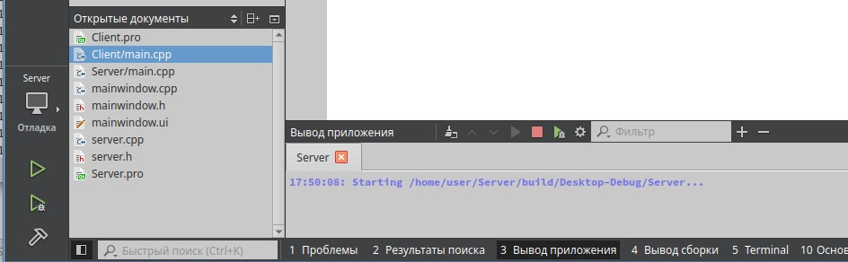
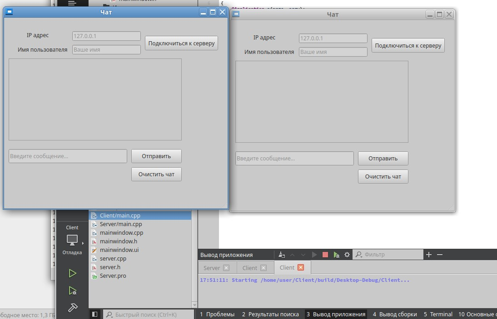
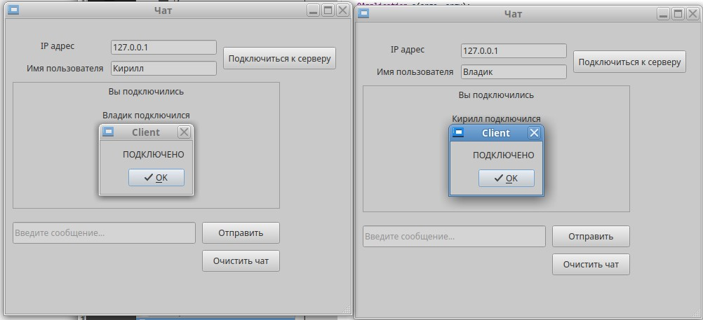
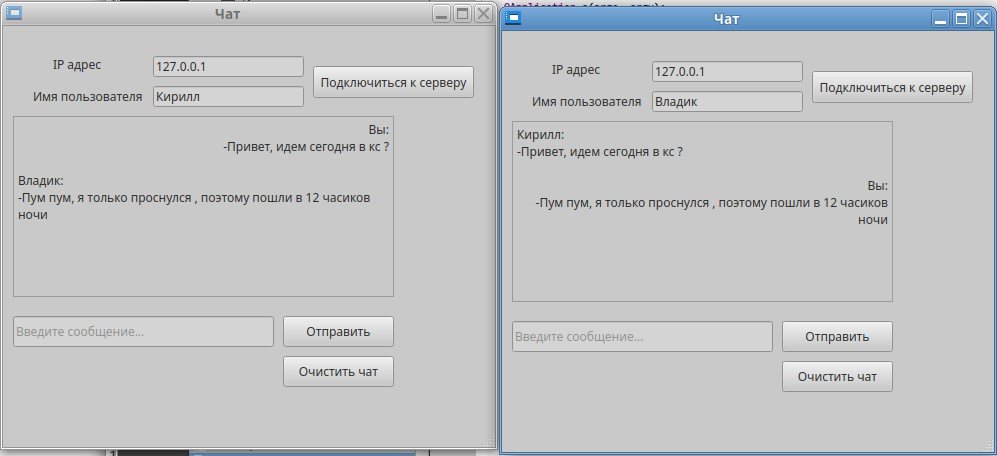

# ЛАБОРАТОРНАЯ РАБОТА №10
## Основы работы с сетью с использованием QtNetwork

---

## Цель работы
Цель данной лабораторной работы заключается в овладении основами работы с сетью в рамках Qt, используя модуль QtNetwork. Студенты научатся создавать сетевые приложения, которые могут отправлять запросы на серверы, принимать ответы и обрабатывать их. Особое внимание будет уделено пониманию асинхронного программирования и обработки событий сети, что является ключевым для разработки отзывчивых приложений, способных работать в сетевой среде.

---

## Задание
Разработать простое клиент-серверное приложение для обмена текстовыми сообщениями в реальном времени. Клиентская часть должна позволять пользователю отправлять сообщения на сервер, который, в свою очередь, рассылает их всем подключенным клиентам.

---

## ФОРМИРОВАНИЕ ОТЧЕТА
В отчёте по лабораторной работе необходимо кратко изложить описание выполненных действий с использованием соответствующих команд, приложить скриншоты настроек и результатов тестов для наглядности. Также следует указать на возникшие в процессе работы проблемы и описать найденные способы их решения. В случае наличия контрольных вопросов, ответы на них должны быть интегрированы в текст.

---

## ЧАСТЬ 1 - Детальные инструкции к выполнению

### Шаг 1. Разработка серверного приложения
- Используя классы QTcpServer и QTcpSocket, создайте серверное приложение, которое может принимать входящие соединения от клиентов.
- Сервер должен уметь обрабатывать подключения от нескольких клиентов одновременно, используя многопоточность или асинхронные сокеты.
- При получении сообщения от одного из клиентов, сервер рассылает его всем подключенным клиентам.

1. Создайте проект `Server` с системой сборки qmake.
2. Для корректной работы в `Server.pro` нужно добавить определенную конфигурацию: 

```cpp
QT = core
QT += core network

CONFIG += c++17 cmdline

# You can make your code fail to compile if it uses deprecated APIs.
# In order to do so, uncomment the following line.
#DEFINES += QT_DISABLE_DEPRECATED_BEFORE=0x060000    # disables all the APIs deprecated before Qt 6.0.0

SOURCES += \
        main.cpp \
        server.cpp

# Default rules for deployment.
qnx: target.path = /tmp/$${TARGET}/bin
else: unix:!android: target.path = /opt/$${TARGET}/bin
!isEmpty(target.path): INSTALLS += target

HEADERS += \
    server.h
```

3. Добавьте в  файл `server.cpp` следующее:   

```cpp
#include <server.h>

Server::Server()
{
    nextBlockSize = 0;

    if (this->listen(QHostAddress::Any, 2323))
    {
        qDebug() << "Start server...";
    }

    else
    {
        qDebug() << "Error start server...";
    }
}

void Server::incomingConnection(qintptr socketDescriptor)
{
    socket = new QTcpSocket;
    socket->setSocketDescriptor(socketDescriptor);
    connect(socket, &QTcpSocket::readyRead, this, &Server::slotReadyRead);
    connect(socket, &QTcpSocket::disconnected, socket, &Server::deleteLater);
    Sockets.push_back(socket);
    qDebug() << "Client is connected..." << socketDescriptor;
}

void Server::slotReadyRead()
{
    socket = (QTcpSocket*)sender();
    QDataStream in(socket);
    in.setVersion(QDataStream::Qt_6_2);

    if (in.status() == QDataStream::Ok)
    {
        for (;;)
        {
            if (nextBlockSize == 0)
            {
                qDebug() << "nextBlockSize = 0";

                if (socket->bytesAvailable() < 2)
                {
                    qDebug() << "Data < 2 bytes, break";
                    break;
                }
                in >> nextBlockSize;
                qDebug() << "nextBlockSize = " << nextBlockSize;
            }

            if (socket->bytesAvailable() < nextBlockSize)
            {
                qDebug() << "Data is not full, break";
                break;
            }

            QString mssng;
            in >> mssng;
            nextBlockSize = 0;
            qDebug() << mssng;
            SendToClient(mssng);
            break;
        }
    }

    else
    {
        qDebug() << "DataStream eror...";
    }
}

void Server::SendToClient(QString mssng)
{
    Data.clear();
    QDataStream out(&Data, QIODevice::WriteOnly);
    out.setVersion(QDataStream::Qt_6_2);
    out << quint16(0) << mssng;
    out.device()->seek(0);
    out << quint16(Data.size() - sizeof(quint16));
    for (int number = 0; number < Sockets.size(); number++)
    {
        Sockets[number]->write(Data);
    }
}
```

4. Добавьте в заголовочный файл `server.h` следующее:  

```cpp
#ifndef SERVER_H
#define SERVER_H

#include <QTcpServer>
#include <QTcpSocket>
#include <QVector>

class Server : public QTcpServer
{
    Q_OBJECT

public:
    Server();
    QTcpSocket *socket;

private:
    QVector <QTcpSocket*> Sockets;
    QByteArray Data;
    quint16 nextBlockSize;

    void SendToClient(QString mssng);

public slots:
    void incomingConnection(qintptr socketDescriptor);
    void slotReadyRead();

};

#endif // SERVER_H
```

5. Добавьте в `main.cpp` следующее:

```cpp
#include <QCoreApplication>
#include <server.h>

int main(int argc, char *argv[])
{
    QCoreApplication a(argc, argv);
    Server server;

    return a.exec();
}
```

### Шаг 2. Разработка клиентского приложения
- Создайте клиентское приложение, используя класс QTcpSocket для подключения к серверу.
- Пользовательский интерфейс должен включать поле для ввода текста сообщений и область для отображения входящих сообщений.
- Клиент должен уметь асинхронно отправлять сообщения на сервер и получать сообщения от него.

1. Создайте проект `Client` с системой сборки qmake.
2. Для корректной работы в `Client.pro` нужно добавить определенную конфигурацию: 

```cpp
QT += core gui network

greaterThan(QT_MAJOR_VERSION, 4): QT += widgets

CONFIG += c++17

# You can make your code fail to compile if it uses deprecated APIs.
# In order to do so, uncomment the following line.
#DEFINES += QT_DISABLE_DEPRECATED_BEFORE=0x060000    # disables all the APIs deprecated before Qt 6.0.0

SOURCES += \
    main.cpp \
    mainwindow.cpp

HEADERS += \
    mainwindow.h

FORMS += \
    mainwindow.ui

# Default rules for deployment.
qnx: target.path = /tmp/$${TARGET}/bin
else: unix:!android: target.path = /opt/$${TARGET}/bin
!isEmpty(target.path): INSTALLS += target
```

3. В файл формы `mainwindow.ui` добавим следующее:

```cpp
<?xml version="1.0" encoding="UTF-8"?>
<ui version="4.0">
 <class>MainWindow</class>
 <widget class="QMainWindow" name="MainWindow">
  <property name="geometry">
   <rect>
    <x>0</x>
    <y>0</y>
    <width>492</width>
    <height>421</height>
   </rect>
  </property>
  <property name="windowTitle">
   <string>Чат</string>
  </property>
  <widget class="QWidget" name="centralwidget">
   <widget class="QPushButton" name="pushButton">
    <property name="geometry">
     <rect>
      <x>310</x>
      <y>40</y>
      <width>161</width>
      <height>32</height>
     </rect>
    </property>
    <property name="text">
     <string>Подключиться к серверу</string>
    </property>
   </widget>
   <widget class="QPushButton" name="pushButton_2">
    <property name="geometry">
     <rect>
      <x>280</x>
      <y>290</y>
      <width>111</width>
      <height>31</height>
     </rect>
    </property>
    <property name="text">
     <string>Отправить</string>
    </property>
   </widget>
   <widget class="QTextBrowser" name="textBrowser">
    <property name="geometry">
     <rect>
      <x>10</x>
      <y>90</y>
      <width>381</width>
      <height>181</height>
     </rect>
    </property>
   </widget>
   <widget class="QLineEdit" name="lineEdit">
    <property name="geometry">
     <rect>
      <x>10</x>
      <y>290</y>
      <width>261</width>
      <height>31</height>
     </rect>
    </property>
    <property name="placeholderText">
     <string>Введите сообщение...</string>
    </property>
   </widget>
   <widget class="QLineEdit" name="lineEdit_2">
    <property name="geometry">
     <rect>
      <x>150</x>
      <y>30</y>
      <width>151</width>
      <height>21</height>
     </rect>
    </property>
    <property name="placeholderText">
     <string>127.0.0.1</string>
    </property>
   </widget>
   <widget class="QLineEdit" name="lineEdit_3">
    <property name="geometry">
     <rect>
      <x>150</x>
      <y>60</y>
      <width>151</width>
      <height>21</height>
     </rect>
    </property>
    <property name="placeholderText">
     <string>Ваше имя</string>
    </property>
   </widget>
   <widget class="QLabel" name="label">
    <property name="geometry">
     <rect>
      <x>50</x>
      <y>30</y>
      <width>58</width>
      <height>16</height>
     </rect>
    </property>
    <property name="text">
     <string>IP адрес</string>
    </property>
   </widget>
   <widget class="QLabel" name="label_2">
    <property name="geometry">
     <rect>
      <x>30</x>
      <y>60</y>
      <width>151</width>
      <height>20</height>
     </rect>
    </property>
    <property name="text">
     <string>Имя пользователя</string>
    </property>
   </widget>
   <widget class="QPushButton" name="pushButton_3">
    <property name="geometry">
     <rect>
      <x>280</x>
      <y>330</y>
      <width>111</width>
      <height>31</height>
     </rect>
    </property>
    <property name="text">
     <string>Очистить чат</string>
    </property>
   </widget>
  </widget>
  <widget class="QMenuBar" name="menubar">
   <property name="geometry">
    <rect>
     <x>0</x>
     <y>0</y>
     <width>492</width>
     <height>22</height>
    </rect>
   </property>
  </widget>
  <widget class="QStatusBar" name="statusbar"/>
 </widget>
 <resources/>
 <connections/>
</ui>
``` 

4. В заголовочный файл `mainwindow.h` добавим следующее:

```cpp
#ifndef MAINWINDOW_H
#define MAINWINDOW_H

#include <QMainWindow>
#include <QTcpSocket>

QT_BEGIN_NAMESPACE
namespace Ui { class MainWindow; }
QT_END_NAMESPACE

class MainWindow : public QMainWindow
{
    Q_OBJECT

public:
    MainWindow(QWidget *parent = nullptr);
    ~MainWindow();

private slots:
    void on_pushButton_clicked();

    void on_pushButton_2_clicked();

    void on_lineEdit_returnPressed();

    void on_lineEdit_2_returnPressed();

    void on_pushButton_3_clicked();

private:
    Ui::MainWindow *ui;
    QTcpSocket *socket;
    QString line_ip;
    QString mssg_buf;
    QString username;
    QByteArray Data;
    quint16 nextBlockSize;

    void SendToServer(QString mssng);
    void SendToServerConnect(QString mssng);

public slots:
    void slotReadyRead();

};
#endif // MAINWINDOW_H
```

5. В исходный файл `mainwindow.cpp` добавить следующее:

```cpp
#include "mainwindow.h"
#include "ui_mainwindow.h"
#include <QMessageBox>

MainWindow::MainWindow(QWidget *parent)
    : QMainWindow(parent)
    , ui(new Ui::MainWindow)
{
    ui->setupUi(this);
    socket = new QTcpSocket(this);
    connect(socket, &QTcpSocket::readyRead, this, &MainWindow::slotReadyRead);
    connect(socket, &QTcpSocket::disconnected, this, &MainWindow::deleteLater);
    nextBlockSize = 0;
}

MainWindow::~MainWindow()
{
    delete ui;
}

void MainWindow::on_pushButton_clicked()
{
    if (ui->lineEdit_3->text() != "")
    {
        username = ui->lineEdit_3->text();
        socket->connectToHost(ui->lineEdit_2->text(), 2323);
        if (socket->waitForConnected(3000))
        {
            SendToServerConnect(username);

            QMessageBox box;
            box.setText("ПОДКЛЮЧЕНО");
            box.exec();
        }
        else
        {
            QMessageBox::warning(0, "ОШИБКА", "Неверный IP адрес");
        }
    }
    else
    {
        QMessageBox::warning(0, "ОШИБКА", "Введите имя пользователя");
    }
}

void MainWindow::SendToServer(QString mssng)
{
    Data.clear();
    QDataStream out(&Data, QIODevice::WriteOnly);
    out.setVersion(QDataStream::Qt_6_2);
    out << quint16(0) << username + ":\n-" + mssng;
    out.device()->seek(0);
    out << quint16(Data.size() - sizeof(quint16));
    socket->write(Data);
    mssg_buf = ui->lineEdit->text();
    ui->lineEdit->clear();
}

void MainWindow::SendToServerConnect(QString mssng)
{
    Data.clear();
    QDataStream out(&Data, QIODevice::WriteOnly);
    out.setVersion(QDataStream::Qt_6_2);
    out << quint16(0) << mssng;
    out.device()->seek(0);
    out << quint16(Data.size() - sizeof(quint16));
    socket->write(Data);
}

void MainWindow::slotReadyRead()
{
    QDataStream in(socket);
    in.setVersion(QDataStream::Qt_6_2);

    if (in.status() == QDataStream::Ok)
    {
        for (;;)
        {
            if (nextBlockSize == 0)
            {
                if (socket->bytesAvailable() < 2)
                {
                    break;
                }
                in >> nextBlockSize;
            }

            if (socket->bytesAvailable() < nextBlockSize)
            {
                break;
            }

            QString mssng;
            in >> mssng;
            nextBlockSize = 0;

            if (mssng == username + ":\n-" + mssg_buf)
            {
                ui->textBrowser->setAlignment(Qt::AlignRight);
                ui->textBrowser->append("Вы:");
                ui->textBrowser->append("-" + mssg_buf + "\n");
            }
            else if (mssng == username)
            {
                ui->textBrowser->setAlignment(Qt::AlignCenter);
                ui->textBrowser->append("Вы подключились\n");
            }
            else if (mssng != username && mssng.indexOf(":\n") >= 0)
            {
                ui->textBrowser->setAlignment(Qt::AlignLeft);
                ui->textBrowser->append(mssng + "\n");
            }
            else
            {
                ui->textBrowser->setAlignment(Qt::AlignCenter);
                ui->textBrowser->append(mssng + " подключился\n");
            }
        }
    }
    else
    {
        ui->textBrowser->append("Ошибка чтения...");
    }
}

void MainWindow::on_pushButton_2_clicked()
{
    SendToServer(ui->lineEdit->text());
}

void MainWindow::on_lineEdit_returnPressed()
{
    SendToServer(ui->lineEdit->text());
}

void MainWindow::on_lineEdit_2_returnPressed()
{
    if (ui->lineEdit_3->text() != "")
    {
        username = ui->lineEdit_3->text();
        socket->connectToHost(ui->lineEdit_2->text(), 2323);
        if (socket->waitForConnected(3000))
        {
            SendToServerConnect(username);

            QMessageBox box;
            box.setText("ПОДКЛЮЧЕНО");
            box.exec();
        }
        else
        {
            QMessageBox::warning(0, "ОШИБКА", "Неверный IP адрес");
        }
    }
    else
    {
        QMessageBox::warning(0, "ОШИБКА", "Введите имя пользователя");
    }
}

void MainWindow::on_pushButton_3_clicked()
{
    ui->textBrowser->clear();
}
```

## ЧАСТЬ 2 - Тестирование приложения

- Сервер ожидает подключений на определенном порту.
- Клиенты подключаются к серверу.
- Сообщения от клиентов пересылаются сервером всем подключенным клиентам.
- Используется механизм блоков данных для корректной передачи сообщений.

1. Запустить сервер.
  
2. Запустить несколько экземпляров клиентского приложения.
  
3. Проверить:

	- Подключение клиентов.
  
	- Отправку сообщений и отображение сообщений у всех клиентов.
  


---

## Задание для самостоятельной работы 
1. Создайте или доработайте GUI-приложение для администрирования сервера.
2. Модифицируйте чат так, чтобы можно было отправлять личные сообщения конкретному пользователю.
3. Доработайте клиентское приложения по своему усмотрению (например, добавьте кнопкку для дисконнекта и т.д).
---

## Вопросы для самопроверки
1. Почему в коде используется quint16 для размера блока данных?
2. Как работает механизм сигналов и слотов в Qt при работе с сетью?
3. Почему в данном задании выбран асинхронный подход? Какие у него преимущества и недостатки?
4. Какие ошибки могут возникнуть при работе с сокетами?

