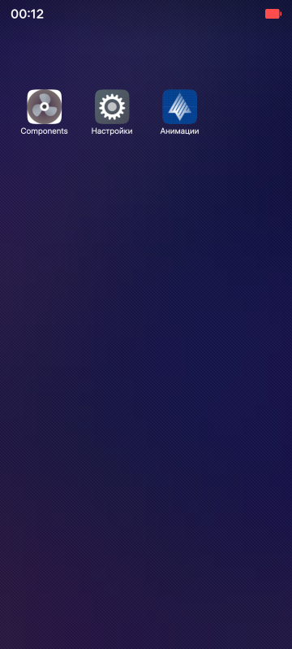
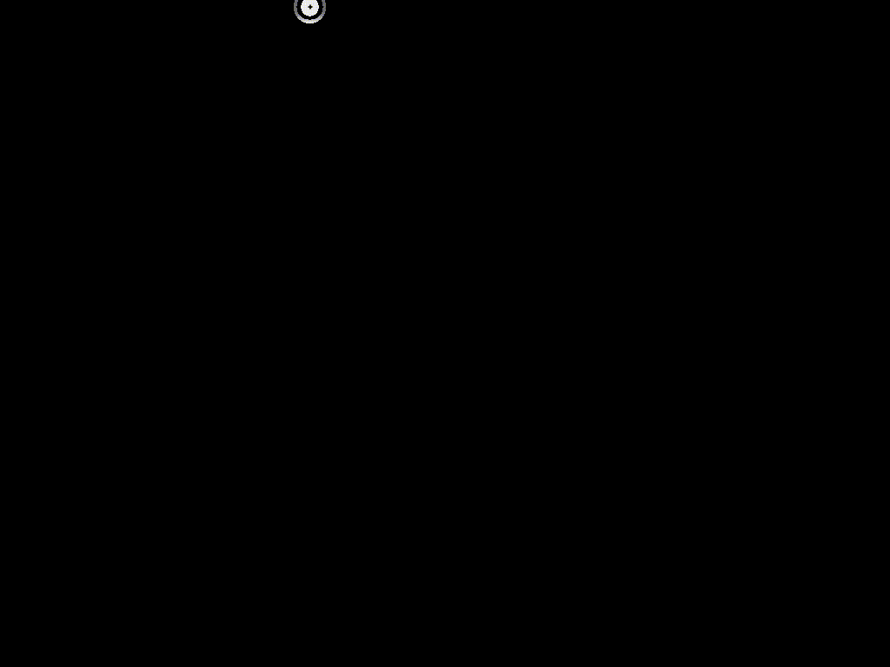

# ЛАБОРАТОРНАЯ РАБОТА №15
## Работа с ресурсами Qt, стили и кастомизация
### Задание 1: Анализ примерного проекта
1. Изучить структуру проекта [projects/animations_aurora · main · omprussia / Education / Разработка приложений на Qt · GitLab](https://gitlab.com/omprussia/edu/qt-app-development/-/tree/main/projects/animations_aurora?ref_type=heads)

### 1. Структура проекта

**Описание:** В корне проекта находятся файлы проекта и конфигурации, а папки организованы по назначению: иконки, QML-интерфейс, C++-исходники и RPM-спецификация.

```
projects/animations_aurora/
├── icons/                             # Иконки приложения для разных DPI
│   ├── 86x86/                         # 86×86 px
│   │   └── ru.auroraos.Animations.png
│   ├── 108x108/                       # 108×108 px
│   │   └── ru.auroraos.Animations.png
│   ├── 128x128/                       # 128×128 px
│   │   └── ru.auroraos.Animations.png
│   └── 172x172/                       # 172×172 px
│       └── ru.auroraos.Animations.png
├── qml/                               # QML-интерфейс и ресурсы
│   ├── Animations.qml                 # Основной QML-файл с логикой и визуализацией анимаций
│   └── images/                        # Дополнительные графические ресурсы
│       └── aurora.svg                 # SVG-файл для анимации вращения
├── src/                               # C++-исходники
│   └── main.cpp                       # Точка входа: инициализация Qt-приложения и загрузка QML
├── rpm/                               # RPM-спецификация для сборки и установки
│   └── ru.auroraos.Animations.spec    # Описание сборки пакета для AuroraOS
├── ru.auroraos.Animations.desktop     # Desktop-файл: ярлык и интеграция в окружение
└── ru.auroraos.Animations.pro         # Qt-проект: пути к исходникам, ресурсам и параметры сборки
```

> **Примечание:** Такая структура характерна для мобильных Qt/QML-приложений: ресурсы (`icons`, `qml/images`), интерфейс (`qml/Animations.qml`), C++-логика (`src/main.cpp`) и пакетирование (`rpm/*.spec`).

---

### 2. Анализ используемых ресурсов

Проект использует два основных типа графических ресурсов:

1. **SVG-файл** для анимации:

   * **`qml/images/aurora.svg`** — векторная графика, легко масштабируется и подходит для плавной анимации без потери качества.
   * **Назначение:** источник изображения в QML (`Image.source`), по которому выполняется вращение через `RotationAnimation`.

2. **PNG-иконки** разных разрешений:

   | Размер  | Путь                                       | Назначение                                        |
   | ------- | ------------------------------------------ | ------------------------------------------------- |
   | 86×86   | `icons/86x86/ru.auroraos.Animations.png`   | Иконка для списка приложений (низкое DPI)         |
   | 108×108 | `icons/108x108/ru.auroraos.Animations.png` | Иконка для среднего DPI                           |
   | 128×128 | `icons/128x128/ru.auroraos.Animations.png` | Иконка для рабочего стола                         |
   | 172×172 | `icons/172x172/ru.auroraos.Animations.png` | Иконка для меню/специальных случаев (высокое DPI) |



> **Примечание:** Разные размеры нужны, чтобы система AuroraOS корректно отображала иконку в разных контекстах и при разных масштабах экрана.

---

### 3. Разбор реализованных анимаций

В данном проекте представлено две базовые анимации на QML:

#### 3.1 Вращение изображения (`RotationAnimation`)

* **Файл**: `qml/Animations.qml`

* **Элемент**: `Image` с `id: image`

* **Ресурс**: `source: Qt.resolvedUrl("images/aurora.svg")`

* **Код анимации**:

  ```qml
  MouseArea {
      anchors.fill: parent
      onClicked: imageAnimation.running = true
  }

  RotationAnimation on rotation {
      id: imageAnimation
      to: image.rotation + 360    // полный оборот на 360°
      duration: 2000              // длительность 2000 мс (2 секунды)
      running: false              // по умолчанию не запущена
  }
  ```

* **Принцип работы:**

  1. Пользователь кликает по SVG-изображению.
  2. Срабатывает `MouseArea.onClicked`, свойство `running` у `RotationAnimation` становится `true`.
  3. Элемент плавно вращается на 360° в течение 2 секунд.



#### 3.2 Смена цвета прямоугольника (`ColorAnimation` + `States` + `Transitions`)

* **Файл**: `qml/Animations.qml`

* **Элемент**: `Rectangle` с `id: rectangle`

* **Начальный цвет**: `color: "red"`

* **Описание логики**:

  * Состояние по умолчанию: красный цвет.
  * При нажатии и удержании (`pressed`) смена состояния на `blue`.
  * При отпускании возвращение к красному.

* **Код анимации**:

  ```qml
  states: State {
      name: "blue"
      when: rectangleMouseArea.pressed
      PropertyChanges { target: rectangle; color: "blue" }
  }

  transitions: [
      Transition {
          to: "blue"
          ColorAnimation { duration: 2000 }  // смена в синий за 2 секунды
      },
      Transition {
          from: "blue"
          ColorAnimation { duration: 500 }   // обратный переход за 0.5 секунды
      }
  ]

  MouseArea {
      id: rectangleMouseArea
      anchors.fill: parent
  }
  ```

* **Принцип работы:**

  1. При нажатии (`rectangleMouseArea.pressed == true`) активируется состояние `blue` и запускается `ColorAnimation` длительностью 2 с.
  2. При отпускании (`pressed == false`) состояние возвращается, запускается обратная анимация 0.5 с.


---

### Общая логика взаимодействия

* **MouseArea** отвечает за обработку пользовательских действий:

  * Клик по изображению → `RotationAnimation`
  * Нажатие на прямоугольник → `ColorAnimation`
* Все анимации выполняются с помощью стандартных QML-аниматоров (`RotationAnimation`, `ColorAnimation`), что демонстрирует базовые возможности создания интерактивных и плавных эффектов в мобильных приложениях на Qt/QML.


