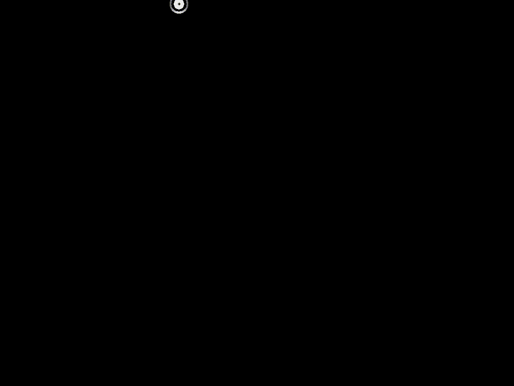

# ЛАБОРАТОРНАЯ РАБОТА №15
## Работа с ресурсами Qt, стили и кастомизация

### Задание 2: Реализация дополнительного функционала
**Варианты расширений:**
1. Добавление новых типов анимаций:
   - Эффекты перехода между состояниями
   - Сложные составные анимации
2. Создание кастомных компонентов:
   - Анимированные кнопки
   - Интерактивные элементы управления
3. Оптимизация ресурсов:
   - Использование векторной графики
   - Динамическая загрузка ресурсов

**Требования:**
- Соответствие стилю ОС Аврора
- Плавность выполнения анимаций
- Оптимальное использование ресурсов

### Описание реализованных изменений в Animations.qml

В рамках выполнения задания 2 были внесены следующие изменения в файл `Animations.qml`:

1. **Добавление новых типов анимаций:**
   - Реализована анимация вращения верхнего изображения (SVG) с помощью `PropertyAnimation`.
   - Для нижнего прямоугольника добавлены плавные анимации изменения цвета и формы (радиуса скругления) при нажатии.
   - Использованы эффекты перехода между состояниями с разной длительностью анимаций.

2. **Создание кастомных компонентов:**
   - Добавлена анимированная круглая кнопка по центру экрана с SVG-иконкой стрелки. Кнопка реагирует на нажатие изменением цвета и масштабирования, а также анимирует вращение иконки.
   - Кнопка запускает вращение верхнего изображения при клике.
   - Прямоугольник в нижней части экрана становится круглым и меняет цвет при нажатии, реализуя интерактивный элемент управления.

```diff
- СТРЕЛКА ДОБАВЛЕНА В ./qml/images/arrow.svg
```

3. **Оптимизация ресурсов:**
   - Для всех графических элементов используются векторные изображения (SVG), что обеспечивает высокое качество и оптимальное использование ресурсов.
   - Все анимации реализованы средствами QML без лишних зависимостей, что способствует производительности.

**Соответствие требованиям:**
- Интерфейс и анимации выполнены в стиле ОС Аврора: используются фирменные цвета, плавные переходы и современные визуальные эффекты.
- Все анимации плавные, с использованием подходящих временных интервалов и функций сглаживания.
- Использование SVG и оптимизация структуры компонентов обеспечивают эффективное использование ресурсов.
---
### Прямоугольник



### Кнопка


# Animations.qml
```qml
// SPDX-FileCopyrightText: 2023 Open Mobile Platform LLC <edu@omp.ru>
// SPDX-License-Identifier: BSD-3-Clause

import QtQuick 2.0

Item {
    width: 400; height: 600

    // Верхнее изображение с вращением
    Image {
        id: image
        source: Qt.resolvedUrl("images/aurora.svg")
        fillMode: Image.PreserveAspectFit
        anchors.top: parent.top
        anchors.left: parent.left
        anchors.right: parent.right
        anchors.margins: 0
        height: parent.height / 2
        rotation: 0
        PropertyAnimation {
            id: rotAnim
            target: image
            property: "rotation"
            to: image.rotation + 360
            duration: 2000
            running: false
        }
    }

    // Кнопка для вращения SVG (по центру)
    Rectangle {
        id: rotateBtn
        width: 80; height: 80
        anchors.horizontalCenter: parent.horizontalCenter
        anchors.verticalCenter: parent.verticalCenter
        z: 2
        color: btnPressed ? "#FF9900" : "#00BFFF"
        radius: 40
        border.color: "#0055AA"
        border.width: 2
        property bool btnPressed: false
        property real btnRotation: 0
        Behavior on color { ColorAnimation { duration: 200; easing.type: Easing.InOutQuad } }
        Behavior on btnRotation { NumberAnimation { duration: 2000; easing.type: Easing.InOutQuad } }
        Behavior on scale { NumberAnimation { duration: 200; easing.type: Easing.InOutQuad } }
        scale: btnPressed ? 1.15 : 1.0
        Image {
            source: Qt.resolvedUrl("images/arrow.svg")
            anchors.centerIn: parent
            width: 48; height: 48
            fillMode: Image.PreserveAspectFit
            rotation: rotateBtn.btnRotation
        }
        MouseArea {
            anchors.fill: parent
            onPressed: rotateBtn.btnPressed = true
            onReleased: rotateBtn.btnPressed = false
            onClicked: {
                rotAnim.running = true;
                rotateBtn.btnRotation += 360;
            }
        }
    }

    // Прямоугольник с изменением формы и цвета (плавные анимации)
    Rectangle {
        id: rectangle
        width: parent.width
        height: parent.height / 2
        y: parent.height / 2
        color: rectMouseArea.pressed ? "blue" : "red"
        radius: rectMouseArea.pressed ? Math.min(width, height) / 2 : 0
        Behavior on color { ColorAnimation { duration: rectMouseArea.pressed ? 300 : 2000; easing.type: Easing.InOutQuad } }
        Behavior on radius { NumberAnimation { duration: rectMouseArea.pressed ? 300 : 2000; easing.type: Easing.InOutQuad } }
        MouseArea {
            id: rectMouseArea
            anchors.fill: parent
        }
    }
}
```