# Лабораторная работа №2
## Работа с базовыми типами, реализация сигналов и слотов

---

### Цель работы:
- Освоение механизма сигналов и слотов в Qt.
- Практика работы с базовыми типами данных Qt.

---

## Формирование отчета
В отчёте по лабораторной работе необходимо кратко изложить описание выполненных действий с использованием соответствующих команд, приложить скриншоты настроек и результатов тестов для наглядности. Также следует указать на возникшие в процессе работы проблемы и описать найденные способы их решения. В случае наличия контрольных вопросов, ответы на них должны быть интегрированы в текст.

---

## ЧАСТЬ 1
### Работа с QString и сигналами/слотами

#### Цели задания:
- Изучить базовые операции с QString.
- Реализовать простую форму для ввода текста и кнопку для его обработки.
- Использовать сигналы и слоты для реализации логики приложения.

### Шаг 1. Создание проекта и формы.
1. Запустите Qt Creator и создайте новый проект **"Приложение Qt Widgets"**.

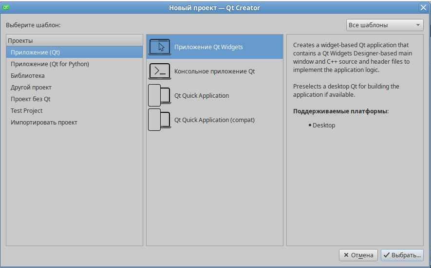

2. Укажите название проекта **"laba2"** и выберите директорию для проекта.

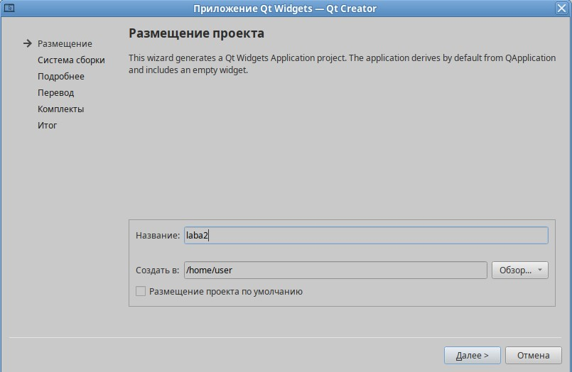

3. Выберите систему сборки **CMake**.

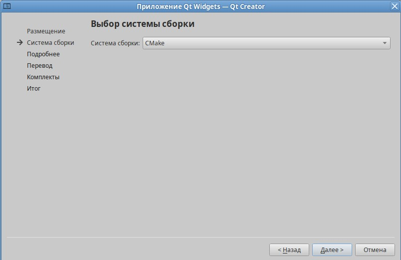

4. Оставьте информацию о классах по умолчанию.

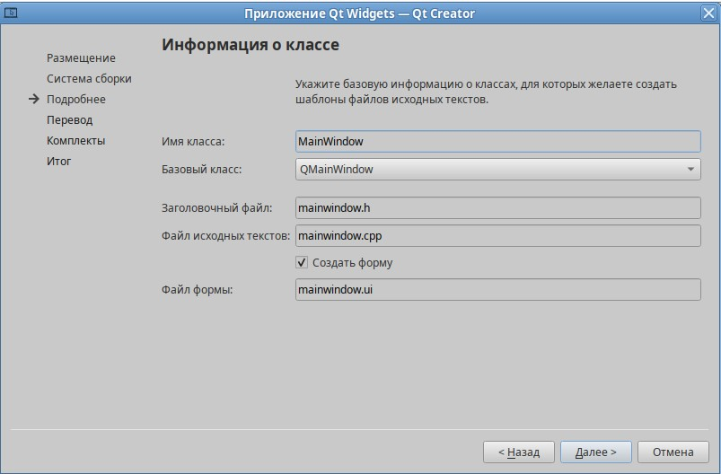

5. Файл перевода можно оставить пустым.

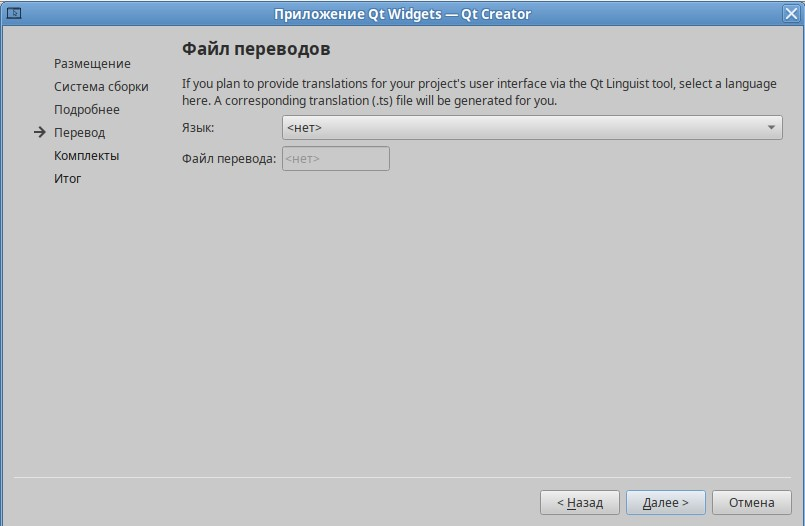

6. Выберите комплект для сборки (должен быть автоматически определён).

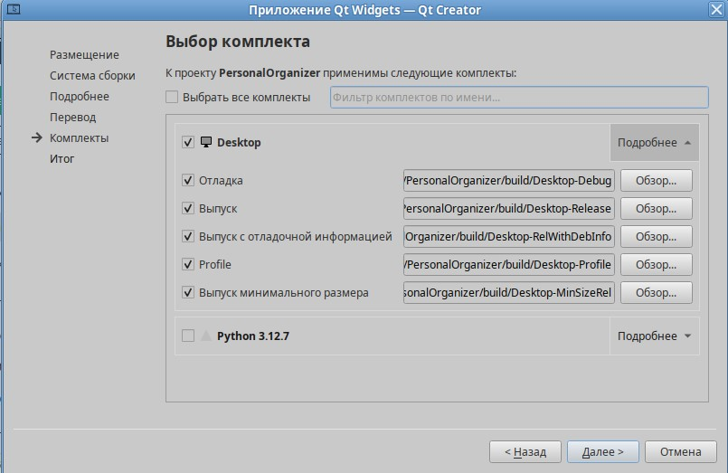

7. Завершите создание проекта, нажав **"Завершить"**.
8. Добавьте на форму **QLineEdit** для ввода текста.

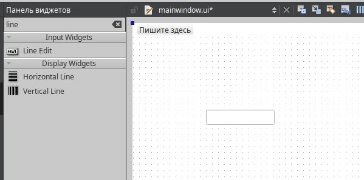

9. Добавьте **QPushButton** для обработки текста.

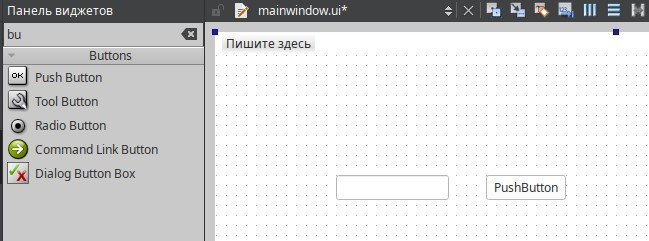

10. Добавьте **QLabel** для вывода результата.

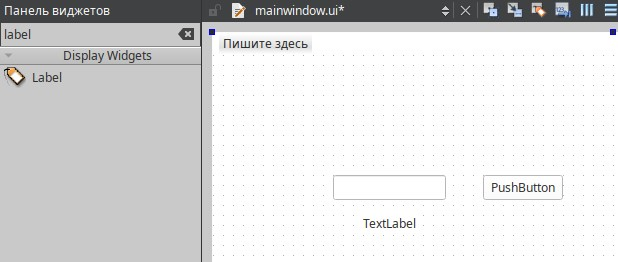

### Шаг 2. Настройка объектов.
1. Выберите **QLineEdit** и в редакторе свойств найдите **objectName** в котором измините ему имя, например **inputLineEdit**.

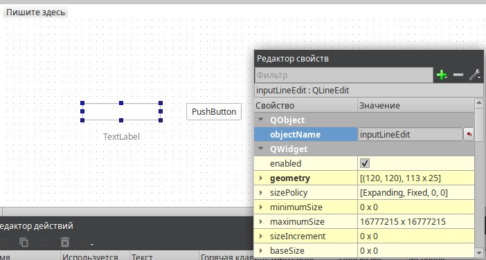

2. Аналогично настройте имена для QPushButton и QLabel: **processButton** и **resultLabel**.

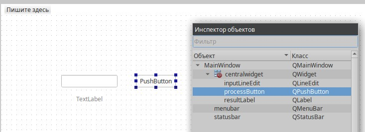

3. Измените название QPushButton и QLabel. Нажмите на каждый объект и в редакторе свойств найдите свойство **text** в разделе **QAbstractButton**, в котором поменяйте текст на объекта.

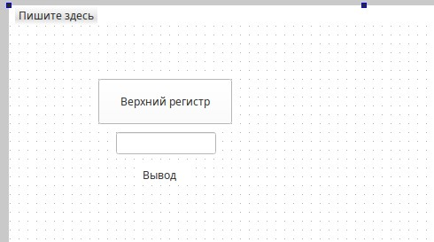

4. Сохраните изменения **(Ctrl+S)**.

### Шаг 3. Реализация слота для обработки.
1.	Добавьте в `mainwindow.h` объявление вашего слота в секцию **private slots** или **public slots** (зависит от ваших требований к защите).
```cpp
private:
    void processText();
```

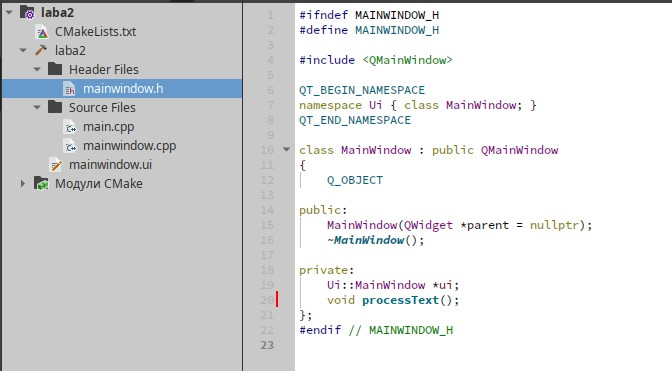

2.	Далее перейдите в `mainwindow.cpp` и реализуйте этот слот, где будет производиться обработка текста из **QLineEdit**, например, преобразование в верхний регистр.

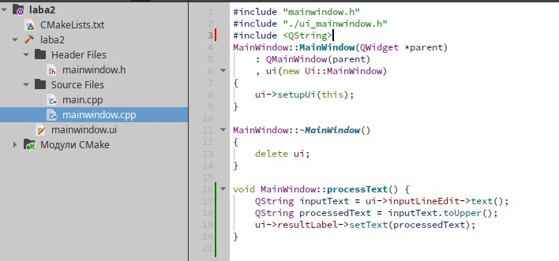

### Шаг 4. Соединение сигналов и слотов.
1.	В конструкторе `MainWindow`, соедините сигнал нажатия кнопки с вашим слотом с помощью следующей команды:
```cpp
connect(ui->processButton, &QPushButton::clicked, this, &MainWindow::processText);
```

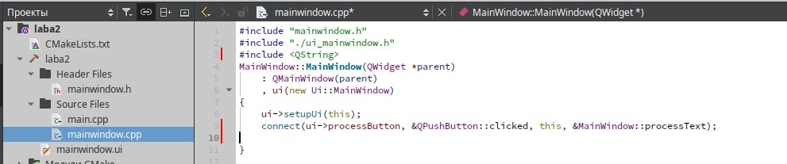

### Шаг 5. Тестирование.
1. Соберите приложение **(Ctrl+B)**.

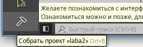

2. Запустите приложение **(Ctrl+R)**.


3. Проверьте ввод текста и его обработку.

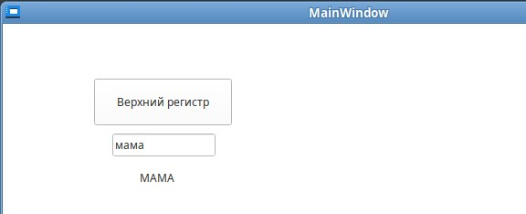

---

## ЧАСТЬ 2
### Использование QVariant для работы с различными типами данных

#### Цели задания:
- Практика применения QVariant.
- Разработка функции для обработки и вывода разнотипных данных.

### Шаг 1. Реализация обработки QVariant.
1.	Добавьте в `mainwindow.h` объявление вашего слота в секцию **private slots** или **public slots** (зависит от ваших требований к защите).
```cpp
private:
    void processVariant();
```

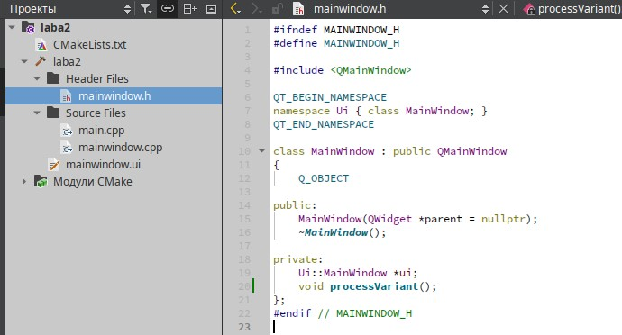

2.	В конструкторе `MainWindow`, соедините сигнал нажатия кнопки с вашим слотом с помощью следующей команды:
```cpp
connect(ui->processButton, &QPushButton::clicked, this, &MainWindow::processVariant);
```

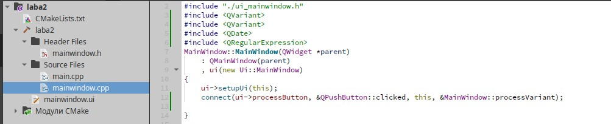

3.	Далее перейдите в `mainwindow.cpp` и реализуйте этот слот, где будет производиться функция по условию задания.
```cpp
#include <QDate>
#include <QDebug>

void MainWindow::processVariant() {
    QString inputText = ui->inputLineEdit->text();
    QVariant var;
    bool isNumber;
    int intValue = inputText.toInt(&isNumber);

    QDate dateValue = QDate::fromString(inputText, "dd.MM.yyyy");
    if (!dateValue.isValid()) {
        dateValue = QDate::fromString(inputText, "dd-MM-yyyy");
    }
    if (!dateValue.isValid()) {
        dateValue = QDate::fromString(inputText, "dd/MM/yyyy");
    }

    if (isNumber) {
        var = intValue;
    } else if (dateValue.isValid()) {
        var = dateValue;
    } else {
        var = inputText;
    }

    QString resultText;
    if (var.type() == QVariant::Int) {
        resultText = "Число: " + QString::number(var.toInt() * 2);
    } else if (var.type() == QVariant::Date) {
        resultText = "Дата: " + var.toDate().toString("dd.MM.yyyy");
    } else {
        resultText = "Строка: " + var.toString();
    }

    ui->resultLabel->setText(resultText);
}
```

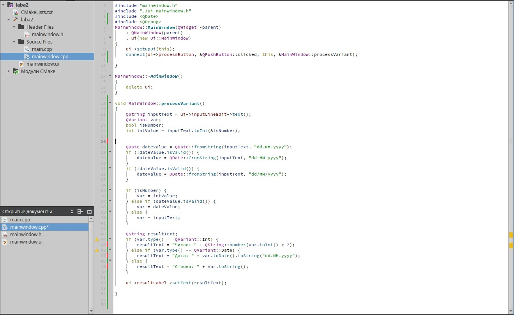

### Шаг 2. Тестирование.
1. Проверка на **число**.

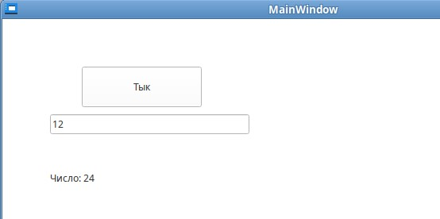

2. Проверка на **дату**.

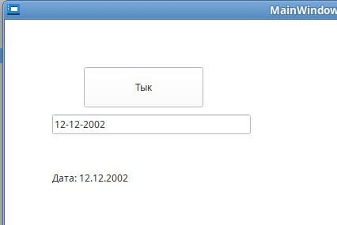

3. Проверка на **строку**.

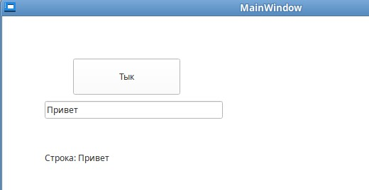

---

## ЧАСТЬ 3
### Создание собственных сигналов и слотов

#### Цели задания:
- Ознакомление с процессом создания и использования собственных сигналов и слотов.

### Шаг 1. Создайте новый класс, наследуя его от QObject. Добавьте в класс собственный сигнал, например, dataProcessed(QString data).

1.	Добавьте новый класс.

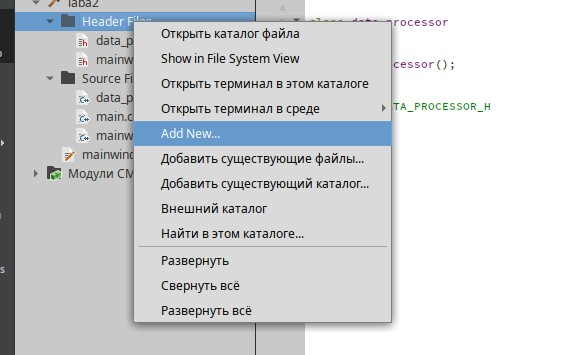

2.	Выберите класс с++.

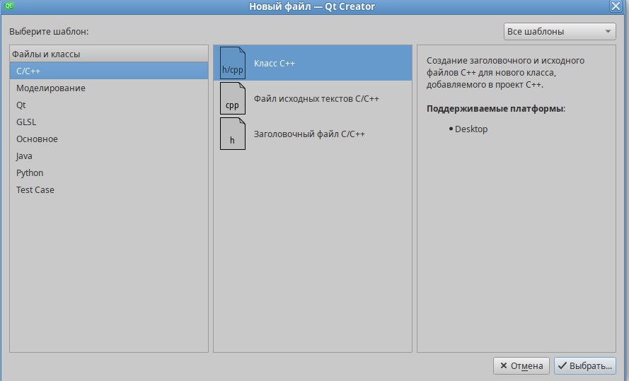

3.	Дайте имя классу и завершите его добавления.

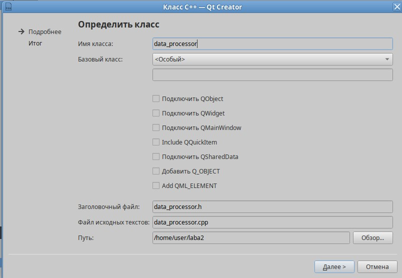

4.	Измените код в файле `data_processor.h`. Наследуйте его от QObject и добавьте сигнал с обработанными данными.
```cpp
#ifndef DATA_PROCESSOR_H
#define DATA_PROCESSOR_H

#include <QObject>

class DataProcessor : public QObject {
    Q_OBJECT
public:
    explicit DataProcessor(QObject *parent = nullptr) : QObject(parent) {}
signals:
    void dataProcessed(const QString &result);
};

#endif // DATA_PROCESSOR_H
```

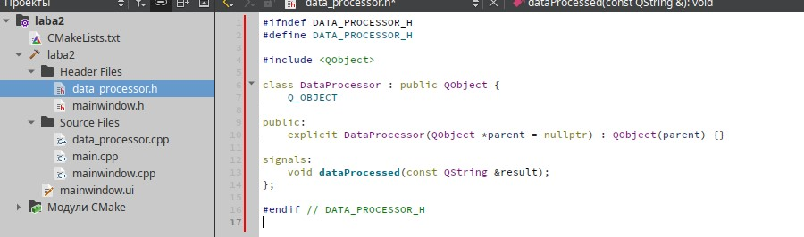

### Шаг 2. Добавьте метод для обработки данных, который после обработки данных будет испускать сигнал dataProcessed с результатом обработки.

1.	Добавьте метод, который выполняет обработку данных.

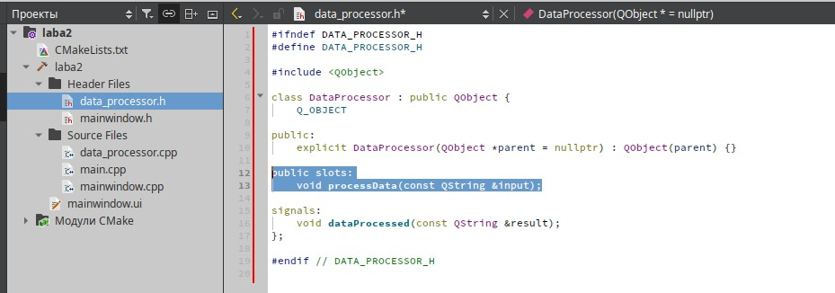

2.	В файле `data_processor.cpp` добавьте обработку данных.
```cpp
#include "data_processor.h"

void DataProcessor::processData(const QString &input) {
    QString processedData = "Обработано: " + input;
    emit dataProcessed(processedData);
}
```

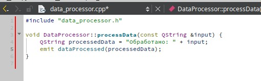

### Шаг 3. В главном окне приложения создайте экземпляр вашего класса и соедините его сигнал dataProcessed со слотом, который будет выводить полученные данные на форму.
1.	Зайдите в класс `mainwindow.h`, который отвечает за интерфейс и обработку событий и добавьте основные объекты, такие как **handleProcessedData**(слот для вывода обработанных данных), **onProcessButtonClicked**(слот для обработки нажатия кнопки), **QLineEdit**(поле ввода), **QLabel**(поля вывода), **QPushButton**(кнопка), **DataProcessor**(экземпляр обработчика данных).
```cpp
#ifndef MAINWINDOW_H
#define MAINWINDOW_H

#include <QMainWindow>
#include <QPushButton>
#include <QLineEdit>
#include <QLabel>
#include "data_processor.h"

class MainWindow : public QMainWindow {
    Q_OBJECT
public:
    explicit MainWindow(QWidget *parent = nullptr);
private slots:
    void handleProcessedData(const QString &data);
    void onProcessButtonClicked();
private:
    QLineEdit *inputField;
    QLabel *outputLabel;
    QPushButton *processButton;
    DataProcessor *processor;
};

#endif // MAINWINDOW_H
```

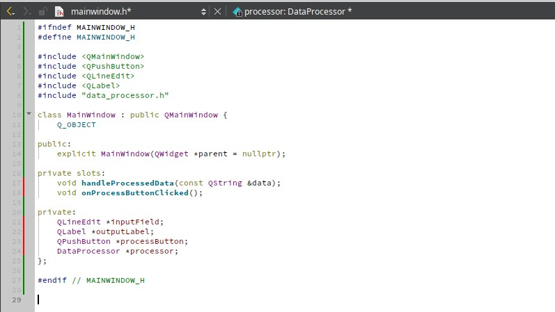

### Шаг 4. Реализуйте логику вызова метода обработки данных, например, по нажатию кнопки в интерфейсе пользователя.
```cpp
#include "mainwindow.h"
#include <QVBoxLayout>
#include <QWidget>

MainWindow::MainWindow(QWidget *parent) : QMainWindow(parent) {
    QWidget *centralWidget = new QWidget(this);
    setCentralWidget(centralWidget);

    inputField = new QLineEdit(this);
    processButton = new QPushButton("Обработать", this);
    outputLabel = new QLabel("Результат: ", this);

    QVBoxLayout *layout = new QVBoxLayout(centralWidget);
    layout->addWidget(inputField);
    layout->addWidget(processButton);
    layout->addWidget(outputLabel);

    processor = new DataProcessor(this);

    connect(processor, &DataProcessor::dataProcessed, this, &MainWindow::handleProcessedData);
    connect(processButton, &QPushButton::clicked, this, &MainWindow::onProcessButtonClicked);
}
```

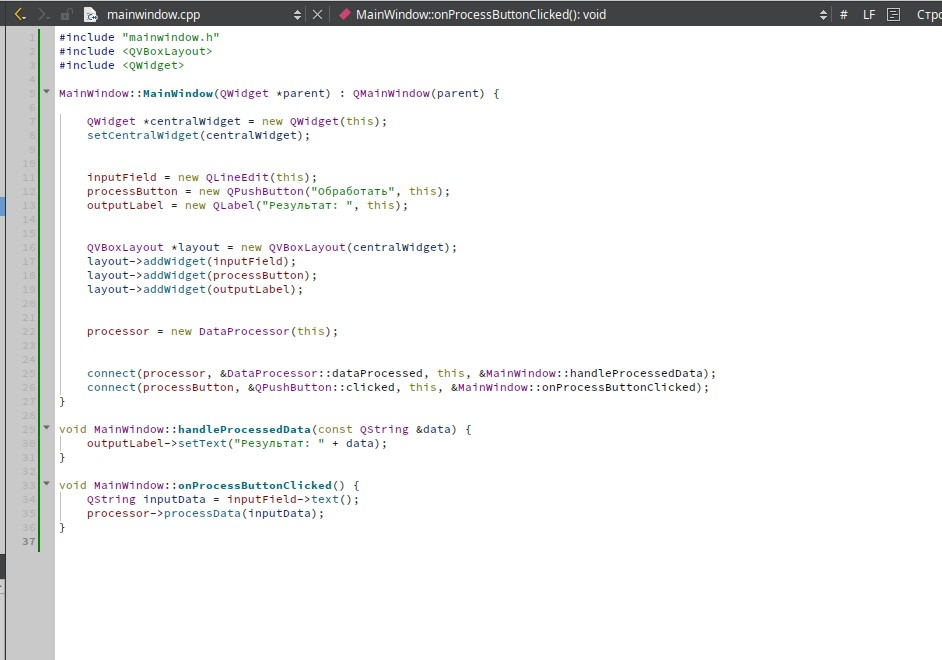

2.	Проверка работы.

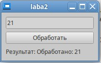

---

## Задания для самостоятельной работы
1. **Расширение функциональности обработки текста:**
   - Добавьте в приложение возможность выбирать несколько режимов обработки введённого текста (например, преобразование в нижний регистр, обратный порядок символов, удаление пробелов).
   - Реализуйте переключатель (QComboBox или набор радиокнопок) для выбора нужного режима обработки.
   - Организуйте сигналы и слоты так, чтобы при изменении режима обработки происходило обновление результата в реальном времени.
2. **Улучшение работы с QVariant:**
   - Расширьте обработку ввода, добавив проверку не только для чисел и дат, но и для вещественных чисел и логических значений.
   - Реализуйте функцию, которая принимает QVariant, определяет его тип и выполняет соответствующее преобразование (например, округление вещественных чисел или логическое отрицание для булевых значений).
   - Выведите результат обработки в QLabel с указанием типа данных.
3. **Создание цепочки обработки с использованием собственных сигналов и слотов:**
   - Создайте дополнительный класс (например, `AdvancedDataProcessor`), который будет наследоваться от QObject и содержать несколько слотов для последовательной обработки данных (например, сначала преобразование текста, затем форматирование и, наконец, логирование).
   - Организуйте цепочку сигналов и слотов между несколькими объектами так, чтобы результат одного этапа автоматически передавался на следующий.
   - Реализуйте вывод промежуточных результатов в отдельные QLabel на форме.
4. **Разработка диалогового окна для ввода и обработки данных:**
   - Создайте новое окно (QDialog), в котором пользователь сможет вводить данные и выбирать тип обработки.
   - Организуйте взаимодействие между основным окном приложения и диалоговым окном с помощью сигналов и слотов (например, по закрытию диалога результат передаётся в главное окно).
   - Реализуйте возможность повторного открытия диалогового окна без перезапуска приложения.

## Вопросы для самопроверки
1. Что представляют собой сигналы и слоты в Qt?
2. Как используется класс QVariant и в каких случаях он может быть полезен?
3. Какие существуют способы подключения сигналов к слотам и в чем преимущества нового синтаксиса подключения (с использованием указателей на методы)?
4. Каковы основные принципы создания собственных сигналов и слотов в классах, наследуемых от QObject?
