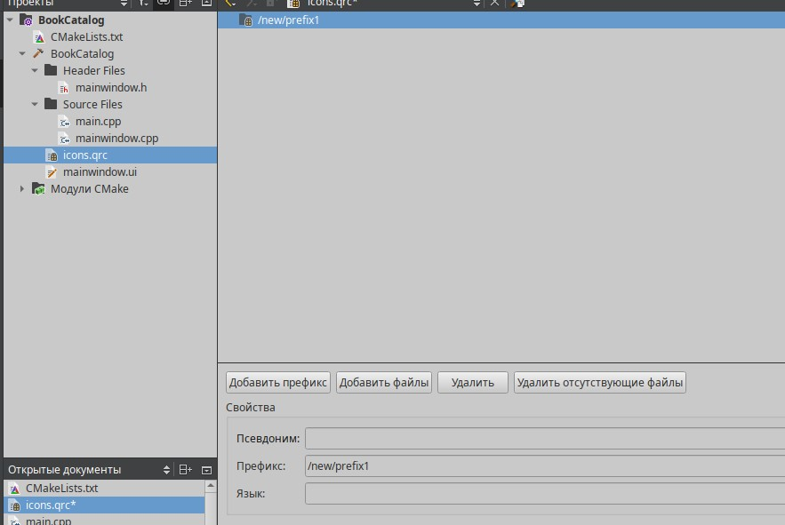

# ЛАБОРАТОРНАЯ РАБОТА №3

## РАЗРАБОТКА ИНТЕРФЕЙСА С ИСПОЛЬЗОВАНИЕМ СТАНДАРТНЫХ ВИДЖЕТОВ

### Цель работы:
На основе знаний, полученных в предыдущих лабораторных работах, разработать приложение "Книжный каталог" с графическим интерфейсом пользователя, используя стандартные виджеты Qt. Приложение должно позволять добавлять, просматривать, редактировать и удалять информацию о книгах.

---

## ФОРМИРОВАНИЕ ОТЧЕТА
В отчёте необходимо кратко изложить описание выполненных действий, приложить скриншоты настроек и результатов тестов. Также следует указать на возникшие в процессе работы проблемы и найденные способы их решения. Ответы на контрольные вопросы должны быть интегрированы в текст.

---

## ЧАСТЬ 1: Разработка интерфейса приложения
### Шаг 1. Инициализация проекта
1. Запустите Qt Creator и создайте новый проект **"Приложение Qt Widgets"**.

  

2. Укажите название проекта **"BookCatalog"** и выберите директорию.

  

3. Выберите систему сборки **CMake**.

  

4. Оставьте данные о классах по умолчанию.

  

5. Файл перевода оставьте пустым.

  

6. Выберите комплект для сборки (должен быть определен автоматически).

  

7. Завершите создание проекта, нажав "Завершить".

### Шаг 2. Разработка интерфейса
1. Откройте `mainwindow.ui` в редакторе форм **Qt Creator**.

  

2. Добавьте виджеты:
   - **QTableView** – для отображения каталога книг.

  

   - **QPushButton** – кнопки "Добавить", "Удалить", "Редактировать".

  

Нажмите на каждую кнопку и в редакторе свойств найдите свойство **text** в разделе **QAbstractButton**, в котором поменяйте текст на кнопке.
   
  

Также поменяйте название объектов для кнопок.

  

   - **QMenuBar** – с пунктами меню "Импорт", "Экспорт", "Выход".

Для этого в меню, где написано «Пишите здесь» нажмите два раза по этому значку и напишите «Действия», нажмите Enter.

  

Добавьте пункты меню «Импорт», «Экспорт», «Выход». Для этого нажмите на значок «Действия» и добавьте все эти пункты меню.

  

Должно получится как на картинке.

  

Измените иконки этих пунктов, для этого нужно создать файл ресурсов Qt, который будет называться «icons».

  

Далее нужно добавить префикс.

  

Создайте в папке проекта папку img, куда поместите 3 png картинки для иконок. Скачать их можно с сайта **flaticon**. 

  

Добавьте эти иконки в файл ресурсов Qt. 

  

Перейдите в `mainwindow.ui` и для каждого пункта прикрепите соответствующие иконки. Для этого в редакторе действий нажмите два раза на определенный пункт и поместите в него иконку. Нажимая **Choose Resource** выберите файлы из папки img.

  

Должно получится как на картинке.

  

### Шаг 3. Настройка QTableView и функционала кнопок
- Настроить модель данных (**QStandardItemModel**) для хранения информации о книгах (автор, название, год, жанр).
- Добавить функциональность кнопок:
  - **Добавление книги** – открывает диалоговое окно для ввода данных.
  - **Удаление книги** – удаляет выбранную книгу.
  - **Редактирование книги** – редактирует выбранную запись.

#### Код `mainwindow.h`
```cpp
#ifndef MAINWINDOW_H
#define MAINWINDOW_H
#include <QMainWindow>
#include <QStandardItemModel>
QT_BEGIN_NAMESPACE
namespace Ui { class MainWindow; }
QT_END_NAMESPACE

class MainWindow : public QMainWindow
{
    Q_OBJECT

public:
    MainWindow(QWidget *parent = nullptr);
    ~MainWindow();

private slots:
    void addBook();
    void editBook();
    void removeBook();

private:
    Ui::MainWindow *ui;
    QStandardItemModel *model;
    void setupModel();
};
#endif // MAINWINDOW_H
```

  

#### Код `mainwindow.cpp`
```cpp
#include "mainwindow.h"
#include "./ui_mainwindow.h"
#include <QInputDialog>
#include <QMessageBox>

MainWindow::MainWindow(QWidget *parent)
    : QMainWindow(parent)
    , ui(new Ui::MainWindow)
{
    ui->setupUi(this);
    setupModel();

        connect(ui->btnAdd, &QPushButton::clicked, this, &MainWindow::addBook);
        connect(ui->btnEdit, &QPushButton::clicked, this, &MainWindow::editBook);
        connect(ui->btnRemove, &QPushButton::clicked, this, &MainWindow::removeBook);
}

MainWindow::~MainWindow()
{
    delete ui;
}

void MainWindow::setupModel()
{
    model = new QStandardItemModel(this);
    model->setColumnCount(4);
    model->setHeaderData(0, Qt::Horizontal, "Автор");
    model->setHeaderData(1, Qt::Horizontal, "Название");
    model->setHeaderData(2, Qt::Horizontal, "Год");
    model->setHeaderData(3, Qt::Horizontal, "Жанр");

    ui->tableView->setModel(model);
}

void MainWindow::addBook()
{
    QString author = QInputDialog::getText(this, "Добавить книгу", "Автор:");
    if (author.isEmpty()) return;

    QString title = QInputDialog::getText(this, "Добавить книгу", "Название:");
    if (title.isEmpty()) return;

    int year = QInputDialog::getInt(this, "Добавить книгу", "Год издания:", 2000, 0, 2100);

    QString genre = QInputDialog::getText(this, "Добавить книгу", "Жанр:");
    if (genre.isEmpty()) return;

    QList<QStandardItem *> rowItems;
    rowItems << new QStandardItem(author)
             << new QStandardItem(title)
             << new QStandardItem(QString::number(year))
             << new QStandardItem(genre);

    model->appendRow(rowItems);
}

void MainWindow::editBook()
{
    QModelIndex index = ui->tableView->currentIndex();
    if (!index.isValid()) {
        QMessageBox::warning(this, "Ошибка", "Выберите книгу для редактирования");
        return;
    }

    QString newText = QInputDialog::getText(this, "Редактировать книгу", "Новое значение:", QLineEdit::Normal, model->item(index.row(), index.column())->text());
    if (!newText.isEmpty()) {
        model->setItem(index.row(), index.column(), new QStandardItem(newText));
    }
}

void MainWindow::removeBook()
{
    QModelIndex index = ui->tableView->currentIndex();
    if (!index.isValid()) {
        QMessageBox::warning(this, "Ошибка", "Выберите книгу для удаления");
        return;
    }

    model->removeRow(index.row());
}
```

  

---

## ЧАСТЬ 2: Реализация поиска по каталогу

### Шаг 1. Включите в интерфейс строку поиска (QLineEdit) и кнопку "Поиск"
- **QLineEdit** (`searchLineEdit`) – ввод поискового запроса.
- **QPushButton** (`searchButton`) – кнопка поиска.

  

### Шаг 2. Реализуйте фильтрацию отображаемых записей в QTableView, по ключевым словам, введенным в строку поиска.
#### Обновленный `mainwindow.h`
```cpp
#ifndef MAINWINDOW_H
#define MAINWINDOW_H
#include <QMainWindow>
#include <QStandardItemModel>
#include <QSortFilterProxyModel>

QT_BEGIN_NAMESPACE
namespace Ui { class MainWindow; }
QT_END_NAMESPACE

class MainWindow : public QMainWindow
{
    Q_OBJECT

public:
    MainWindow(QWidget *parent = nullptr);
    ~MainWindow();

private slots:
    void addBook();
    void editBook();
    void removeBook();
    void searchBooks();

private:
    Ui::MainWindow *ui;
    QStandardItemModel *model;
    QSortFilterProxyModel *proxyModel;
    void setupModel();
    void setupSearch();
};
#endif // MAINWINDOW_H
```

  

#### Добавляем поддержку поиска в `mainwindow.cpp`
```cpp
#include "mainwindow.h"
#include "./ui_mainwindow.h"
#include <QInputDialog>
#include <QMessageBox>
#include <QFileDialog>
#include <QTextStream>

MainWindow::MainWindow(QWidget *parent)
    : QMainWindow(parent)
    , ui(new Ui::MainWindow)
{
    ui->setupUi(this);
    setupModel();
    setupSearch();

    connect(ui->btnAdd, &QPushButton::clicked, this, &MainWindow::addBook);
    connect(ui->btnEdit, &QPushButton::clicked, this, &MainWindow::editBook);
    connect(ui->btnRemove, &QPushButton::clicked, this, &MainWindow::removeBook);
    connect(ui->searchButton, &QPushButton::clicked, this, &MainWindow::searchBooks);
}

MainWindow::~MainWindow()
{
    delete ui;
}

void MainWindow::setupModel()
{
    model = new QStandardItemModel(this);
    model->setColumnCount(4);
    model->setHeaderData(0, Qt::Horizontal, "Автор");
    model->setHeaderData(1, Qt::Horizontal, "Название");
    model->setHeaderData(2, Qt::Horizontal, "Год");
    model->setHeaderData(3, Qt::Horizontal, "Жанр");

    proxyModel = new QSortFilterProxyModel(this);
    proxyModel->setSourceModel(model);
    proxyModel->setFilterCaseSensitivity(Qt::CaseInsensitive); 
    proxyModel->setFilterKeyColumn(-1);

    ui->tableView->setModel(proxyModel);
}

void MainWindow::addBook()
{
    QString author = QInputDialog::getText(this, "Добавить книгу", "Автор:");
    if (author.isEmpty()) return;

    QString title = QInputDialog::getText(this, "Добавить книгу", "Название:");
    if (title.isEmpty()) return;

    int year = QInputDialog::getInt(this, "Добавить книгу", "Год издания:", 2000, 0, 2100);

    QString genre = QInputDialog::getText(this, "Добавить книгу", "Жанр:");
    if (genre.isEmpty()) return;

    QList<QStandardItem *> rowItems;
    rowItems << new QStandardItem(author)
             << new QStandardItem(title)
             << new QStandardItem(QString::number(year))
             << new QStandardItem(genre);

    model->appendRow(rowItems);
}

void MainWindow::editBook()
{
    QModelIndex index = ui->tableView->currentIndex();
    if (!index.isValid()) {
        QMessageBox::warning(this, "Ошибка", "Выберите книгу для редактирования");
        return;
    }

    QString newText = QInputDialog::getText(this, "Редактировать книгу", "Новое значение:", QLineEdit::Normal, model->item(index.row(), index.column())->text());
    if (!newText.isEmpty()) {
        model->setItem(index.row(), index.column(), new QStandardItem(newText));
    }
}

void MainWindow::removeBook()
{
    QModelIndex index = ui->tableView->currentIndex();
    if (!index.isValid()) {
        QMessageBox::warning(this, "Ошибка", "Выберите книгу для удаления");
        return;
    }

    model->removeRow(index.row());
}

void MainWindow::setupSearch()
{
}

void MainWindow::searchBooks()
{
    QString searchText = ui->searchLineEdit->text();
    proxyModel->setFilterFixedString(searchText);
}
```

  

  

---

## ЧАСТЬ 3: Импорт и экспорт каталога
### Реализуйте возможность сохранения каталога книг в файл и загрузки из файла через пункты меню в QMenuBar.

Используйте форматы файлов, такие как CSV или JSON, для хранения данных.
Измените названия объектов для пунктов.

  

#### Добавьте объявления слота для экспорта и импорта CSV в `mainwindow.h`
```cpp
private slots:
    void importCSV();
    void exportCSV();
```

  

#### Добавьте код для обработки пунктов экспорта, импорта и выхода в `mainwindow.cpp`

Для экспорта. 

```cpp
#include <QFileDialog> 
#include <QTextStream>
void MainWindow::exportCSV()
{
    QString fileName = QFileDialog::getSaveFileName(this, "Экспорт в CSV", "", "CSV Files (*.csv)");
    if (fileName.isEmpty()) {

        return;
    }

    if (!fileName.endsWith(".csv", Qt::CaseInsensitive)) {
        fileName += ".csv";
    }

    QFile file(fileName);
    if (!file.open(QIODevice::WriteOnly | QIODevice::Text)) {
        QMessageBox::warning(this, "Ошибка", "Не удалось сохранить файл");
        return;
    }

    QTextStream out(&file);

    for (int row = 0; row < model->rowCount(); ++row) {
        QStringList fields;
        for (int col = 0; col < model->columnCount(); ++col) {
            QString text = model->item(row, col)->text();
            text.replace("\"", "\"\"");  
            fields.append('"' + text + '"');
        }
        out << fields.join(",") << "\n";
    }

    file.close();
    QMessageBox::information(this, "Экспорт", "Файл сохранён успешно!");
}
```

  

Для импорта 

```cpp
void MainWindow::importCSV()
{
    QString fileName = QFileDialog::getOpenFileName(this, "Импорт CSV", "", "CSV Files (*.csv)");
        if (fileName.isEmpty()) {

            return;
        }

        QFile file(fileName);
        if (!file.open(QIODevice::ReadOnly | QIODevice::Text)) {
            QMessageBox::warning(this, "Ошибка", "Не удалось открыть файл");
            return;
        }

        QTextStream in(&file);
        model->clear();
        setupModel();

        int rowCount = 0;
        while (!in.atEnd()) {
            QString line = in.readLine();
            QStringList fields = line.split(",");

            if (fields.size() != 4) {  
                continue;
            }

            QList<QStandardItem *> rowItems;
            for (const QString &field : fields)
                rowItems.append(new QStandardItem(field.trimmed()));

            model->appendRow(rowItems);
            rowCount++;
        }

        file.close();

        if (rowCount == 0) {
            QMessageBox::information(this, "Импорт CSV", "Файл загружен, но он пуст.");
        } else {
            QMessageBox::information(this, "Импорт CSV", "Файл успешно загружен: " + fileName);
        }
}
```

  

Соедините сигналы наших пунктов

```cpp
    connect(ui->actionImportCSV, &QAction::triggered, this, &MainWindow::importCSV);
    connect(ui->actionExportCSV, &QAction::triggered, this, &MainWindow::exportCSV);
    connect(ui->actionExit, &QAction::triggered, this, &QApplication::quit);
```

  

---

## ОЖИДАЕМЫЕ РЕЗУЛЬТАТЫ
К завершению работы над лабораторной у вас должно получиться приложение, позволяющее эффективно управлять каталогом книг. Пользователь может добавлять новые книги, удалять и редактировать существующие записи, а также искать книги по названию или автору. Дополнительно реализованы функции импорта и экспорта каталога, что делает приложение полнофункциональным инструментом для ведения книжного каталога.

1. Первоначальное окно

  

2. Добавление информации о книге

  

  

  

  

  

3. Редактирование

  

  

  

4.Поиск

  

  

5. Экспорт

  

  

  

6. Импорт

  

  

  

---

### Приложение "Книжный каталог" завершено!

Ниже приведены примеры заданий для самостоятельной работы, а также вопросы для самопроверки, которые помогут углубить понимание принципов работы с виджетами, моделями и механизмами импорта/экспорта в Qt.

---

## Задания для самостоятельной работы
1. **Расширение функциональности поиска и сортировки:**
   - Реализуйте дополнительную фильтрацию, позволяющую искать книги не только по общему ключевому слову, но и по отдельным полям (например, автор или жанр).  
   - Добавьте возможность сортировки данных по столбцам (например, по году издания или по алфавиту) с использованием виджетов, таких как QHeaderView.
2. **Редактирование через диалоговое окно:**
   - Создайте отдельное диалоговое окно для редактирования данных книги, в котором пользователь сможет изменять все поля записи.  
   - Обеспечьте валидацию вводимых данных (например, проверку корректности года издания или обязательность заполнения полей).
3. **Работа с альтернативными форматами данных:**
   - Расширьте функционал импорта/экспорта, добавив поддержку формата JSON для сохранения и загрузки каталога.  
   - Сравните особенности работы с CSV и JSON, продемонстрируйте преимущества каждого подхода в зависимости от задачи.
4. **Добавление новых параметров для книги:**
   - Модифицируйте модель данных, добавив дополнительные поля, например, «Издательство», «ISBN» или «Количество страниц».  
   - Обновите интерфейс, обеспечив корректное отображение и редактирование новых данных, а также добавьте функционал поиска по этим параметрам.

---

## Вопросы для самопроверки
1. Какова роль модели QStandardItemModel в реализации книжного каталога и чем она отличается от других моделей MVC в Qt?
2. Что представляет собой QSortFilterProxyModel и как он используется для реализации поиска и сортировки данных?
3. Какие преимущества и недостатки существуют у форматов CSV и JSON для хранения и обмена данными?
4. Какие меры можно предпринять для валидации вводимых пользователем данных в диалоговом окне редактирования, и почему это важно?
