# ЛАБОРАТОРНАЯ РАБОТА №4
## СОЗДАНИЕ КАСТОМНОГО ВИДЖЕТА С ПЕРЕОПРЕДЕЛЕНИЕМ СОБЫТИЙ ОТРИСОВКИ

---

## Цель работы
Научиться создавать кастомные виджеты в Qt, используя механизмы переопределения событий отрисовки. Разработать приложение, которое демонстрирует использование созданного кастомного виджета.

---

## Задание
Разработка кастомного виджета "Индикатор выполнения".

---

## ФОРМИРОВАНИЕ ОТЧЕТА
В отчёте по лабораторной работе необходимо кратко изложить описание выполненных действий с использованием соответствующих команд, приложить скриншоты настроек и результатов тестов для наглядности. Также следует указать на возникшие в процессе работы проблемы и описать найденные способы их решения. В случае наличия контрольных вопросов, ответы на них должны быть интегрированы в текст.

---

## ЧАСТЬ 1 - Детальные инструкции к выполнению

### Шаг 1. Создание класса кастомного виджета
1. Создайте новый класс C++. В созданном проекте нажмите правой кнопкой мыши по папке `Source Files` и выберите `Add New`.

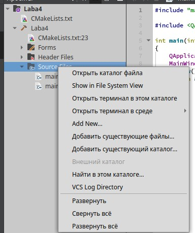  

2. Назовите класс `ProgressIndicator`.

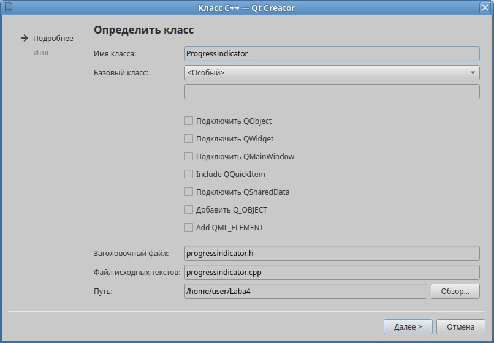  

3. Измените код в файле `progressindicator.h`. Наследуйте его от `QWidget`.

```cpp
#ifndef PROGRESSINDICATOR_H
#define PROGRESSINDICATOR_H

#include <QWidget>
#include <QPainter>
#include <QWheelEvent>

class ProgressIndicator : public QWidget
{
    Q_OBJECT

public:
    explicit ProgressIndicator(QWidget *parent = nullptr);
};

#endif // PROGRESSINDICATOR_H
```

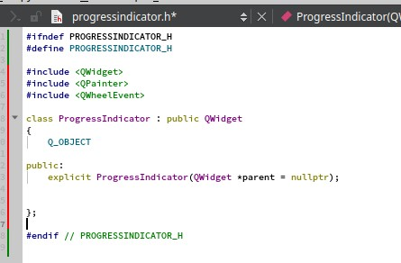  

### Шаг 2. Переопределение метода отрисовки
В классе `ProgressIndicator` переопределите метод `paintEvent(QPaintEvent *event)`для отрисовки индикатора выполнения. Используйте `QPainter` для рисования индикатора.

Добавьте в `progressindicator.h` следующее:

```cpp
protected:
    void paintEvent(QPaintEvent *event) override;
```

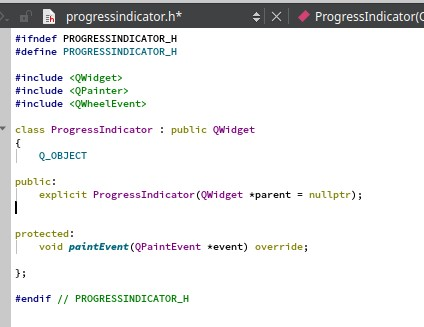  

Добавьте в `progressindicator.cpp` следующее:

```cpp
void ProgressIndicator::paintEvent(QPaintEvent *event)
{
    Q_UNUSED(event);

    QPainter painter(this);
    painter.setRenderHint(QPainter::Antialiasing);

    int side = qMin(width(), height());
    QRectF outerRect(0, 0, side, side);
    outerRect.moveCenter(rect().center());

    painter.setPen(Qt::NoPen);
    painter.setBrush(Qt::gray);
    painter.drawEllipse(outerRect);

    painter.setBrush(Qt::blue);
    int spanAngle = static_cast<int>(360 * (static_cast<double>(m_progressValue - m_minimumValue) / (m_maximumValue - m_minimumValue)));
    painter.drawPie(outerRect, 90 * 16, -spanAngle * 16);

    painter.setPen(Qt::white);
    QFont font = painter.font();
    int fontSize = static_cast<int>(side * 0.15);
    font.setPointSize(fontSize);
    painter.setFont(font);

    QString progressText = QString("%1%").arg((static_cast<double>(m_progressValue - m_minimumValue) / (m_maximumValue - m_minimumValue)) * 100, 0, 'f', 1);

    QRectF textRect = outerRect;
    textRect.adjust(10, 10, -10, -10);
    painter.drawText(textRect, Qt::AlignCenter, progressText);
}
```

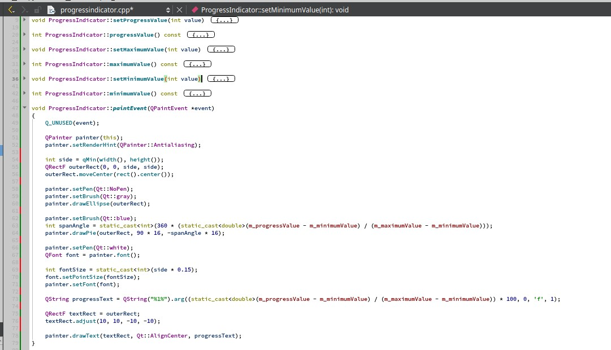  

### Шаг 3. Добавление свойств виджета
1. Добавьте в класс `ProgressIndicator` свойства, такие как `progressValue` (текущее значение прогресса), `maximumValue` (максимальное значение) и `minimumValue` (минимальное значение).

Измените файл `progressindicator.h` на следующее содержание:

```cpp
#ifndef PROGRESSINDICATOR_H
#define PROGRESSINDICATOR_H

#include <QWidget>
#include <QPainter>
#include <QWheelEvent>

class ProgressIndicator : public QWidget
{
    Q_OBJECT

public:
    explicit ProgressIndicator(QWidget *parent = nullptr);

    void setProgressValue(int value);
    int progressValue() const;

    void setMaximumValue(int value);
    int maximumValue() const;

    void setMinimumValue(int value);
    int minimumValue() const;

protected:
    void paintEvent(QPaintEvent *event) override;

private:
    int m_progressValue;
    int m_maximumValue;
    int m_minimumValue;
};
#endif // PROGRESSINDICATOR_H
```

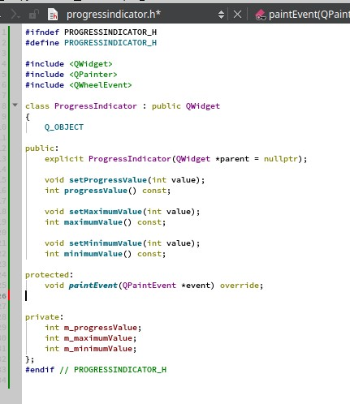  

2. Реализуйте методы для работы со свойствами.

Добавьте в `progressindicator.cpp` следующее:

```cpp
ProgressIndicator::ProgressIndicator(QWidget *parent)
    : QWidget(parent), m_progressValue(0), m_maximumValue(100), m_minimumValue(0)
{
    setSizePolicy(QSizePolicy::Expanding, QSizePolicy::Expanding);
}

void ProgressIndicator::setProgressValue(int value)
{
    if (value < m_minimumValue)
        value = m_minimumValue;
    if (value > m_maximumValue)
        value = m_maximumValue;

    m_progressValue = value;
    update();
}

int ProgressIndicator::progressValue() const
{
    return m_progressValue;
}

void ProgressIndicator::setMaximumValue(int value)
{
    m_maximumValue = value;
    update();
}

int ProgressIndicator::maximumValue() const
{
    return m_maximumValue;
}

void ProgressIndicator::setMinimumValue(int value)
{
    m_minimumValue = value;
    update();
}

int ProgressIndicator::minimumValue() const
{
    return m_minimumValue;
}
```

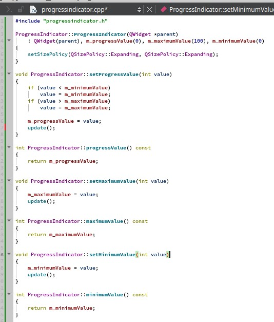 

### Шаг 4. Реализация интерактивности
Добавьте возможность изменять значение прогресса через колесо мыши.

Добавьте в `progressindicator.h` следующее:

```cpp
protected:
    void wheelEvent(QWheelEvent *event) override;
```

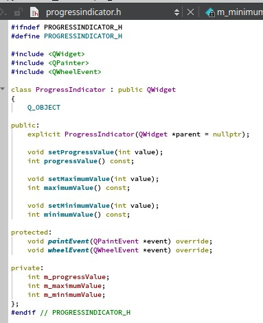 

Добавьте в `progressindicator.cpp` следующее:

```cpp
void ProgressIndicator::wheelEvent(QWheelEvent *event)
{
    int delta = event->angleDelta().y() / 120;
    setProgressValue(m_progressValue + delta);
}
```

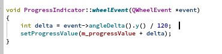 

---

## ЧАСТЬ 2 - Интеграция кастомного виджета в приложение

### Шаг 1. Создание главного окна приложения
1. Используйте `QMainWindow` или `QWidget` в качестве контейнера для вашего кастомного виджета. Создайте новые файлы `mainwindow.h` и `mainwindow.cpp` для реализации главного окна.

Добавьте в `mainwindow.h` следующее:

```cpp
#ifndef MAINWINDOW_H
#define MAINWINDOW_H

#include <QMainWindow>
#include <QSlider>
#include <QVBoxLayout>
#include "progressindicator.h"

class MainWindow : public QMainWindow
{
    Q_OBJECT

public:
    MainWindow(QWidget *parent = nullptr);
    ~MainWindow();

private:
    ProgressIndicator *progressIndicator;
    QSlider *slider;
};

#endif // MAINWINDOW_H
```

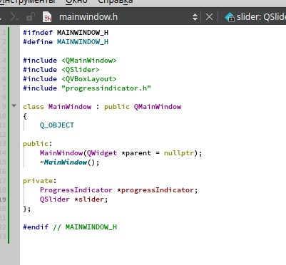 

Реализуйте `mainwindow.cpp`:

```cpp
#include "mainwindow.h"
MainWindow::MainWindow(QWidget *parent)
    : QMainWindow(parent)
{
    progressIndicator = new ProgressIndicator(this);

    slider = new QSlider(Qt::Horizontal, this);
    slider->setRange(0, 100);
    slider->setValue(0); 

    QVBoxLayout *layout = new QVBoxLayout();
    layout->addWidget(progressIndicator);
    layout->addWidget(slider);

    QWidget *centralWidget = new QWidget(this);
    centralWidget->setLayout(layout);
    setCentralWidget(centralWidget);

    connect(slider, &QSlider::valueChanged, progressIndicator, &ProgressIndicator::setProgressValue);
}

MainWindow::~MainWindow()
{
}
```

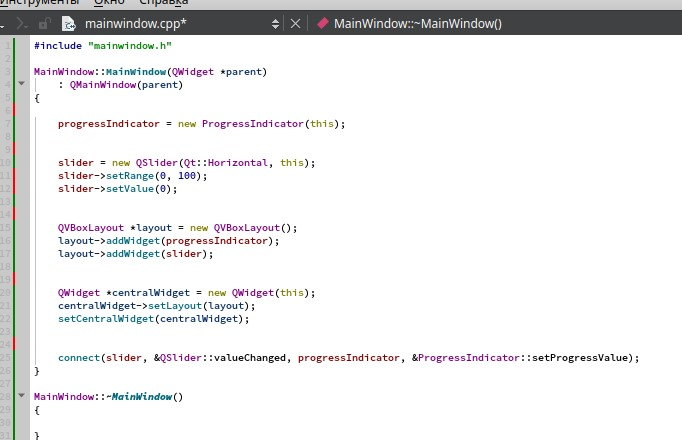 

### Шаг 2. Тестирование приложения
1. Создадим файл `main.cpp` для запуска приложения и тестирования виджета.

```cpp
#include <QApplication>
#include "mainwindow.h"

int main(int argc, char *argv[])
{
    QApplication app(argc, argv);

    MainWindow mainWindow;
    mainWindow.show();

    return app.exec();
}
```

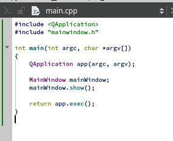 

2.	Реализуйте изменение значения индикатора выполнения через предоставленный интерфейс и убедитесь, что отрисовка индикатора корректно обновляется.

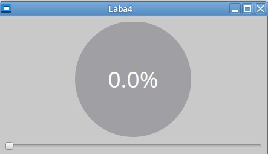

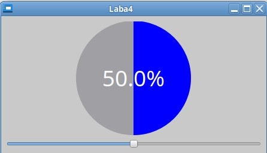

Также с помощью колесика.

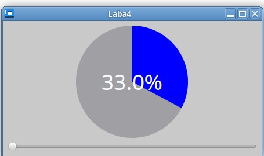

---

## Задание для самостоятельной работы
1. Создать класс `SpiralProgressIndicator`, наследующийся от `QWidget`.
2. Реализовать отрисовку спирального индикатора прогресса с использованием `QPainter`.
3. Добавить свойства для управления минимальным, максимальным и текущим значениями прогресса.
4. Реализовать анимацию изменения значения прогресса.
5. Добавить изменение значения с помощью колесика мыши и слайдера.
6. Отображать текущее значение прогресса в виде текста в центре спирали.

Примерный вариант:

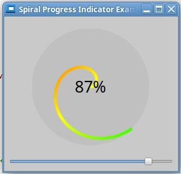

---

## Вопросы для самопроверки
1. Что такое кастомный виджет в Qt?
2. Какие преимущества предоставляет использование `QPainter` для отрисовки виджетов?
3. Как реализовать изменение значения индикатора через колесико мыши?
4. Как можно оптимизировать производительность кастомного виджета?

