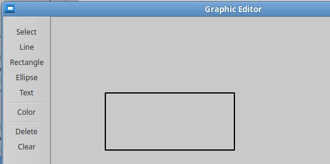
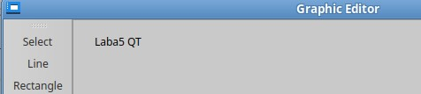
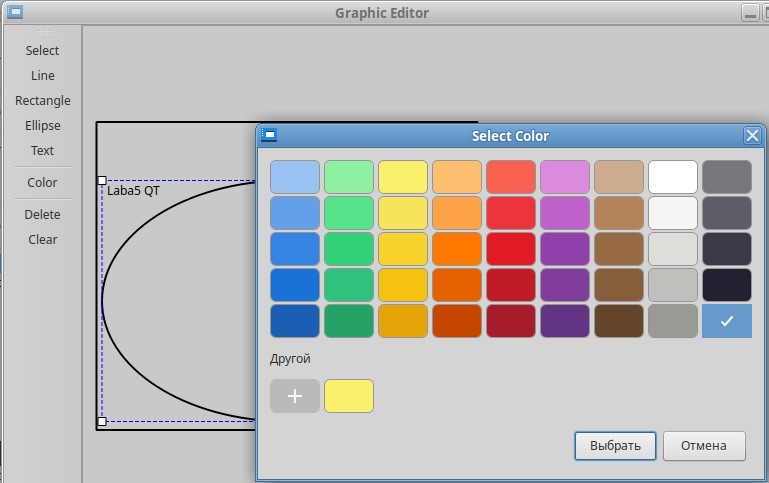

# ЛАБОРАТОРНАЯ РАБОТА №5
## РАБОТА С ГРАФИЧЕСКИМИ ПРИМИТИВАМИ, ИСПОЛЬЗОВАНИЕ MVC

---

## Цель работы
Изучить принципы работы с графическими примитивами в Qt и освоить паттерн Model-View-Controller (MVC) на практике. Разработать приложение, демонстрирующее отрисовку графических элементов и их взаимодействие с моделью данных.

---

## Задание
Разработка приложения "Графический редактор".

---

## ФОРМИРОВАНИЕ ОТЧЕТА
В отчёте по лабораторной работе необходимо кратко изложить описание выполненных действий с использованием соответствующих команд, приложить скриншоты настроек и результатов тестов для наглядности. Также следует указать на возникшие в процессе работы проблемы и описать найденные способы их решения. В случае наличия контрольных вопросов, ответы на них должны быть интегрированы в текст.

---

## ЧАСТЬ 1 - Детальные инструкции к выполнению

### Шаг 1. Инициализация проекта.
1. Создайте новый проект "Приложение Qt Widgets" в Qt Creator и назовите его "GraphicEditor".

  

### Шаг 2. Реализация интерфейса редактора(View)
Для того, чтобы пользователь взаимодействовал с графическим редактором, нужно выполнить следующие пункты:
1.	Создать главное окно с областью рисования (`QGraphicsView`) и панелью инструментов (`QToolBar`).
2.	Добавить кнопки для создания фигур (линия, прямоугольник и т.д.) и инструменты для изменения цвета и удаления.
3.	Настроить отображение, для этого включаем сглаживание (`Antialiasing`) и режим выделения прямоугольником (`RubberBandDrag`).

Добавьте в `mainwindow.h` следующее:

```cpp
#ifndef MAINWINDOW_H
#define MAINWINDOW_H

#include <QMainWindow>
#include <QGraphicsView>
#include <QToolBar>
#include <QColorDialog>
#include <QInputDialog>
#include <QKeyEvent>
#include "graphicmodel.h"
#include "graphiccontroller.h"

class MainWindow : public QMainWindow {
    Q_OBJECT
public:
    MainWindow(QWidget* parent = nullptr);
    ~MainWindow();

protected:
    void keyPressEvent(QKeyEvent* event) override;

private slots:
    void onSelectAction();
    void onLineAction();
    void onRectAction();
    void onEllipseAction();
    void onTextAction();
    void onColorAction();
    void onDeleteAction();
    void onClearAction();

    void handleMousePressed(const QPointF& pos);
    void handleMouseMoved(const QPointF& pos);
    void handleMouseReleased();

private:
    void setupUI();
    void setupToolBar();
    void setupConnections();

    QGraphicsView* view;
    QToolBar* toolBar;

    GraphicModel* model;
    GraphicController* controller;
};

#endif // MAINWINDOW_H

```

Добавьте в `mainwindow.cpp` следующее:

```cpp
#include "mainwindow.h"

MainWindow::MainWindow(QWidget* parent) : QMainWindow(parent) {
    model = new GraphicModel(this);
    controller = new GraphicController(model, this);

    setupUI();
    setupToolBar();
    setupConnections();
}

MainWindow::~MainWindow() {}

void MainWindow::setupUI() {
    view = new QGraphicsView(this);
    view->setScene(model->getScene());
    view->setRenderHint(QPainter::Antialiasing);
    view->setDragMode(QGraphicsView::RubberBandDrag);
    view->setInteractive(true);
    setCentralWidget(view);

    toolBar = new QToolBar("Tools", this);
    addToolBar(Qt::LeftToolBarArea, toolBar);
}

void MainWindow::setupToolBar() {
    QAction* selectAction = toolBar->addAction("Select");
    QAction* lineAction = toolBar->addAction("Line");
    QAction* rectAction = toolBar->addAction("Rectangle");
    QAction* ellipseAction = toolBar->addAction("Ellipse");
    QAction* textAction = toolBar->addAction("Text");
    toolBar->addSeparator();
    QAction* colorAction = toolBar->addAction("Color");
    toolBar->addSeparator();
    QAction* deleteAction = toolBar->addAction("Delete");
    QAction* clearAction = toolBar->addAction("Clear");

    connect(selectAction, &QAction::triggered, this, &MainWindow::onSelectAction);
    connect(lineAction, &QAction::triggered, this, &MainWindow::onLineAction);
    connect(rectAction, &QAction::triggered, this, &MainWindow::onRectAction);
    connect(ellipseAction, &QAction::triggered, this, &MainWindow::onEllipseAction);
    connect(textAction, &QAction::triggered, this, &MainWindow::onTextAction);
    connect(colorAction, &QAction::triggered, this, &MainWindow::onColorAction);
    connect(deleteAction, &QAction::triggered, this, &MainWindow::onDeleteAction);
    connect(clearAction, &QAction::triggered, this, &MainWindow::onClearAction);
}

void MainWindow::setupConnections() {
    connect(model->getScene(), &CustomGraphicsScene::sceneMousePressed,
            this, &MainWindow::handleMousePressed);
    connect(model->getScene(), &CustomGraphicsScene::sceneMouseMoved,
            this, &MainWindow::handleMouseMoved);
    connect(model->getScene(), &CustomGraphicsScene::sceneMouseReleased,
            this, &MainWindow::handleMouseReleased);
}

void MainWindow::onSelectAction() {
    controller->setEditorMode(EditorMode::Select);
    view->setDragMode(QGraphicsView::RubberBandDrag);
}

void MainWindow::onLineAction() {
    controller->setEditorMode(EditorMode::CreateLine);
    view->setDragMode(QGraphicsView::NoDrag);
}

void MainWindow::onRectAction() {
    controller->setEditorMode(EditorMode::CreateRect);
    view->setDragMode(QGraphicsView::NoDrag);
}

void MainWindow::onEllipseAction() {
    controller->setEditorMode(EditorMode::CreateEllipse);
    view->setDragMode(QGraphicsView::NoDrag);
}

void MainWindow::onTextAction() {
    controller->setEditorMode(EditorMode::CreateText);
    view->setDragMode(QGraphicsView::NoDrag);
}

void MainWindow::onColorAction() {
    QColor color = QColorDialog::getColor(controller->getCurrentColor(),
                                        this, "Select Color");
    if (color.isValid()) {
        controller->setCurrentColor(color);
        controller->changeSelectedItemsColor(color);
    }
}

void MainWindow::onDeleteAction() {
    controller->deleteSelectedItems();
}

void MainWindow::onClearAction() {
    controller->clearAll();
}

void MainWindow::keyPressEvent(QKeyEvent* event) {
    if (event->key() == Qt::Key_Delete) {
        controller->deleteSelectedItems();
    }
    QMainWindow::keyPressEvent(event);
}

void MainWindow::handleMousePressed(const QPointF& pos) {
    controller->mousePressed(pos);
}

void MainWindow::handleMouseMoved(const QPointF& pos) {
    controller->mouseMoved(pos);
}

void MainWindow::handleMouseReleased() {
    controller->mouseReleased();
}

```

### Шаг 3.  Создание модели данных(Model)
Модель отвечает за хранение данных и бизнес-логику приложения.
1.	Нужно разработать базовый класс `Shape` где определить общие свойства всех фигур (координаты, цвет), реализовать методы отрисовки (paint) и обработки событий.
2.	Нужно создать класс `GraphicModel`,который хранит список всех фигур на сцене, управляет `QGraphicsScene` (контейнер для графических элементов) и предоставляет методы для добавления/удаления фигур.

Добавьте в `shape.h` следующее: 

```cpp
#ifndef SHAPE_H
#define SHAPE_H

#include <QGraphicsItem>
#include <QPainter>
#include <QColor>
#include <QGraphicsSceneMouseEvent>

enum class ShapeType { Line, Rectangle, Ellipse, Text };

class Shape : public QGraphicsItem {
public:
    Shape(ShapeType type, const QPointF& startPos, const QColor& color, QGraphicsItem* parent = nullptr);

    QRectF boundingRect() const override;
    void paint(QPainter* painter, const QStyleOptionGraphicsItem* option, QWidget* widget = nullptr) override;

    void setEndPos(const QPointF& endPos);
    void setText(const QString& text);
    void setColor(const QColor& color);
    void setEditing(bool editing);

    ShapeType getType() const;
    QColor getColor() const;
    QString getText() const;

protected:
    void mousePressEvent(QGraphicsSceneMouseEvent* event) override;
    void mouseMoveEvent(QGraphicsSceneMouseEvent* event) override;
    void mouseReleaseEvent(QGraphicsSceneMouseEvent* event) override;
    void hoverMoveEvent(QGraphicsSceneHoverEvent* event) override;

private:
    enum ResizeHandle { None, TopLeft, TopRight, BottomLeft, BottomRight };
    ResizeHandle getResizeHandle(const QPointF& pos) const;
    QRectF getHandleRect(ResizeHandle handle) const;

    ShapeType type;
    QPointF startPos;
    QPointF endPos;
    QColor color;
    QString text;
    bool isEditing;
    ResizeHandle currentHandle;
    bool isResizing;
    QPointF resizeStartPos;
    QPointF resizeStartEnd;
};

#endif // SHAPE_H

```

Добавьте в `shape.cpp` следующее:

```cpp
#include "shape.h"
#include <QCursor>
#include <QGraphicsSceneMouseEvent>

Shape::Shape(ShapeType type, const QPointF& startPos, const QColor& color, QGraphicsItem* parent)
    : QGraphicsItem(parent), type(type), startPos(startPos), endPos(startPos),
      color(color), isEditing(false), currentHandle(None), isResizing(false) {
    setFlags(QGraphicsItem::ItemIsSelectable | QGraphicsItem::ItemIsMovable);
    setAcceptHoverEvents(true);
}

QRectF Shape::boundingRect() const {
    QRectF rect(startPos, endPos);
    rect = rect.normalized().adjusted(-10, -10, 10, 10);
    return rect;
}

void Shape::paint(QPainter* painter, const QStyleOptionGraphicsItem* option, QWidget* widget) {
    Q_UNUSED(option);
    Q_UNUSED(widget);

    painter->setPen(QPen(color, 2));

    switch(type) {
    case ShapeType::Line:
        painter->drawLine(startPos, endPos);
        break;
    case ShapeType::Rectangle:
        painter->drawRect(QRectF(startPos, endPos));
        break;
    case ShapeType::Ellipse:
        painter->drawEllipse(QRectF(startPos, endPos));
        break;
    case ShapeType::Text:
        if (!isEditing) {
            painter->drawText(startPos, text);
        }
        break;
    }

    if (isSelected() || isEditing) {
        painter->setPen(QPen(Qt::blue, 1, Qt::DashLine));
        QRectF rect(startPos, endPos);
        painter->drawRect(rect);

        if (type != ShapeType::Text) {
            painter->setBrush(Qt::white);
            painter->setPen(QPen(Qt::black, 1));

            for (int i = 1; i <= 4; ++i) {
                QRectF handle = getHandleRect(static_cast<ResizeHandle>(i));
                painter->drawRect(handle);
            }
        }
    }
}

Shape::ResizeHandle Shape::getResizeHandle(const QPointF& pos) const {
    if (type == ShapeType::Text) return None;

    for (int i = 1; i <= 4; ++i) {
        ResizeHandle handle = static_cast<ResizeHandle>(i);
        if (getHandleRect(handle).contains(pos)) {
            return handle;
        }
    }
    return None;
}

QRectF Shape::getHandleRect(ResizeHandle handle) const {
    QRectF rect(startPos, endPos);
    rect = rect.normalized();
    const qreal handleSize = 8;

    switch(handle) {
    case TopLeft:     return QRectF(rect.topLeft() - QPointF(handleSize/2, handleSize/2),
                                   QSizeF(handleSize, handleSize));
    case TopRight:    return QRectF(rect.topRight() - QPointF(handleSize/2, handleSize/2),
                                   QSizeF(handleSize, handleSize));
    case BottomLeft:  return QRectF(rect.bottomLeft() - QPointF(handleSize/2, handleSize/2),
                                   QSizeF(handleSize, handleSize));
    case BottomRight: return QRectF(rect.bottomRight() - QPointF(handleSize/2, handleSize/2),
                                   QSizeF(handleSize, handleSize));
    default: return QRectF();
    }
}

void Shape::setEndPos(const QPointF& endPos) {
    prepareGeometryChange();
    this->endPos = endPos;
    update();
}

void Shape::setText(const QString& text) {
    this->text = text;
    update();
}

void Shape::setColor(const QColor& color) {
    this->color = color;
    update();
}

void Shape::setEditing(bool editing) {
    isEditing = editing;
    update();
}

ShapeType Shape::getType() const { return type; }
QColor Shape::getColor() const { return color; }
QString Shape::getText() const { return text; }

void Shape::mousePressEvent(QGraphicsSceneMouseEvent* event) {
    if (event->button() == Qt::LeftButton) {
        currentHandle = getResizeHandle(event->pos());
        isResizing = (currentHandle != None);

        if (isResizing) {
            resizeStartPos = startPos;
            resizeStartEnd = endPos;
        }
    }
    QGraphicsItem::mousePressEvent(event);
}

void Shape::mouseMoveEvent(QGraphicsSceneMouseEvent* event) {
    if (isResizing && (event->buttons() & Qt::LeftButton)) {
        prepareGeometryChange();
        QPointF delta = event->scenePos() - event->lastScenePos();

        switch(currentHandle) {
        case TopLeft:
            startPos += delta;
            break;
        case TopRight:
            endPos.setX(endPos.x() + delta.x());
            startPos.setY(startPos.y() + delta.y());
            break;
        case BottomLeft:
            startPos.setX(startPos.x() + delta.x());
            endPos.setY(endPos.y() + delta.y());
            break;
        case BottomRight:
            endPos += delta;
            break;
        default:
            break;
        }
        update();
    } else {
        QGraphicsItem::mouseMoveEvent(event);
    }
}

void Shape::mouseReleaseEvent(QGraphicsSceneMouseEvent* event) {
    isResizing = false;
    currentHandle = None;
    QGraphicsItem::mouseReleaseEvent(event);
}

void Shape::hoverMoveEvent(QGraphicsSceneHoverEvent* event) {
    ResizeHandle handle = getResizeHandle(event->pos());

    switch(handle) {
    case TopLeft:
    case BottomRight:
        setCursor(Qt::SizeFDiagCursor);
        break;
    case TopRight:
    case BottomLeft:
        setCursor(Qt::SizeBDiagCursor);
        break;
    default:
        setCursor(Qt::ArrowCursor);
    }

    QGraphicsItem::hoverMoveEvent(event);
}

```

Добавьте в `graphicmodel.h` следующее:

```cpp
#ifndef GRAPHICMODEL_H
#define GRAPHICMODEL_H

#include <QObject>
#include <QList>
#include "customgraphicsscene.h"
#include "shape.h"

class GraphicModel : public QObject {
    Q_OBJECT
public:
    explicit GraphicModel(QObject* parent = nullptr);

    void addShape(ShapeType type, const QPointF& startPos, const QColor& color);
    void removeShape(Shape* shape);
    void clear();

    QList<Shape*> getShapes() const;
    CustomGraphicsScene* getScene() const;

signals:
    void sceneUpdated();

private:
    CustomGraphicsScene* scene;
    QList<Shape*> shapes;
};

#endif // GRAPHICMODEL_H

```

Добавьте в `graphicmodel.cpp` следующее:

```cpp
#include "graphicmodel.h"

GraphicModel::GraphicModel(QObject* parent) : QObject(parent) {
    scene = new CustomGraphicsScene(this);
    scene->setSceneRect(-500, -500, 1000, 1000);
}

void GraphicModel::addShape(ShapeType type, const QPointF& startPos, const QColor& color) {
    Shape* shape = new Shape(type, startPos, color);
    shapes.append(shape);
    scene->addItem(shape);
    emit sceneUpdated();
}

void GraphicModel::removeShape(Shape* shape) {
    if (shapes.removeOne(shape)) {
        scene->removeItem(shape);
        delete shape;
        emit sceneUpdated();
    }
}

void GraphicModel::clear() {
    for (Shape* shape : shapes) {
        scene->removeItem(shape);
        delete shape;
    }
    shapes.clear();
    emit sceneUpdated();
}

QList<Shape*> GraphicModel::getShapes() const {
    return shapes;
}

CustomGraphicsScene* GraphicModel::getScene() const {
    return scene;
}

```

Добавьте в `customgraphicsscene.h` следующее:

```cpp
#ifndef CUSTOMGRAPHICSSCENE_H
#define CUSTOMGRAPHICSSCENE_H

#include <QGraphicsScene>
#include <QGraphicsSceneMouseEvent>

class CustomGraphicsScene : public QGraphicsScene
{
    Q_OBJECT
public:
    explicit CustomGraphicsScene(QObject *parent = nullptr);

signals:
    void sceneMousePressed(const QPointF &pos);
    void sceneMouseMoved(const QPointF &pos);
    void sceneMouseReleased();

protected:
    void mousePressEvent(QGraphicsSceneMouseEvent *event) override;
    void mouseMoveEvent(QGraphicsSceneMouseEvent *event) override;
    void mouseReleaseEvent(QGraphicsSceneMouseEvent *event) override;
};

#endif // CUSTOMGRAPHICSSCENE_H

```

Добавьте в `customgraphicsscene.cpp` следующее:
```cpp
#include "customgraphicsscene.h"

CustomGraphicsScene::CustomGraphicsScene(QObject *parent) 
    : QGraphicsScene(parent)
{
}

void CustomGraphicsScene::mousePressEvent(QGraphicsSceneMouseEvent *event)
{
    QGraphicsScene::mousePressEvent(event);
    if (!event->isAccepted()) {
        emit sceneMousePressed(event->scenePos());
    }
}

void CustomGraphicsScene::mouseMoveEvent(QGraphicsSceneMouseEvent *event)
{
    QGraphicsScene::mouseMoveEvent(event);
    if (!event->isAccepted()) {
        emit sceneMouseMoved(event->scenePos());
    }
}

void CustomGraphicsScene::mouseReleaseEvent(QGraphicsSceneMouseEvent *event)
{
    QGraphicsScene::mouseReleaseEvent(event);
    if (!event->isAccepted()) {
        emit sceneMouseReleased();
    }
}

```

---

### Шаг 4. Реализация контроллера(Controller)
Контроллер является "посредником", который преобразует действия пользователя в изменения.
1.	Создадим класс `GraphicController`, который хранит текущий выбранный инструмент, обрабатывает действия пользователя (клики, перемещение) и управляет взаимодействием `View` и `Model`.
2.	Реализуем создание фигур при кликах мыши, изменение цвета выделенных элементов, удаление объектов.

Добавьте в `graphiccontroller.h` следующее:

```cpp
#ifndef GRAPHICCONTROLLER_H
#define GRAPHICCONTROLLER_H

#include <QObject>
#include <QColor>
#include "graphicmodel.h"
#include "shape.h"

enum class EditorMode { Select, CreateLine, CreateRect, CreateEllipse, CreateText };

class GraphicController : public QObject {
    Q_OBJECT
public:
    explicit GraphicController(GraphicModel* model, QObject* parent = nullptr);

    void setEditorMode(EditorMode mode);
    void setCurrentColor(const QColor& color);
    void setCurrentText(const QString& text);
    QColor getCurrentColor() const;
    void changeSelectedItemsColor(const QColor& color);

    void mousePressed(const QPointF& pos);
    void mouseMoved(const QPointF& pos);
    void mouseReleased();

    void deleteSelectedItems();
    void clearAll();

private:
    GraphicModel* model;
    EditorMode currentMode;
    QColor currentColor;
    QString currentText;
    Shape* currentShape;
    bool isDrawing;
    bool isMoving;
    Shape* selectedShape;
};

#endif // GRAPHICCONTROLLER_H

```

Реализуйте `graphiccontroller.cpp`:

```cpp
#include "graphiccontroller.h"
#include <QInputDialog>

GraphicController::GraphicController(GraphicModel* model, QObject* parent)
    : QObject(parent), model(model), currentMode(EditorMode::Select),
      currentColor(Qt::black), currentShape(nullptr), isDrawing(false),
      isMoving(false), selectedShape(nullptr) {}

void GraphicController::setEditorMode(EditorMode mode) {
    currentMode = mode;
}

void GraphicController::setCurrentColor(const QColor& color) {
    currentColor = color;
}

void GraphicController::setCurrentText(const QString& text) {
    currentText = text;
}

QColor GraphicController::getCurrentColor() const {
    return currentColor;
}

void GraphicController::changeSelectedItemsColor(const QColor& color) {
    for (Shape* shape : model->getShapes()) {
        if (shape->isSelected()) {
            shape->setColor(color);
        }
    }
}

void GraphicController::mousePressed(const QPointF& pos) {
    if (currentMode == EditorMode::Select) {
        QList<QGraphicsItem*> items = model->getScene()->items(pos);
        for (QGraphicsItem* item : items) {
            Shape* shape = dynamic_cast<Shape*>(item);
            if (shape) {
                isMoving = true;
                selectedShape = shape;
                return;
            }
        }
    }
    else {
        switch(currentMode) {
        case EditorMode::CreateLine:
            model->addShape(ShapeType::Line, pos, currentColor);
            break;
        case EditorMode::CreateRect:
            model->addShape(ShapeType::Rectangle, pos, currentColor);
            break;
        case EditorMode::CreateEllipse:
            model->addShape(ShapeType::Ellipse, pos, currentColor);
            break;
        case EditorMode::CreateText: {
            bool ok;
            QString text = QInputDialog::getText(nullptr, "Enter Text", "Text:",
                                              QLineEdit::Normal, "", &ok);
            if (ok && !text.isEmpty()) {
                model->addShape(ShapeType::Text, pos, currentColor);
                Shape* shape = model->getShapes().last();
                shape->setText(text);
            }
            return;
        }
        default:
            return;
        }

        currentShape = model->getShapes().last();
        isDrawing = true;
    }
}

void GraphicController::mouseMoved(const QPointF& pos) {
    if (isMoving && selectedShape) {
        selectedShape->setPos(pos - selectedShape->boundingRect().center());
    }
    else if (isDrawing && currentShape) {
        currentShape->setEndPos(pos);
    }
}

void GraphicController::mouseReleased() {
    isDrawing = false;
    isMoving = false;
    currentShape = nullptr;
    selectedShape = nullptr;
}

void GraphicController::deleteSelectedItems() {
    QList<Shape*> toRemove;
    for (Shape* shape : model->getShapes()) {
        if (shape->isSelected()) {
            toRemove.append(shape);
        }
    }

    for (Shape* shape : toRemove) {
        model->removeShape(shape);
    }
}

void GraphicController::clearAll() {
    model->clear();
}

```

## ЧАСТЬ 2 - Интеграция MVC в приложение

### Шаг 1. Связывание модели, представления и контроллера
Связывание модели, представления и контроллера обеспечивает согласованную работу всех компонентов системы.

1.	Связываем сигналы от View с методами Controller , такие как клики по инструментам → выбор режима и события мыши на сцене → создание/редактирование фигур
2.	Настраиваем обновление View при изменениях Model, так,чтобы при  добавлении/удалении фигур сцена автоматически перерисовывается
3.	Подключаем диалог выбора цвета

Эти шаги проделаны выше.
 
### Шаг 2. Тестирование приложения
1. Проверяем создание графических элементов:

"Линия"

 

"Прямоугольник"

 

"Эллипс"

 

"Текст"

 

 

2.Проверяем основные действия:

Для того, чтобы фигуры не создавались нужно нажать на `select`.

"Выделение"

 

"Изменение размера"

 

"Изменение цвета"

 

 

3. Проверяем удаление:

"Определенной фигуры"

 

 

"Всей области"

 

 

---

## Задание для самостоятельной работы
1. Добавьте любую новую фигуру.
2. Реализуйте `undo` и `redo` действия.
3. Добавьте продвинутое редактирование текста: выбор шрифта, размера, начертания.
4. Сделайте чтобы при выделении и перемещение текста, не оставались остаточные следы. 

---

## Вопросы для самопроверки
1. Объясните принцип работы паттерна MVC
2. Какие классы Qt используются для работы с графическими примитивами?
3. Какие проблемы могут возникнуть при масштабировании сцены с большим количеством элементов?

