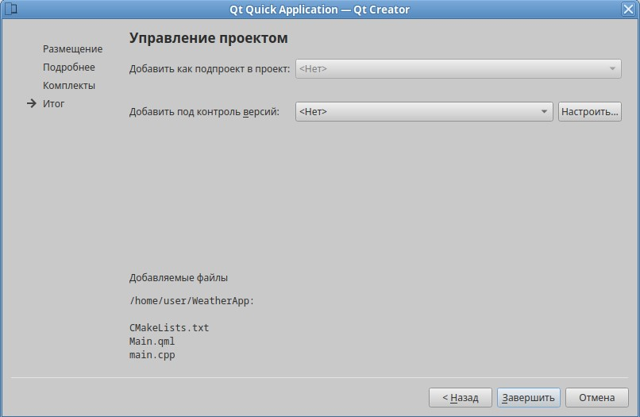

# ЛАБОРАТОРНАЯ РАБОТА №6
## Разработка приложения на QML

---

## Цель работы
Освоить основы разработки приложений с использованием QML и Qt Quick. Создать мобильное или десктопное приложение с графическим пользовательским интерфейсом, реализованным на QML.

---

## Задание
Разработка приложения "Погодный информатор".

---

## ФОРМИРОВАНИЕ ОТЧЕТА
В отчёте по лабораторной работе необходимо кратко изложить описание выполненных действий с использованием соответствующих команд, приложить скриншоты настроек и результатов тестов для наглядности. Также следует указать на возникшие в процессе работы проблемы и описать найденные способы их решения. В случае наличия контрольных вопросов, ответы на них должны быть интегрированы в текст.

---

## ЧАСТЬ 1 - Детальные инструкции к выполнению

### Шаг 1. Инициализация проекта
1. Создайте новый проект в Qt Creator, выбрав тип проекта "QML-приложение (Qt Quick)".

  
 
2. Назовите проект "WeatherApp".

  

### Шаг 2. Разработка интерфейса пользователя
- С использованием QML создайте интерфейс приложения, который должен включать:
    - Элемент для отображения текущего города и погоды (температуры, состояния погоды, влажности, ветра).
    - Поле для ввода названия города.
    - Кнопку для обновления информации о погоде в выбранном городе.

Добавьте в `Main.qml` следующее:

```cpp
import QtQuick 2.15
import QtQuick.Controls 2.15
import QtQuick.Layouts 1.15
import QtCore
import "WeatherFetcher.js" as WeatherFetcher

ApplicationWindow {
    visible: true
    width: 400
    height: 600
    title: qsTr("Погодный информатор")

    Settings {
        id: appSettings
        property string lastCity: ""
    }

    Rectangle {
        anchors.fill: parent
        color: "#f0f0f0"

        ColumnLayout {
            anchors.centerIn: parent
            spacing: 15

            TextField {
                id: cityInput
                placeholderText: qsTr("Введите город")
                Layout.preferredWidth: 300
                font.pointSize: 16
                background: Rectangle {
                    color: "#ffffff"
                    radius: 5
                    border.color: "#cccccc"
                }
            }

            Button {
                text: qsTr("Обновить погоду")
                font.pointSize: 16
                Layout.preferredWidth: 300
                background: Rectangle {
                    color: "#4caf50"
                    radius: 5
                }
                onClicked: {
                    WeatherFetcher.fetchWeather(cityInput.text)
                    appSettings.lastCity = cityInput.text
                }
            }

            ColumnLayout {
                id: weatherBlock
                spacing: 10
                opacity: 0.0

                Behavior on opacity {
                    NumberAnimation { duration: 500 }
                }

                Text {
                    id: cityName
                    text: qsTr("Город: -")
                    font.pointSize: 18
                    font.bold: true
                    color: "#333"
                }

                Text {
                    id: temperature
                    text: qsTr("Температура: -")
                    font.pointSize: 18
                    color: "#ff5722"
                    font.bold: true
                    Behavior on text {
                        NumberAnimation { duration: 300; easing.type: Easing.InOutQuad }
                    }
                }

                Text {
                    id: description
                    text: qsTr("Описание: -")
                    font.pointSize: 14
                    color: "#757575"
                }

                Text {
                    id: humidity
                    text: qsTr("Влажность: -")
                    font.pointSize: 14
                    color: "#757575"
                }

                Text {
                    id: wind
                    text: qsTr("Ветер: -")
                    font.pointSize: 14
                    color: "#757575"
                }
            }
            
            Text {
                id: errorMessage
                color: "red"
                font.pointSize: 12
                wrapMode: Text.Wrap
                visible: false
                width: parent.width * 0.8
                horizontalAlignment: Text.AlignHCenter
            }
        }
        
        Component.onCompleted: {
            if (appSettings.lastCity !== "") {
                cityInput.text = appSettings.lastCity
                WeatherFetcher.fetchWeather(appSettings.lastCity)
            }
        }
    }
}


```

### Шаг 3.  Логика приложения
- Используйте JavaScript для обработки событий интерфейса (например, нажатие на кнопку обновления погоды).
- Реализуйте запрос к погодному API (например, OpenWeatherMap) для получения актуальных данных о погоде. Для запросов используйте `XmlHttpRequest` или другие доступные средства QML для работы с сетью.

Создайте файл `JS`.

 

Назовите файл `WeatherFetcher.js`

 

Добавьте в `WeatherFetcher.js` следующее: 

```cpp
var apiKey = "53f2e1b43a53b9ec86018cdf1e816cfa"
var baseUrl = "https://api.openweathermap.org/data/2.5/weather"

function fetchWeather(city) {
    if (!city) {
        errorMessage.text = qsTr("Введите город")
        errorMessage.visible = true
        return
    }

    var xhr = new XMLHttpRequest()
    var url = baseUrl + "?q=" + encodeURIComponent(city) +
              "&appid=" + apiKey + "&units=metric&lang=ru"

    xhr.onreadystatechange = function () {
        if (xhr.readyState === XMLHttpRequest.DONE) {
            if (xhr.status === 200) {
                var response = JSON.parse(xhr.responseText)
                cityName.text = qsTr("Город: ") + response.name
                temperature.text = qsTr("Температура: ") + response.main.temp + "°C"
                description.text = qsTr("Описание: ") + response.weather[0].description
                humidity.text = qsTr("Влажность: ") + response.main.humidity + "%"
                wind.text = qsTr("Ветер: ") + response.wind.speed + " м/с"
                errorMessage.visible = false
                weatherBlock.opacity = 1.0
            } else {
                errorMessage.text = qsTr("Ошибка: проверьте название города")
                errorMessage.visible = true
                weatherBlock.opacity = 0.0
            }
        }
    }

    xhr.open("GET", url)
    xhr.send()
}


```

### Шаг 4. Отображение данных
- После получения данных от API отобразите информацию о погоде в соответствующих элементах интерфейса.
- Обработайте возможные ошибки запроса (например, неверное название города или проблемы с сетью) и информируйте пользователя об этих ошибках.

Добавьте в `main.cpp` следующее:

```cpp
#include <QGuiApplication>
#include <QQmlApplicationEngine>
#include <QTranslator>
#include <QLocale>

int main(int argc, char *argv[])
{
    QGuiApplication app(argc, argv);

    QCoreApplication::setOrganizationName("MyCompany");
    QCoreApplication::setApplicationName("WeatherApp");

    QTranslator translator;
    if (translator.load(QLocale(), "weatherapp", "_", ":/i18n")) {
        app.installTranslator(&translator);
    }

    QQmlApplicationEngine engine;
    engine.load(QUrl(QStringLiteral("WeatherApp/Main.qml")));
    if (engine.rootObjects().isEmpty())
        return -1;

    return app.exec();
}


```

## ЧАСТЬ 2 - Дополнительные возможности

- **Кастомизация интерфейса**: Используйте возможности QML для создания анимаций, переходов и других эффектов, чтобы сделать интерфейс пользователя более динамичным и приятным в использовании.
- **Локализация**: Добавьте поддержку нескольких языков в ваше приложение, позволяя пользователю выбирать предпочитаемый язык интерфейса.
- **Сохранение настроек**: Реализуйте возможность сохранения последнего запрошенного города в локальном хранилище, чтобы при следующем запуске приложения информация автоматически обновлялась для этого города.

Все это проделано выше.

## ЧАСТЬ 3 - Тестирование приложения

1. Проверка поддержки нескольких языков:

"На русском языке"

 

"На английском языке"

 

2. Проверка ошибок и уведомлений: 

"Ошибка"

 

"Уведомление"

 

3. Проверка сохранения последнего запрошенного города в локальном хранилище:


---

## Задание для самостоятельной работы
1. Модифицируйте приложение так, чтобы оно не только показывало текущую погоду, но и предоставляло краткий прогноз на несколько дней вперёд.
2. Реализуйте возможность выбора единиц измерения температуры (Цельсий, Фаренгейт).
3. Создайте график изменения температуры и других погодных параметров (например, влажности и ветра) на протяжении дня.

---

## Вопросы для самопроверки
1. Что такое QML и как оно связано с Qt Quick?
2. Как осуществляется взаимодействие между QML и C++ в приложении?
3. Как в QML использовать локализацию (поддержку нескольких языков)?
4. Что такое QtCore?

