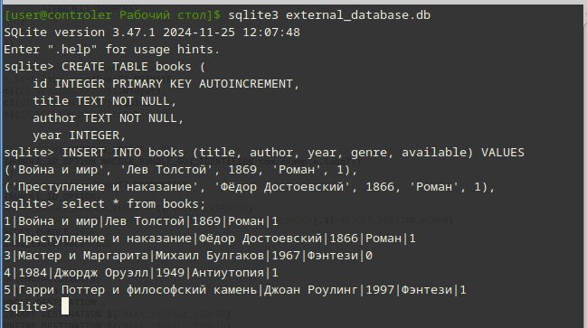
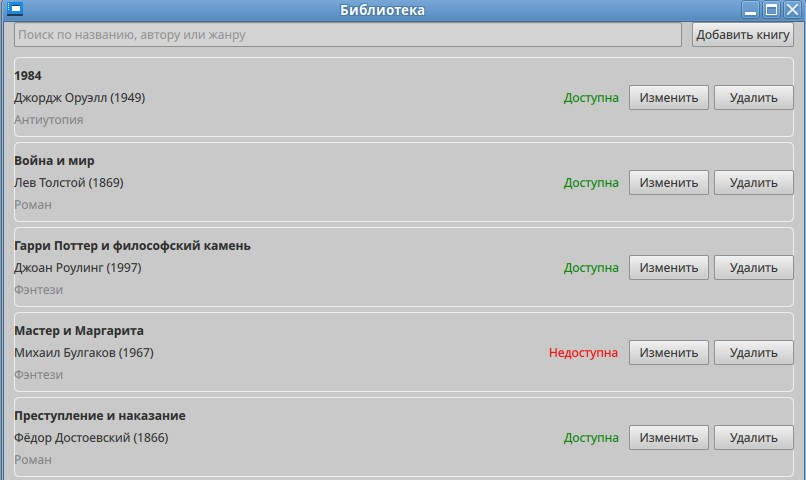
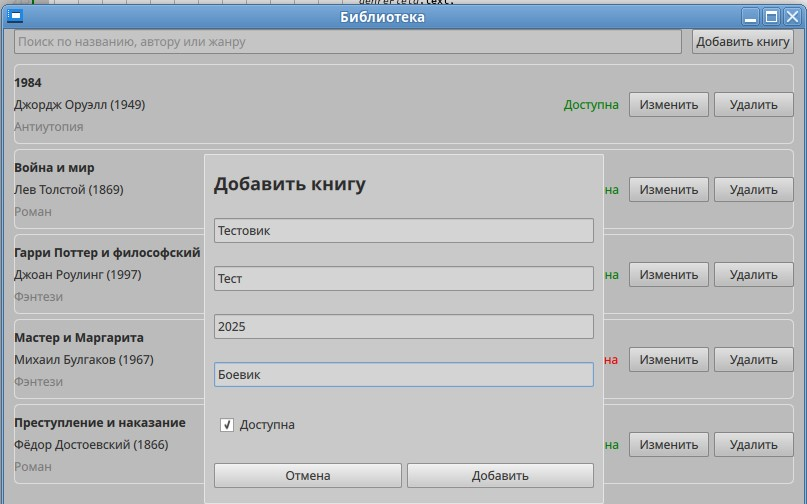
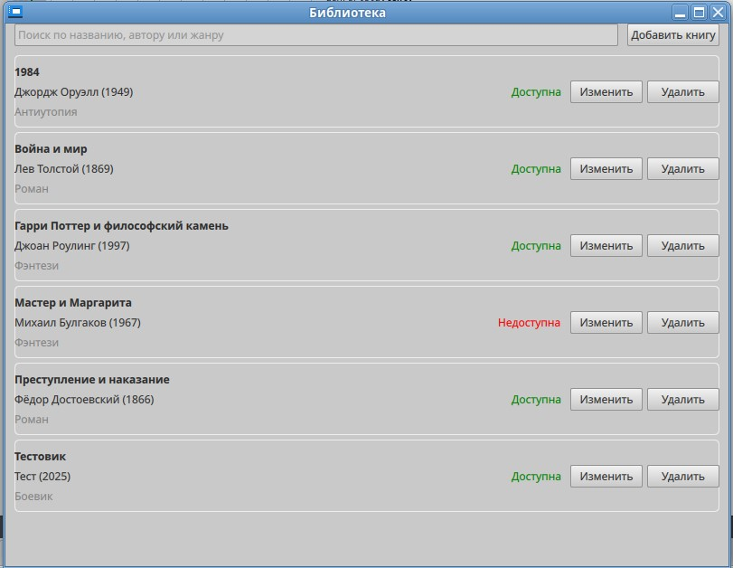
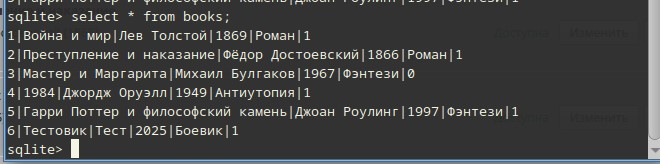
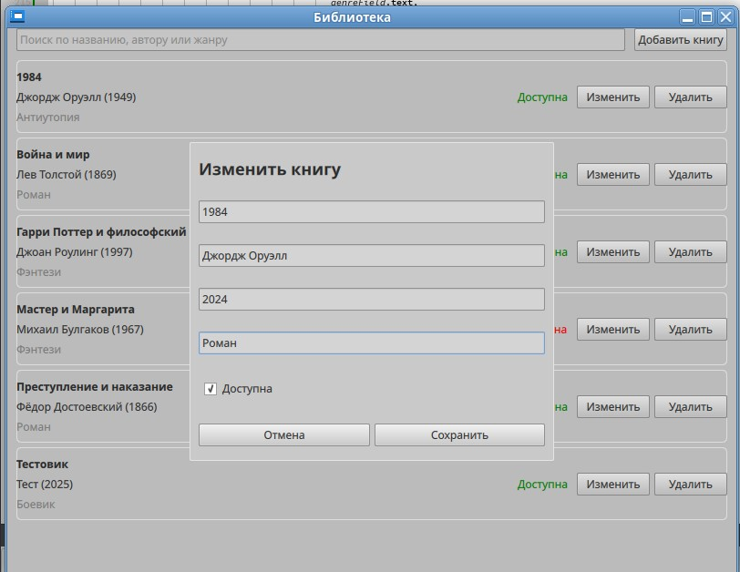
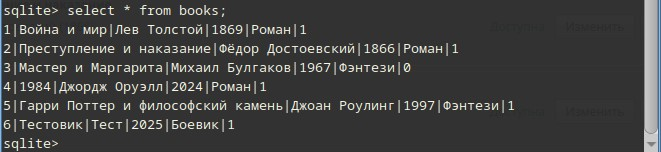
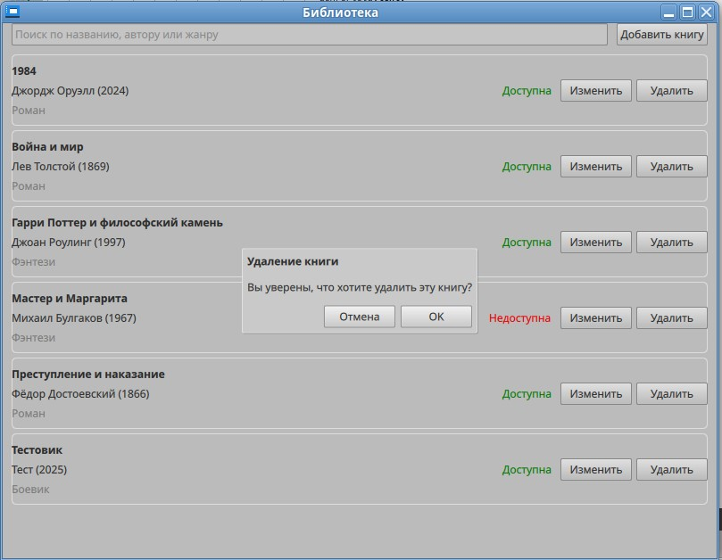
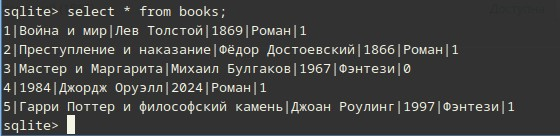
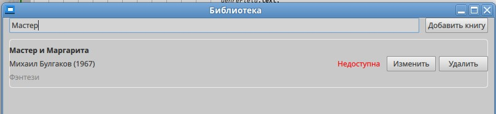

# ЛАБОРАТОРНАЯ РАБОТА №7
## Разработка приложения с использованием базы данных в QML

---

## Цель работы
Разработать многофункциональное приложение с графическим интерфейсом на QML, которое взаимодействует с базой данных для хранения, обработки и представления данных. Студенты научатся интегрировать QML с С++ для работы с базами данных, освоят основы проектирования пользовательских интерфейсов и получат практические навыки в области создания современных приложений на базе Qt.

---

## ФОРМИРОВАНИЕ ОТЧЕТА
В отчёте по лабораторной работе необходимо кратко изложить описание выполненных действий с использованием соответствующих команд, приложить скриншоты настроек и результатов тестов для наглядности. Также следует указать на возникшие в процессе работы проблемы и описать найденные способы их решения. В случае наличия контрольных вопросов, ответы на них должны быть интегрированы в текст.

---

## ЧАСТЬ 1 - Детальные инструкции к выполнению

### Шаг 1. Выбор темы приложения.
Студентам предлагается выбрать тему приложения, которое будет разрабатываться в рамках лабораторной работы. Тема должна предполагать хранение и обработку данных (например, учетная запись пользователей, органайзер задач, электронный дневник и т.д.).

Тема: "Учет книг в библиотеке".
- Приложение позволяет:
    - Просматривать список книг.
    - Добавлять, редактировать и удалять книги.
    - Искать книги по названию, автору или жанру.
    - Отмечать доступность книг.

---

### Шаг 2. Проектирование базы данных
На основе выбранной темы студенты должны спроектировать базу данных, определив необходимые таблицы, их поля и связи между ними. Рекомендуется использовать SQLite в качестве СУБД.
- С помощью sqlite создайте базу данных.

```
sqlite3 external_database.db
```  

- Создайте таблицу books.

```
CREATE TABLE books (
    id INTEGER PRIMARY KEY AUTOINCREMENT,
    title TEXT NOT NULL,
    author TEXT NOT NULL,
    year INTEGER,
    genre TEXT,
    available BOOLEAN DEFAULT 1
);
```

- Добавьте тестовые данные.

```
INSERT INTO books (title, author, year, genre, available) VALUES 
('Война и мир', 'Лев Толстой', 1869, 'Роман', 1),
('Преступление и наказание', 'Фёдор Достоевский', 1866, 'Роман', 1),
('Мастер и Маргарита', 'Михаил Булгаков', 1967, 'Фэнтези', 0),
('1984', 'Джордж Оруэлл', 1949, 'Антиутопия', 1),
('Гарри Поттер и философский камень', 'Джоан Роулинг', 1997, 'Фэнтези', 1);
``` 

  

---

### Шаг 3.  Разработка интерфейса пользователя
Используя QML, студенты разрабатывают интерфейс пользователя для своего приложения. Интерфейс должен быть интуитивно понятным и обеспечивать легкий доступ ко всем функциям приложения.

- Список книг
    - Отображает книги в виде списка.
    - Название, автор, год, жанр, статус доступности.
    - Кнопки "Изменить" и "Удалить" для каждой книги.
- Поиск
    - Поле ввода для поиска по названию, автору или жанру.
- Форма добавления/редактирования книги
    - Название, автор, год, жанр, чекбокс "Доступна".
    - Кнопки "Сохранить" и "Отмена".

Добавьте в `main.qml` следующее:

```cpp
import QtQuick 2.15
import QtQuick.Controls 2.15
import QtQuick.Layouts 1.15

ApplicationWindow {
    id: window
    width: 800
    height: 600
    visible: true
    title: qsTr("Библиотека")

    property int currentBookId: -1

    ColumnLayout {
        anchors.fill: parent
        spacing: 10

        RowLayout {
            Layout.fillWidth: true
            Layout.leftMargin: 10
            Layout.rightMargin: 10
            spacing: 10

            TextField {
                id: searchField
                placeholderText: "Поиск по названию, автору или жанру"
                Layout.fillWidth: true
                onTextChanged: {
                    bookModel.clear()
                    var books = database.searchBooks(text)
                    for (var i = 0; i < books.length; i++) {
                        bookModel.append(books[i])
                    }
                }
            }

            Button {
                text: "Добавить книгу"
                onClicked: {
                    currentBookId = -1
                    titleField.text = ""
                    authorField.text = ""
                    yearField.text = ""
                    genreField.text = ""
                    availableCheckBox.checked = true
                    bookFormPopup.open()
                }
            }
        }

        ScrollView {
            Layout.fillWidth: true
            Layout.fillHeight: true
            Layout.leftMargin: 10
            Layout.rightMargin: 10

            ListView {
                id: bookListView
                width: parent.width
                height: parent.height
                clip: true
                spacing: 5
                model: ListModel { id: bookModel }

                delegate: ItemDelegate {
                    width: bookListView.width
                    height: 80
                    leftPadding: 10
                    rightPadding: 10

                    background: Rectangle {
                        color: "transparent"
                        border.color: "#eee"
                        radius: 5
                    }

                    RowLayout {
                        anchors.fill: parent
                        spacing: 10

                        ColumnLayout {
                            Layout.fillWidth: true
                            spacing: 5

                            Label {
                                text: title
                                font.bold: true
                                elide: Text.ElideRight
                                Layout.fillWidth: true
                            }

                            Label {
                                text: author + " (" + year + ")"
                                elide: Text.ElideRight
                                Layout.fillWidth: true
                            }

                            Label {
                                text: genre
                                color: "gray"
                                elide: Text.ElideRight
                                Layout.fillWidth: true
                            }
                        }

                        Label {
                            text: available ? "Доступна" : "Недоступна"
                            color: available ? "green" : "red"
                        }

                        RowLayout {
                            spacing: 5

                            Button {
                                text: "Изменить"
                                onClicked: {
                                    currentBookId = id
                                    titleField.text = title
                                    authorField.text = author
                                    yearField.text = year
                                    genreField.text = genre
                                    availableCheckBox.checked = available
                                    bookFormPopup.open()
                                }
                            }

                            Button {
                                text: "Удалить"
                                onClicked: {
                                    deleteDialog.bookId = id
                                    deleteDialog.open()
                                }
                            }
                        }
                    }
                }
            }
        }
    }

    Popup {
        id: bookFormPopup
        width: Math.min(window.width * 0.9, 400)
        height: Math.min(window.height * 0.9, 350)
        x: (window.width - width) / 2
        y: (window.height - height) / 2
        modal: true
        closePolicy: Popup.CloseOnEscape | Popup.CloseOnPressOutside
        padding: 10

        ColumnLayout {
            anchors.fill: parent
            spacing: 10

            Label {
                text: currentBookId === -1 ? "Добавить книгу" : "Изменить книгу"
                font.bold: true
                font.pixelSize: 18
            }

            TextField {
                id: titleField
                placeholderText: "Название"
                Layout.fillWidth: true
            }

            TextField {
                id: authorField
                placeholderText: "Автор"
                Layout.fillWidth: true
            }

            TextField {
                id: yearField
                placeholderText: "Год издания"
                validator: IntValidator { bottom: 0; top: 2100 }
                Layout.fillWidth: true
            }

            TextField {
                id: genreField
                placeholderText: "Жанр"
                Layout.fillWidth: true
            }

            CheckBox {
                id: availableCheckBox
                text: "Доступна"
                checked: true
            }

            RowLayout {
                Button {
                    text: "Отмена"
                    Layout.fillWidth: true
                    onClicked: bookFormPopup.close()
                }

                Button {
                    text: currentBookId === -1 ? "Добавить" : "Сохранить"
                    Layout.fillWidth: true
                    onClicked: {
                        if (currentBookId === -1) {
                            if (database.addBook(titleField.text, authorField.text,
                                               parseInt(yearField.text),
                                               genreField.text,
                                               availableCheckBox.checked)) {
                                refreshBookList()
                                bookFormPopup.close()
                            }
                        } else {
                            if (database.updateBook(currentBookId, titleField.text,
                                                   authorField.text,
                                                   parseInt(yearField.text),
                                                   genreField.text,
                                                   availableCheckBox.checked)) {
                                refreshBookList()
                                bookFormPopup.close()
                            }
                        }
                    }
                }
            }
        }
    }

    Dialog {
        id: deleteDialog
        modal: true
        title: "Удаление книги"
        standardButtons: Dialog.Ok | Dialog.Cancel
        x: (window.width - width) / 2
        y: (window.height - height) / 2

        property int bookId: -1

        Label {
            text: "Вы уверены, что хотите удалить эту книгу?"
        }

        onAccepted: {
            if (database.deleteBook(bookId)) {
                refreshBookList()
            }
        }
    }

    function refreshBookList() {
        bookModel.clear()
        var books = database.getAllBooks()
        for (var i = 0; i < books.length; i++) {
            bookModel.append(books[i])
        }
    }

    Component.onCompleted: refreshBookList()
}
```  

---

### Шаг 4. Интеграция с базой данных
Студенты должны реализовать взаимодействие приложения с базой данных. Это включает в себя выполнение запросов на добавление, удаление, изменение и извлечение данных. Для интеграции с базой данных рекомендуется использовать классы Qt SQL и обеспечить взаимодействие с QML через С++.

- Класс Database беспечивает взаимодействие с SQLite:
    - Подключение к базе данных.
    - Выполнение SQL-запросов.
    - Возврат данных в QML.

Установите `apt-get install qt6-sql` для работы с sqlite.

Добавьте в `CMakeLists.txt` следующее:

```cpp
cmake_minimum_required(VERSION 3.16)

project(laba77 VERSION 0.1 LANGUAGES CXX)

set(CMAKE_AUTOUIC ON)
set(CMAKE_AUTOMOC ON)
set(CMAKE_AUTORCC ON)

set(CMAKE_CXX_STANDARD 17)
set(CMAKE_CXX_STANDARD_REQUIRED ON)

# Ищем основные модули Qt
find_package(QT NAMES Qt6 Qt5 REQUIRED COMPONENTS Widgets Quick Sql)
find_package(Qt${QT_VERSION_MAJOR} REQUIRED COMPONENTS Widgets Quick Sql)

set(PROJECT_SOURCES
        main.cpp
        mainwindow.cpp
        mainwindow.h
        mainwindow.ui


)

if(${QT_VERSION_MAJOR} GREATER_EQUAL 6)
    qt_add_executable(laba77
        MANUAL_FINALIZATION
        ${PROJECT_SOURCES}
        main.qml
    )

    # Добавляем QML модуль
    qt_add_qml_module(laba77
        URI Laba77
        VERSION 1.0
        QML_FILES main.qml
        QML_FILES
        QML_FILES
        SOURCES database.h database.cpp
    )
else()
    if(ANDROID)
        add_library(laba77 SHARED
            ${PROJECT_SOURCES}
        )
    else()
        add_executable(laba77
            ${PROJECT_SOURCES}
        )
    endif()
endif()

# Подключаем все необходимые модули
target_link_libraries(laba77 PRIVATE
    Qt${QT_VERSION_MAJOR}::Widgets
    Qt${QT_VERSION_MAJOR}::Quick
    Qt${QT_VERSION_MAJOR}::Sql
)

if(${QT_VERSION} VERSION_LESS 6.1.0)
  set(BUNDLE_ID_OPTION MACOSX_BUNDLE_GUI_IDENTIFIER com.example.laba77)
endif()
set_target_properties(laba77 PROPERTIES
    ${BUNDLE_ID_OPTION}
    MACOSX_BUNDLE_BUNDLE_VERSION ${PROJECT_VERSION}
    MACOSX_BUNDLE_SHORT_VERSION_STRING ${PROJECT_VERSION_MAJOR}.${PROJECT_VERSION_MINOR}
    MACOSX_BUNDLE TRUE
    WIN32_EXECUTABLE TRUE
)

include(GNUInstallDirs)
install(TARGETS laba77
    BUNDLE DESTINATION .
    LIBRARY DESTINATION ${CMAKE_INSTALL_LIBDIR}
    RUNTIME DESTINATION ${CMAKE_INSTALL_BINDIR}
)

if(QT_VERSION_MAJOR EQUAL 6)
    qt_finalize_executable(laba77)
endif()
```

Добавьте в `database.cpp` следующее:

```cpp
#include "database.h"
#include <QDebug>
#include <QStandardPaths>

Database::Database(QObject *parent) : QObject(parent)
{
}

Database::~Database()
{
    closeDatabase();
}

bool Database::connectToDatabase(const QString &path)
{
    m_db = QSqlDatabase::addDatabase("QSQLITE");
    m_db.setDatabaseName(path);

    if (!m_db.open()) {
        qDebug() << "Error: connection with database failed";
        return false;
    } else {
        qDebug() << "Database: connection ok";
        return true;
    }
}

void Database::closeDatabase()
{
    if (m_db.isOpen()) {
        m_db.close();
    }
}

bool Database::addBook(const QString &title, const QString &author, int year, const QString &genre, bool available)
{
    if (!m_db.isOpen()) return false;

    QSqlQuery query;
    query.prepare("INSERT INTO books (title, author, year, genre, available) "
                  "VALUES (:title, :author, :year, :genre, :available)");
    query.bindValue(":title", title);
    query.bindValue(":author", author);
    query.bindValue(":year", year);
    query.bindValue(":genre", genre);
    query.bindValue(":available", available);

    if (!query.exec()) {
        qDebug() << "Add book error:" << query.lastError();
        return false;
    }
    return true;
}

bool Database::updateBook(int id, const QString &title, const QString &author, int year, const QString &genre, bool available)
{
    if (!m_db.isOpen()) return false;

    QSqlQuery query;
    query.prepare("UPDATE books SET title = :title, author = :author, year = :year, "
                  "genre = :genre, available = :available WHERE id = :id");
    query.bindValue(":title", title);
    query.bindValue(":author", author);
    query.bindValue(":year", year);
    query.bindValue(":genre", genre);
    query.bindValue(":available", available);
    query.bindValue(":id", id);

    if (!query.exec()) {
        qDebug() << "Update book error:" << query.lastError();
        return false;
    }
    return true;
}

bool Database::deleteBook(int id)
{
    if (!m_db.isOpen()) return false;

    QSqlQuery query;
    query.prepare("DELETE FROM books WHERE id = :id");
    query.bindValue(":id", id);

    if (!query.exec()) {
        qDebug() << "Delete book error:" << query.lastError();
        return false;
    }
    return true;
}

QVariantList Database::getAllBooks()
{
    QVariantList books;
    if (!m_db.isOpen()) return books;

    QSqlQuery query("SELECT * FROM books ORDER BY title");
    while (query.next()) {
        QVariantMap book;
        book["id"] = query.value("id");
        book["title"] = query.value("title");
        book["author"] = query.value("author");
        book["year"] = query.value("year");
        book["genre"] = query.value("genre");
        book["available"] = query.value("available");
        books.append(book);
    }
    return books;
}

QVariantList Database::searchBooks(const QString &searchTerm)
{
    QVariantList books;
    if (!m_db.isOpen()) return books;

    QSqlQuery query;
    query.prepare("SELECT * FROM books WHERE title LIKE :search OR author LIKE :search OR genre LIKE :search ORDER BY title");
    query.bindValue(":search", "%" + searchTerm + "%");

    if (!query.exec()) {
        qDebug() << "Search error:" << query.lastError();
        return books;
    }

    while (query.next()) {
        QVariantMap book;
        book["id"] = query.value("id");
        book["title"] = query.value("title");
        book["author"] = query.value("author");
        book["year"] = query.value("year");
        book["genre"] = query.value("genre");
        book["available"] = query.value("available");
        books.append(book);
    }
    return books;
}
```  

Добавьте в `database.h` следующее:

```cpp
#ifndef DATABASE_H
#define DATABASE_H

#include <QObject>
#include <QSqlDatabase>
#include <QSqlQuery>
#include <QSqlError>
#include <QVariantList>

class Database : public QObject
{
    Q_OBJECT
public:
    explicit Database(QObject *parent = nullptr);
    ~Database();

    bool connectToDatabase(const QString &path);
    void closeDatabase();

    Q_INVOKABLE bool addBook(const QString &title, const QString &author, int year, const QString &genre, bool available);
    Q_INVOKABLE bool updateBook(int id, const QString &title, const QString &author, int year, const QString &genre, bool available);
    Q_INVOKABLE bool deleteBook(int id);
    Q_INVOKABLE QVariantList getAllBooks();
    Q_INVOKABLE QVariantList searchBooks(const QString &searchTerm);

private:
    QSqlDatabase m_db;
};

#endif // DATABASE_H
```

Добавьте в `main.cpp` следующее:

```cpp
#include <QGuiApplication>
#include <QQmlApplicationEngine>
#include <QQmlContext>
#include "database.h"

int main(int argc, char *argv[])
{
    // Отключаем предупреждение об отладке QML
    qputenv("QT_LOGGING_RULES", "qt.qml.debug=false");

    QCoreApplication::setAttribute(Qt::AA_EnableHighDpiScaling);
    QGuiApplication app(argc, argv);

    Database db;
    if (!db.connectToDatabase("/home/user/Рабочий стол/external_database.db")) {
        qCritical() << "Failed to connect to database!";
        return -1;
    }

    QQmlApplicationEngine engine;
    engine.rootContext()->setContextProperty("database", &db);

    const QUrl url(QStringLiteral("Laba77/main.qml"));
    QObject::connect(&engine, &QQmlApplicationEngine::objectCreated,
                     &app, [url](QObject *obj, const QUrl &objUrl) {
        if (!obj && url == objUrl)
            QCoreApplication::exit(-1);
    }, Qt::QueuedConnection);

    engine.load(url);

    return app.exec();
}
```

---

## ЧАСТЬ 2 - Тестирование приложения
Рабочее приложение, которое демонстрирует взаимодействие с базой данных через графический интерфейс, разработанный на QML. Приложение должно позволять добавлять, удалять, изменять и просматривать данные.

- Основное окно приложения

  

- Добавление книги
    - Ввод данных → Нажатие "Добавить" → Проверка появления в списке

  





- Редактирование книги
    - Изменение данных → Нажатие "Сохранить" → Проверка обновления





- Удаление книги
    - Нажатие "Удалить" → Подтверждение → Проверка исчезновения из списка





- Поиск
    - Ввод запроса → Проверка фильтрации списка



---

## Задание для самостоятельной работы
1. Добавьте фильтр для показа только доступных книг.
2. Реализуйте экспорт в Excel.
3. Реализовать комбинированный поиск с фильтрами:
    - По диапазону годов.
    - По доступности.
    - По сочетанию автора и жанр.

---

## Вопросы для самопроверки
1. Какие компоненты Qt используются для работы с базами данных?
2. В чем разница между SQLite и другими СУБД (MySQL, PostgreSQL)?
3. Как защитить приложение от SQL-инъекций?
4. Какие методы аутентификации можно реализовать?

