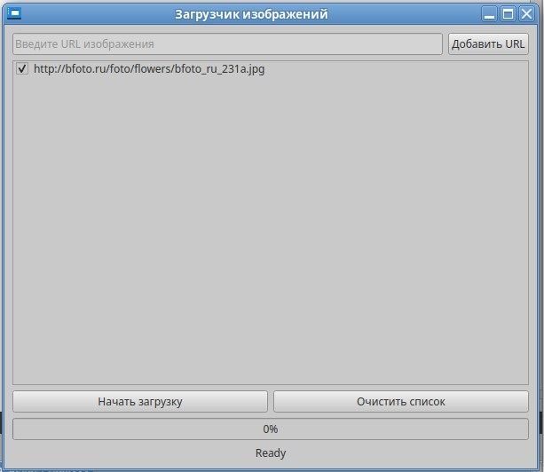

# ЛАБОРАТОРНАЯ РАБОТА №8
## Реализация многопоточности в приложении с использованием QThread

---

## Цель работы
Целью данной лабораторной работы является разработка приложения на Qt, демонстрирующего принципы многопоточности с использованием класса QThread. Студенты научатся создавать, управлять потоками и безопасно обмениваться данными между ними, что является критически важным навыком для разработки отзывчивых и эффективных приложений.

---

## Задание
Разработать приложение, которое принимает список URL изображений и загружает их параллельно, используя многопоточность. Пользовательский интерфейс должен позволять ввод списка URL, отображать прогресс загрузки для каждого изображения и сообщать о завершении операции.

---

## ФОРМИРОВАНИЕ ОТЧЕТА
В отчёте по лабораторной работе необходимо кратко изложить описание выполненных действий с использованием соответствующих команд, приложить скриншоты настроек и результатов тестов для наглядности. Также следует указать на возникшие в процессе работы проблемы и описать найденные способы их решения. В случае наличия контрольных вопросов, ответы на них должны быть интегрированы в текст.

---

## ЧАСТЬ 1 - Детальные инструкции к выполнению

### Шаг 1. Особенности работы с сетью и принципы многопоточности в Qt.
- QThread - базовый класс для реализации потоков в Qt
- Сигналы и слоты - механизм межпоточного взаимодействия
- QThreadPool - управление пулом потоков
- QMutex/QReadWriteLock - синхронизация доступа к общим ресурсам
- QNetworkAccessManager - основной класс для сетевых запросов
- Обработка ошибок - проверка HTTP-статусов и Content-Type
- Валидация данных - проверка формата полученных изображений

### Шаг 2. Практическая реализация

Добавьте в заголовочный файл `mainwindow.h` следующее:  

```cpp
#ifndef MAINWINDOW_H
#define MAINWINDOW_H

#include <QMainWindow>
#include <QThreadPool>
#include <QNetworkAccessManager>
#include <QNetworkReply>
#include <QListWidgetItem>
#include <QFileInfo>
#include <QDateTime>
#include <QUrl>
#include <QCloseEvent>
#include <QMenu>

QT_BEGIN_NAMESPACE
namespace Ui { class MainWindow; }
QT_END_NAMESPACE

class DownloadTask : public QObject
{
    Q_OBJECT
public:
    explicit DownloadTask(const QString &url, QObject *parent = nullptr);
    ~DownloadTask();

public slots:
    void startDownload();

signals:
    void downloadProgress(int percent);
    void finished(const QString &url, const QByteArray &data);
    void error(const QString &url, const QString &error);

private:
    QString m_url;
    QNetworkAccessManager* m_manager;
};

class MainWindow : public QMainWindow
{
    Q_OBJECT

public:
    MainWindow(QWidget *parent = nullptr);
    ~MainWindow();

protected:
    void dragEnterEvent(QDragEnterEvent *event) override;
    void dropEvent(QDropEvent *event) override;
    void closeEvent(QCloseEvent *event) override;

private slots:
    void on_addUrlButton_clicked();
    void on_downloadButton_clicked();
    void on_clearButton_clicked();
    void handleDownloadFinished(const QString &url, const QByteArray &data);
    void handleDownloadError(const QString &url, const QString &error);
    void handleDownloadProgress(int percent);
    void showUrlListContextMenu(const QPoint &pos);

private:
    Ui::MainWindow *ui;
    QThreadPool m_threadPool;
    int m_activeDownloads;
    int m_totalDownloads;
    QMap<QString, QListWidgetItem*> m_urlItems;
    QList<QNetworkReply*> m_activeReplies;

    bool isValidUrl(const QString &url);
    void updateStatus();
    QString generateFileName(const QString &url) const;
    void updateUI(const QString &url, bool success);
};

#endif // MAINWINDOW_H

```
Добавьте в `mainwindow.cpp` следующее: 

```cpp
#include "mainwindow.h"
#include "ui_mainwindow.h"
#include <QFileDialog>
#include <QMessageBox>
#include <QImage>
#include <QThread>
#include <QDir>
#include <QMimeData>

DownloadTask::DownloadTask(const QString &url, QObject *parent)
    : QObject(parent), m_url(url), m_manager(nullptr)
{
    setProperty("url", url);
}

DownloadTask::~DownloadTask()
{
    delete m_manager;
}

void DownloadTask::startDownload()
{
    m_manager = new QNetworkAccessManager(this);

    QNetworkRequest request(m_url);
    request.setRawHeader("Accept", "image/jpeg,image/png,image/*;q=0.8");
    request.setAttribute(QNetworkRequest::RedirectPolicyAttribute,
                       QNetworkRequest::NoLessSafeRedirectPolicy);

    QNetworkReply *reply = m_manager->get(request);

    connect(reply, &QNetworkReply::downloadProgress, [this](qint64 bytesReceived, qint64 bytesTotal) {
        int percent = bytesTotal > 0 ? static_cast<int>((bytesReceived * 100) / bytesTotal) : 0;
        emit downloadProgress(percent);
    });

    connect(reply, &QNetworkReply::finished, [this, reply]() {
        if(reply->error() != QNetworkReply::NoError) {
            emit error(m_url, reply->errorString());
            reply->deleteLater();
            return;
        }

        QString contentType = reply->header(QNetworkRequest::ContentTypeHeader).toString();
        if(!contentType.contains("image/")) {
            emit error(m_url, "Invalid content type: " + contentType);
            reply->deleteLater();
            return;
        }

        emit finished(m_url, reply->readAll());
        reply->deleteLater();
    });
}

MainWindow::MainWindow(QWidget *parent)
    : QMainWindow(parent), ui(new Ui::MainWindow),
      m_activeDownloads(0), m_totalDownloads(0)
{
    ui->setupUi(this);
    m_threadPool.setMaxThreadCount(4);
    ui->progressBar->setValue(0);
    ui->statusLabel->setText("Ready");

    setAcceptDrops(true);
    ui->urlList->setDragEnabled(true);
    ui->urlList->setDropIndicatorShown(true);
    ui->urlList->setDragDropMode(QAbstractItemView::InternalMove);
    ui->urlList->setContextMenuPolicy(Qt::CustomContextMenu);

    connect(ui->urlList, &QListWidget::customContextMenuRequested,
            this, &MainWindow::showUrlListContextMenu);
}

MainWindow::~MainWindow()
{
    delete ui;
}

bool MainWindow::isValidUrl(const QString &url)
{
    QUrl qurl(url);
    return qurl.isValid() && !qurl.scheme().isEmpty() && !qurl.host().isEmpty();
}

void MainWindow::on_addUrlButton_clicked()
{
    QString url = ui->urlEdit->text().trimmed();
    if(url.isEmpty()) {
        QMessageBox::warning(this, "Error", "Please enter image URL");
        return;
    }

    if(!url.startsWith("http://") && !url.startsWith("https://")) {
        url.prepend("http://");
    }

    if(!isValidUrl(url)) {
        QMessageBox::warning(this, "Error", "Invalid URL format");
        return;
    }

    if(ui->urlList->count() >= 100) {
        QMessageBox::warning(this, "Error", "Maximum 100 URLs allowed");
        return;
    }

    if(!m_urlItems.contains(url)) {
        QListWidgetItem *item = new QListWidgetItem(url);
        item->setData(Qt::UserRole, url);
        item->setFlags(item->flags() | Qt::ItemIsUserCheckable);
        item->setCheckState(Qt::Checked);
        ui->urlList->addItem(item);
        m_urlItems.insert(url, item);
        ui->urlEdit->clear();
    }
}

void MainWindow::on_downloadButton_clicked()
{
    if(ui->urlList->count() == 0) {
        QMessageBox::warning(this, "Error", "Please add at least one URL");
        return;
    }

    m_activeDownloads = 0;
    m_totalDownloads = 0;
    m_activeReplies.clear();

    for(int i = 0; i < ui->urlList->count(); ++i) {
        if(ui->urlList->item(i)->checkState() == Qt::Checked) {
            m_totalDownloads++;
        }
    }

    if(m_totalDownloads == 0) {
        QMessageBox::warning(this, "Error", "No URLs selected for download");
        return;
    }

    ui->progressBar->setMaximum(m_totalDownloads * 100);
    ui->progressBar->setValue(0);
    ui->statusLabel->setText(QString("Downloading: 0/%1").arg(m_totalDownloads));

    for(int i = 0; i < ui->urlList->count(); ++i) {
        QListWidgetItem *item = ui->urlList->item(i);
        if(item->checkState() == Qt::Checked) {
            QString url = item->data(Qt::UserRole).toString();
            DownloadTask *task = new DownloadTask(url);

            QThread *thread = new QThread;
            task->moveToThread(thread);

            connect(thread, &QThread::started, task, &DownloadTask::startDownload);
            connect(task, &DownloadTask::finished, this, &MainWindow::handleDownloadFinished);
            connect(task, &DownloadTask::error, this, &MainWindow::handleDownloadError);
            connect(task, &DownloadTask::downloadProgress, this, &MainWindow::handleDownloadProgress);

            connect(task, &DownloadTask::finished, thread, &QThread::quit);
            connect(task, &DownloadTask::error, thread, &QThread::quit);
            connect(thread, &QThread::finished, thread, &QThread::deleteLater);
            connect(thread, &QThread::finished, task, &DownloadTask::deleteLater);

            m_activeDownloads++;
            thread->start();
        }
    }
}

void MainWindow::handleDownloadProgress(int percent)
{
    Q_UNUSED(percent);
    if (ui->progressBar->value() < ui->progressBar->maximum()) {
        ui->progressBar->setValue(ui->progressBar->value() + 1);
    }
}

void MainWindow::handleDownloadFinished(const QString &url, const QByteArray &data)
{
    QImage image;
    if(!image.loadFromData(data)) {
        if(data.startsWith("<html") || data.startsWith("<?xml")) {
            handleDownloadError(url, "Server returned HTML instead of image");
            return;
        }
        handleDownloadError(url, "Invalid image data");
        return;
    }

    QString defaultDir = QDir::homePath() + "/Downloads/Images/";
    QDir().mkpath(defaultDir);

    QString fileName = generateFileName(url);
    QString savePath = QFileDialog::getSaveFileName(this, "Save Image",
                                                  defaultDir + fileName,
                                                  "Images (*.jpg *.png *.bmp)");

    if(!savePath.isEmpty()) {
        QFile file(savePath);
        if(file.open(QIODevice::WriteOnly)) {
            file.write(data);
            file.close();
            updateUI(url, true);
        } else {
            handleDownloadError(url, "Failed to save file: " + file.errorString());
        }
    }
    m_activeDownloads--;
    updateStatus();
}

void MainWindow::handleDownloadError(const QString &url, const QString &error)
{
    QListWidgetItem *item = m_urlItems.value(url);
    if(item) {
        item->setCheckState(Qt::Unchecked);
        item->setBackground(QBrush(QColor(255, 200, 200)));
        item->setToolTip(error);
    }
    m_activeDownloads--;
    updateStatus();
}

void MainWindow::updateStatus()
{
    int completed = m_totalDownloads - m_activeDownloads;
    ui->statusLabel->setText(QString("Downloading: %1/%2").arg(completed).arg(m_totalDownloads));
    ui->progressBar->setValue(completed * 100);

    if(m_activeDownloads == 0) {
        ui->statusLabel->setText("All downloads completed");
        m_activeReplies.clear();
    }
}

QString MainWindow::generateFileName(const QString &url) const
{
    QString fileName = QFileInfo(url).fileName();
    if(fileName.isEmpty()) {
        fileName = QString("image_%1.jpg").arg(QDateTime::currentDateTime().toString("yyyyMMddhhmmss"));
    }
    return fileName;
}

void MainWindow::updateUI(const QString &url, bool success)
{
    QListWidgetItem *item = m_urlItems.value(url);
    if(item) {
        item->setCheckState(Qt::Unchecked);
        item->setBackground(QBrush(success ? QColor(200, 255, 200) : QColor(255, 200, 200)));
    }
}

void MainWindow::on_clearButton_clicked()
{
    ui->urlList->clear();
    m_urlItems.clear();
    ui->progressBar->setValue(0);
    ui->statusLabel->setText("Ready");
}

void MainWindow::dragEnterEvent(QDragEnterEvent *event)
{
    if(event->mimeData()->hasUrls())
        event->acceptProposedAction();
}

void MainWindow::dropEvent(QDropEvent *event)
{
    foreach(const QUrl &url, event->mimeData()->urls()) {
        QString urlString = url.toString();
        if(!m_urlItems.contains(urlString)) {
            QListWidgetItem *item = new QListWidgetItem(urlString);
            item->setData(Qt::UserRole, urlString);
            item->setFlags(item->flags() | Qt::ItemIsUserCheckable);
            item->setCheckState(Qt::Checked);
            ui->urlList->addItem(item);
            m_urlItems.insert(urlString, item);
        }
    }
}

void MainWindow::closeEvent(QCloseEvent *event)
{
    if(m_activeDownloads > 0) {
        QMessageBox::StandardButton reply = QMessageBox::question(
            this, "Downloads in progress",
            "There are active downloads. Do you want to cancel them and exit?",
            QMessageBox::Yes|QMessageBox::No);

        if(reply == QMessageBox::No) {
            event->ignore();
            return;
        }
    }
    event->accept();
}

void MainWindow::showUrlListContextMenu(const QPoint &pos)
{
    QMenu menu;
    QAction *removeAction = menu.addAction("Remove selected");
    QAction *selectAllAction = menu.addAction("Select all");
    QAction *deselectAllAction = menu.addAction("Deselect all");

    QAction *selectedAction = menu.exec(ui->urlList->viewport()->mapToGlobal(pos));

    if(selectedAction == removeAction) {
        qDeleteAll(ui->urlList->selectedItems());
    } else if(selectedAction == selectAllAction) {
        for(int i = 0; i < ui->urlList->count(); ++i)
            ui->urlList->item(i)->setCheckState(Qt::Checked);
    } else if(selectedAction == deselectAllAction) {
        for(int i = 0; i < ui->urlList->count(); ++i)
            ui->urlList->item(i)->setCheckState(Qt::Unchecked);
    }
}

```

Добавьте в файл интерфейса `mainwindow.ui` следующее: 

```cpp
<?xml version="1.0" encoding="UTF-8"?>
<ui version="4.0">
 <class>MainWindow</class>
 <widget class="QMainWindow" name="MainWindow">
  <property name="geometry">
   <rect>
    <x>0</x>
    <y>0</y>
    <width>600</width>
    <height>500</height>
   </rect>
  </property>
  <property name="windowTitle">
   <string>Загрузчик изображений</string>
  </property>
  <widget class="QWidget" name="centralwidget">
   <layout class="QVBoxLayout" name="verticalLayout">
    <item>
     <layout class="QHBoxLayout" name="horizontalLayout">
      <item>
       <widget class="QLineEdit" name="urlEdit">
        <property name="placeholderText">
         <string>Введите URL изображения</string>
        </property>
       </widget>
      </item>
      <item>
       <widget class="QPushButton" name="addUrlButton">
        <property name="text">
         <string>Добавить URL</string>
        </property>
       </widget>
      </item>
     </layout>
    </item>
    <item>
     <widget class="QListWidget" name="urlList"/>
    </item>
    <item>
     <layout class="QHBoxLayout" name="horizontalLayout_2">
      <item>
       <widget class="QPushButton" name="downloadButton">
        <property name="text">
         <string>Начать загрузку</string>
        </property>
       </widget>
      </item>
      <item>
       <widget class="QPushButton" name="clearButton">
        <property name="text">
         <string>Очистить список</string>
        </property>
       </widget>
      </item>
     </layout>
    </item>
    <item>
     <widget class="QProgressBar" name="progressBar">
      <property name="value">
       <number>0</number>
      </property>
     </widget>
    </item>
    <item>
     <widget class="QLabel" name="statusLabel">
      <property name="text">
       <string>Готово</string>
      </property>
      <property name="alignment">
       <set>Qt::AlignCenter</set>
      </property>
     </widget>
    </item>
   </layout>
  </widget>
 </widget>
 <resources/>
 <connections/>
</ui>

```

Добавьте в файл сборки CMake `CMakeLists.txt` следующее: 

```cpp
cmake_minimum_required(VERSION 3.16)
project(lab8 VERSION 0.1 LANGUAGES CXX)

set(CMAKE_AUTOUIC ON)
set(CMAKE_AUTOMOC ON)
set(CMAKE_AUTORCC ON)
set(CMAKE_CXX_STANDARD 17)
set(CMAKE_CXX_STANDARD_REQUIRED ON)

find_package(QT NAMES Qt6 Qt5 REQUIRED COMPONENTS Widgets Network)
find_package(Qt${QT_VERSION_MAJOR} REQUIRED COMPONENTS Widgets Network)

set(PROJECT_SOURCES
    main.cpp
    mainwindow.cpp
)

set(PROJECT_HEADERS
    mainwindow.h
)

set(PROJECT_FORMS
    mainwindow.ui
)

if(${QT_VERSION_MAJOR} GREATER_EQUAL 6)
    qt_add_executable(lab8
        MANUAL_FINALIZATION
        ${PROJECT_SOURCES}
        ${PROJECT_HEADERS}
        ${PROJECT_FORMS}
    )
else()
    add_executable(lab8
        ${PROJECT_SOURCES}
        ${PROJECT_HEADERS}
        ${PROJECT_FORMS}
    )
endif()

target_link_libraries(lab8 PRIVATE
    Qt${QT_VERSION_MAJOR}::Widgets
    Qt${QT_VERSION_MAJOR}::Network
)

if(QT_VERSION_MAJOR EQUAL 6)
    qt_finalize_executable(lab8)
endif()

```

## ЧАСТЬ 2 - Тестирование приложения

- Добавление URL
	- Введите корректный URL изображения → нажмите "Добавить URL" → проверьте, что URL появился в списке
  
	- URL без http/https (должно автоматически добавляться)
  
  
	- Один и тот же URL дважды (должен добавляться только один раз)
  
- Drag & Drop
	- Перетащите ссылку на изображение из браузера в список URL
  
  
- Корректные случаи
	- Выберите 1 URL → "Начать загрузку"
		- Проверьте прогресс-бар
		- Дождитесь диалога сохранения
		- Убедитесь, что файл сохранился корректно
  
  
	- Выберите 2 URL → проверьте:
		- Параллельную загрузку
		- Общий прогресс
		- Статус "Загрузка: X/Y"
  
  
- Ошибочные случаи
	- URL несуществующего изображения и URL HTML-страницы вместо изображения(должна быть ошибка)
  
- Контекстное меню (правый клик на списке)
	- "Удалить выбранное" → проверьте удаление
	- "Выбрать все"/"Снять выделение" → проверьте галочки
  
- Кнопки
	- "Очистить список" → должен очищаться весь список
	- Повторное нажатие "Начать загрузку" во время загрузки
  

---

## Задание для самостоятельной работы (на выбор)
1. Приложение "Поиск файлов".
    - **Задача:** Создать приложение для поиска файлов по заданному критерию (например, по расширению, содержимому, размеру) в выбранной пользователем директории и её поддиректориях.
    - **Многопоточность:** Осуществление поиска в каждой поддиректории должно производиться в отдельном потоке, с целью ускорения процесса поиска на больших объемах данных. Результаты поиска отображаются в пользовательском интерфейсе по мере их нахождения.
2. Многопоточный конвертер изображений.
    - **Задача:** Разработать приложение для пакетной конвертации изображений из одного формата в другой (например, из PNG в JPEG) с возможностью выбора директории для обработки.
    - **Многопоточность:** Каждая операция конвертации должна выполняться в отдельном потоке, позволяя тем самым увеличить скорость обработки больших коллекций изображений. Пользовательский интерфейс должен отображать прогресс выполнения операций и позволять пользователю отменять их в любой момент.

---

## Вопросы для самопроверки
1. Какие HTTP-заголовки отправляются при запросе изображения?
2. Как реализована многопоточность в приложении?
3. Какие механизмы безопасности реализованы в приложении?
4. Какие уязвимости есть в текущей реализации?

