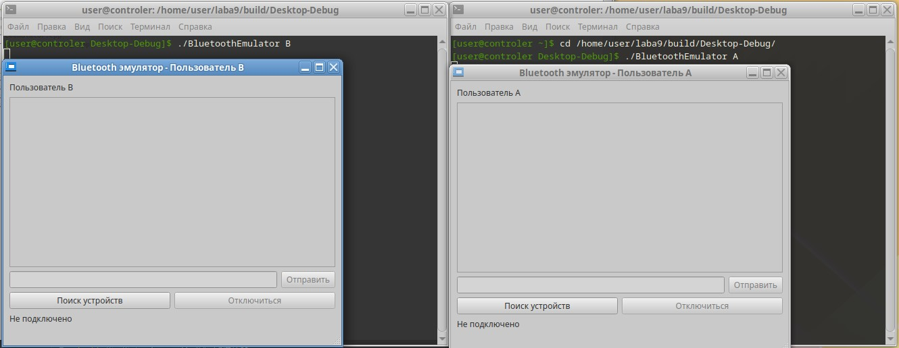

# ЛАБОРАТОРНАЯ РАБОТА №9
## QIODevice, работа с внешними устройствами

---

## Цель работы
Целью данной лабораторной работы является разработка приложения на Qt, которое взаимодействует с внешними устройствами через различные интерфейсы (например, Bluetooth). Студенты изучат классы QIODevice и связанные с ними инструменты для обмена данными с устройствами. Это даст понимание принципов работы с внешними устройствами и коммуникационными протоколами.

---

## Задание
Разработать приложение для обмена файлами по Bluetooth, которое:
- Эмулирует Bluetooth-соединение между двумя устройствами через TCP-сокеты.
- Обеспечивает двусторонний обмен.
- Реализует графический интерфейс для управления подключением и передачи данных.

---

## ФОРМИРОВАНИЕ ОТЧЕТА
В отчёте по лабораторной работе необходимо кратко изложить описание выполненных действий с использованием соответствующих команд, приложить скриншоты настроек и результатов тестов для наглядности. Также следует указать на возникшие в процессе работы проблемы и описать найденные способы их решения. В случае наличия контрольных вопросов, ответы на них должны быть интегрированы в текст.

---

## ЧАСТЬ 1 - Детальные инструкции к выполнению

### Шаг 1. Архитектура приложения.
Приложение реализует эмуляцию Bluetooth-соединения между двумя устройствами (A и B) через TCP-сокеты. Основные компоненты:
- DeviceEmulator - ядро системы, управляющее сетевым соединением.
- MainWindow - графический интерфейс пользователя.
- DeviceSelectionDialog - диалог выбора устройства для подключения.
- QTcpServer/QTcpSocket - обеспечивают TCP-соединение.
- QUuid - эмуляция Bluetooth-адресов устройств.
- Сигналы/слоты - механизм взаимодействия компонентов.

### Шаг 2. Реализация класса DeviceEmulator

- connectToDevice() - установка соединения.
- sendData() - отправка текстовых данных.
- onNewConnection() - обработка входящих подключений.

Добавьте в заголовочный файл `deviceemulator.cpp` следующее:  

```cpp
#include "deviceemulator.h"
#include <QMessageBox>
#include <QDebug>

DeviceEmulator::DeviceEmulator(const QString &userType, QObject *parent)
    : QObject(parent), userType(userType), server(new QTcpServer(this)), socket(nullptr)
{
    uuidToPortMap[QUuid("550e8400-e29b-41d4-a716-446655440000")] = 12345;
    uuidToPortMap[QUuid("550e8400-e29b-41d4-a716-446655440001")] = 12346;

    localUuid = (userType == "A")
        ? QUuid("550e8400-e29b-41d4-a716-446655440000")
        : QUuid("550e8400-e29b-41d4-a716-446655440001");

    if (!server->listen(QHostAddress::LocalHost, uuidToPortMap[localUuid])) {
        qCritical() << "Не удалось запустить сервер:" << server->errorString();
    } else {
        qDebug() << "Сервер запущен на порту" << uuidToPortMap[localUuid];
    }

    connect(server, &QTcpServer::newConnection, this, &DeviceEmulator::onNewConnection);
}

DeviceEmulator::~DeviceEmulator() {
    disconnect();
    server->close();
}

bool DeviceEmulator::connectToDevice(const QString &uuid) {
    QUuid targetUuid(uuid);
    if (!uuidToPortMap.contains(targetUuid) || targetUuid == localUuid) {
        return false;
    }

    if (socket) {
        socket->disconnectFromHost();
        socket->deleteLater();
    }

    socket = new QTcpSocket(this);
    connect(socket, &QTcpSocket::readyRead, this, &DeviceEmulator::onReadyRead);
    connect(socket, &QTcpSocket::disconnected, this, &DeviceEmulator::onDisconnected);
    connect(socket, &QTcpSocket::errorOccurred, this, &DeviceEmulator::onSocketError);

    socket->connectToHost(QHostAddress::LocalHost, uuidToPortMap[targetUuid]);

    if (!socket->waitForConnected(3000)) {
        qWarning() << "Не удалось подключиться:" << socket->errorString();
        return false;
    }

    remoteUuid = targetUuid;
    emit connectionEstablished();
    return true;
}

void DeviceEmulator::sendData(const QString &data) {
    if (socket && socket->state() == QAbstractSocket::ConnectedState) {
        socket->write(data.toUtf8());
        socket->flush();
    }
}

void DeviceEmulator::disconnect() {
    if (socket) {
        socket->disconnectFromHost();
    }
}

bool DeviceEmulator::isConnected() const {
    return socket && socket->state() == QAbstractSocket::ConnectedState;
}

void DeviceEmulator::onNewConnection() {
    if (socket) {
        socket->disconnectFromHost();
        socket->deleteLater();
    }

    socket = server->nextPendingConnection();
    connect(socket, &QTcpSocket::readyRead, this, &DeviceEmulator::onReadyRead);
    connect(socket, &QTcpSocket::disconnected, this, &DeviceEmulator::onDisconnected);
    connect(socket, &QTcpSocket::errorOccurred, this, &DeviceEmulator::onSocketError);

    quint16 peerPort = socket->peerPort();
    remoteUuid = (peerPort == 12345)
        ? QUuid("550e8400-e29b-41d4-a716-446655440000")
        : QUuid("550e8400-e29b-41d4-a716-446655440001");

    emit connectionEstablished();
}

void DeviceEmulator::onReadyRead() {
    if (socket) {
        QByteArray data = socket->readAll();
        emit dataReceived(QString::fromUtf8(data));
    }
}

void DeviceEmulator::onDisconnected() {
    emit connectionLost();
}

void DeviceEmulator::onSocketError(QAbstractSocket::SocketError error) {
    qWarning() << "Ошибка сокета:" << error;
    emit connectionLost();
}


```

Добавьте в `deviceemulator.h` следующее: 

```cpp
#ifndef DEVICEEMULATOR_H
#define DEVICEEMULATOR_H

#include <QObject>
#include <QTcpServer>
#include <QTcpSocket>
#include <QUuid>

class DeviceEmulator : public QObject
{
    Q_OBJECT

public:
    explicit DeviceEmulator(const QString &userType, QObject *parent = nullptr);
    ~DeviceEmulator();

    bool connectToDevice(const QString &uuid);
    void sendData(const QString &data);
    void disconnect();
    bool isConnected() const;

signals:
    void dataReceived(const QString &data);
    void connectionEstablished();
    void connectionLost();

private slots:
    void onNewConnection();
    void onReadyRead();
    void onDisconnected();
    void onSocketError(QAbstractSocket::SocketError error);

private:
    QTcpServer *server;
    QTcpSocket *socket;
    QString userType;
    QUuid localUuid;
    QUuid remoteUuid;
    QMap<QUuid, quint16> uuidToPortMap;
};

#endif // DEVICEEMULATOR_H


```

### Шаг 3. Реализация графического интерфейса

- chatDisplay - область отображения сообщений.
- messageEdit - поле ввода текста.
- scanButton - кнопка поиска устройств.

Добавьте в `mainwindow.cpp` следующее: 

```cpp
#include "mainwindow.h"

MainWindow::MainWindow(const QString &userType, QWidget *parent)
    : QMainWindow(parent), currentUser(userType), connectedDeviceName("")
{
    QWidget *centralWidget = new QWidget(this);
    setCentralWidget(centralWidget);

    QVBoxLayout *mainLayout = new QVBoxLayout(centralWidget);
    QHBoxLayout *messageLayout = new QHBoxLayout();
    QHBoxLayout *buttonLayout = new QHBoxLayout();

    userLabel = new QLabel(QString("Пользователь %1").arg(userType));
    chatDisplay = new QTextEdit();
    chatDisplay->setReadOnly(true);
    messageEdit = new QLineEdit();
    sendButton = new QPushButton("Отправить");
    scanButton = new QPushButton("Поиск устройств");
    disconnectButton = new QPushButton("Отключиться");
    connectionStatus = new QLabel("Не подключено");

    statusBar = new QStatusBar();
    setStatusBar(statusBar);

    messageLayout->addWidget(messageEdit);
    messageLayout->addWidget(sendButton);

    buttonLayout->addWidget(scanButton);
    buttonLayout->addWidget(disconnectButton);

    mainLayout->addWidget(userLabel);
    mainLayout->addWidget(chatDisplay);
    mainLayout->addLayout(messageLayout);
    mainLayout->addLayout(buttonLayout);
    mainLayout->addWidget(connectionStatus);

    setWindowTitle(QString("Bluetooth эмулятор - Пользователь %1").arg(userType));
    resize(500, 400);

    deviceEmulator = new DeviceEmulator(userType, this);

    connect(scanButton, &QPushButton::clicked, this, &MainWindow::on_scanButton_clicked);
    connect(sendButton, &QPushButton::clicked, this, &MainWindow::on_sendButton_clicked);
    connect(disconnectButton, &QPushButton::clicked, this, &MainWindow::on_disconnectButton_clicked);
    connect(deviceEmulator, &DeviceEmulator::dataReceived, this, &MainWindow::onDataReceived);
    connect(deviceEmulator, &DeviceEmulator::connectionEstablished, this, &MainWindow::onConnectionEstablished);
    connect(deviceEmulator, &DeviceEmulator::connectionLost, this, &MainWindow::onConnectionLost);

    sendButton->setEnabled(false);
    disconnectButton->setEnabled(false);
}

MainWindow::~MainWindow()
{
    delete deviceEmulator;
}

void MainWindow::on_scanButton_clicked()
{
    DeviceSelectionDialog dialog(currentUser, this);
    connect(&dialog, &DeviceSelectionDialog::deviceSelected, this, &MainWindow::onDeviceSelected);
    dialog.exec();
}

void MainWindow::on_sendButton_clicked()
{
    QString message = messageEdit->text();
    if (!message.isEmpty()) {
        deviceEmulator->sendData(message);
        chatDisplay->append(QString("[Вы]: %1").arg(message));
        messageEdit->clear();
    }
}

void MainWindow::on_disconnectButton_clicked()
{
    deviceEmulator->disconnect();
}

void MainWindow::onDeviceSelected(const QString &uuid)
{
    if (deviceEmulator->connectToDevice(uuid)) {
        connectedDeviceName = (uuid == "550e8400-e29b-41d4-a716-446655440000") ? "Устройство A" : "Устройство B";
        statusBar->showMessage(QString("Подключение к %1...").arg(connectedDeviceName));
    } else {
        statusBar->showMessage("Ошибка подключения", 3000);
    }
}

void MainWindow::onDataReceived(const QString &data)
{
    chatDisplay->append(QString("[%1]: %2").arg(connectedDeviceName).arg(data));
}

void MainWindow::onConnectionEstablished()
{
    connectionStatus->setText(QString("Подключено к %1").arg(connectedDeviceName));
    sendButton->setEnabled(true);
    scanButton->setEnabled(false);
    disconnectButton->setEnabled(true);
    statusBar->showMessage("Подключение установлено", 3000);
}

void MainWindow::onConnectionLost()
{
    connectionStatus->setText("Не подключено");
    sendButton->setEnabled(false);
    scanButton->setEnabled(true);
    disconnectButton->setEnabled(false);
    statusBar->showMessage("Соединение разорвано", 3000);
    chatDisplay->append("> Соединение потеряно");
}

```

Добавьте в `mainwindow.h` следующее: 

```cpp
#ifndef MAINWINDOW_H
#define MAINWINDOW_H

#include <QMainWindow>
#include <QTextEdit>
#include <QLineEdit>
#include <QPushButton>
#include <QLabel>
#include <QStatusBar>
#include <QVBoxLayout>
#include <QHBoxLayout>
#include "deviceemulator.h"
#include "deviceselectiondialog.h"

class MainWindow : public QMainWindow
{
    Q_OBJECT

public:
    explicit MainWindow(const QString &userType, QWidget *parent = nullptr);
    ~MainWindow();

private slots:
    void on_scanButton_clicked();
    void on_sendButton_clicked();
    void on_disconnectButton_clicked();
    void onDeviceSelected(const QString &uuid);
    void onDataReceived(const QString &data);
    void onConnectionEstablished();
    void onConnectionLost();

private:
    QTextEdit *chatDisplay;
    QLineEdit *messageEdit;
    QPushButton *sendButton;
    QPushButton *scanButton;
    QPushButton *disconnectButton;
    QLabel *userLabel;
    QLabel *connectionStatus;
    QStatusBar *statusBar;

    DeviceEmulator *deviceEmulator;
    QString currentUser;
    QString connectedDeviceName;
};

#endif // MAINWINDOW_H

```

Добавьте в `main.cpp` следующее: 

```cpp
#include <QApplication>
#include "mainwindow.h"

int main(int argc, char *argv[])
{
    QApplication a(argc, argv);

    QString userType = (argc > 1) ? argv[1] : "A";

    MainWindow w(userType);
    w.show();

    return a.exec();
}

```

### Шаг 3. Реализация класса DeviceSelectionDialog

Добавьте в `deviceselectiondialog.cpp` следующее: 

```cpp
#include "deviceselectiondialog.h"

DeviceSelectionDialog::DeviceSelectionDialog(const QString &userType, QWidget *parent)
    : QDialog(parent), userType(userType)
{
    QVBoxLayout *mainLayout = new QVBoxLayout(this);

    devicesList = new QListWidget(this);
    connectButton = new QPushButton("Подключиться", this);

    if (userType != "A") {
        devicesList->addItem("Устройство A (550e8400-e29b-41d4-a716-446655440000)");
    }
    if (userType != "B") {
        devicesList->addItem("Устройство B (550e8400-e29b-41d4-a716-446655440001)");
    }

    mainLayout->addWidget(devicesList);
    mainLayout->addWidget(connectButton);

    setLayout(mainLayout);
    setWindowTitle("Выбор устройства");
    resize(400, 200);

    connect(connectButton, &QPushButton::clicked, this, &DeviceSelectionDialog::on_connectButton_clicked);
}

DeviceSelectionDialog::~DeviceSelectionDialog()
{

}

void DeviceSelectionDialog::on_connectButton_clicked()
{
    if (devicesList->currentItem()) {
        QString selectedDevice = devicesList->currentItem()->text();
        QString uuid;

        if (selectedDevice.contains("Устройство A")) {
            uuid = "550e8400-e29b-41d4-a716-446655440000";
        } else {
            uuid = "550e8400-e29b-41d4-a716-446655440001";
        }

        emit deviceSelected(uuid);
        accept();
    }
}

```

Добавьте в `deviceselectiondialog.h` следующее: 

```cpp
#ifndef DEVICESELECTIONDIALOG_H
#define DEVICESELECTIONDIALOG_H

#include <QDialog>
#include <QListWidget>
#include <QPushButton>
#include <QVBoxLayout>
#include <QUuid>

class DeviceSelectionDialog : public QDialog
{
    Q_OBJECT

public:
    explicit DeviceSelectionDialog(const QString &userType, QWidget *parent = nullptr);
    ~DeviceSelectionDialog() override;

signals:
    void deviceSelected(const QString &uuid);

private slots:
    void on_connectButton_clicked();

private:
    QListWidget *devicesList;
    QPushButton *connectButton;
    QString userType;
};

#endif // DEVICESELECTIONDIALOG_H

```

Для корректной работы в `CMakeLists.txt` нужно добавить определенную конфигурацию:

```cpp
cmake_minimum_required(VERSION 3.5)
project(BluetoothEmulator LANGUAGES CXX)

set(CMAKE_CXX_STANDARD 17)
set(CMAKE_CXX_STANDARD_REQUIRED ON)
set(CMAKE_AUTOMOC ON)

find_package(Qt6 REQUIRED COMPONENTS Core Gui Widgets Network)

add_executable(BluetoothEmulator
    main.cpp
    mainwindow.cpp
    deviceemulator.cpp
    deviceselectiondialog.cpp
)

target_link_libraries(BluetoothEmulator PRIVATE
    Qt6::Core
    Qt6::Gui
    Qt6::Widgets
    Qt6::Network
)

```

## ЧАСТЬ 2 - Тестирование приложения

Нужно запустить два экземпляра, для этого в qtcreator соберем проект и перейдем в терминал где выполним следующие команды:

```cpp
./BluetoothEmulator A
./BluetoothEmulator B
```
  
- Нажать "Поиск устройств" в любом из окон.
  
- Выбрать устройство для подключения (например, от пользователя B).
  
- Отправлять текстовые сообщения через поле ввода.
  
- Отключиться.
  
- Повторное подключение (например, от пользователя А). 
  
---

## Задание для самостоятельной работы 
1. Реализуйте передачу файлов между устройствами.
2. Реализуйте ГОСТ Р 34.12-2015 "Магма" (российский стандарт блочного шифрования с длиной блока 64 бита) для защиты данных.
---

## Вопросы для самопроверки
1. Какой класс в Qt является базовым для работы с устройствами ввода-вывода?
2. Для чего используются UUID и как они связаны с портами?
3. Какие основные методы предоставляет QIODevice?
4. Как можно модифицировать код для работы с реальным Bluetooth (без эмуляции через TCP)?

