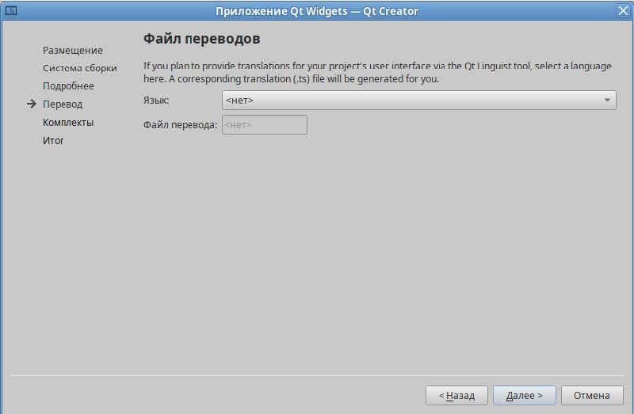
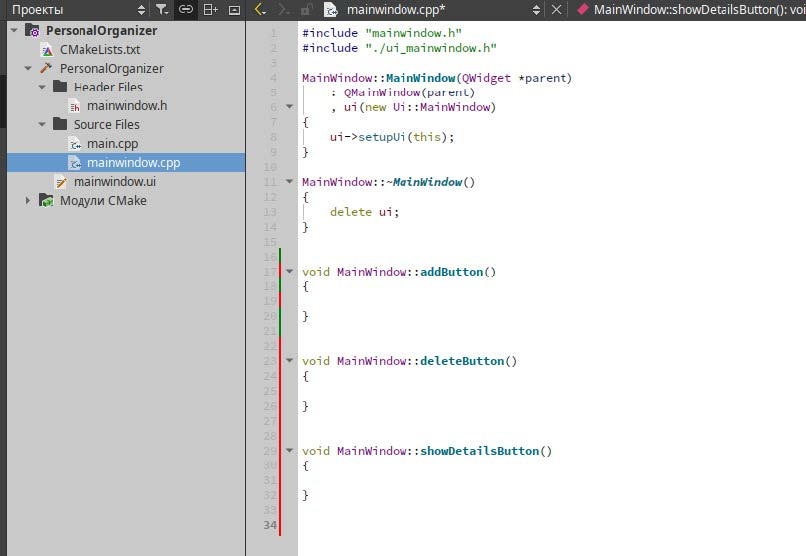
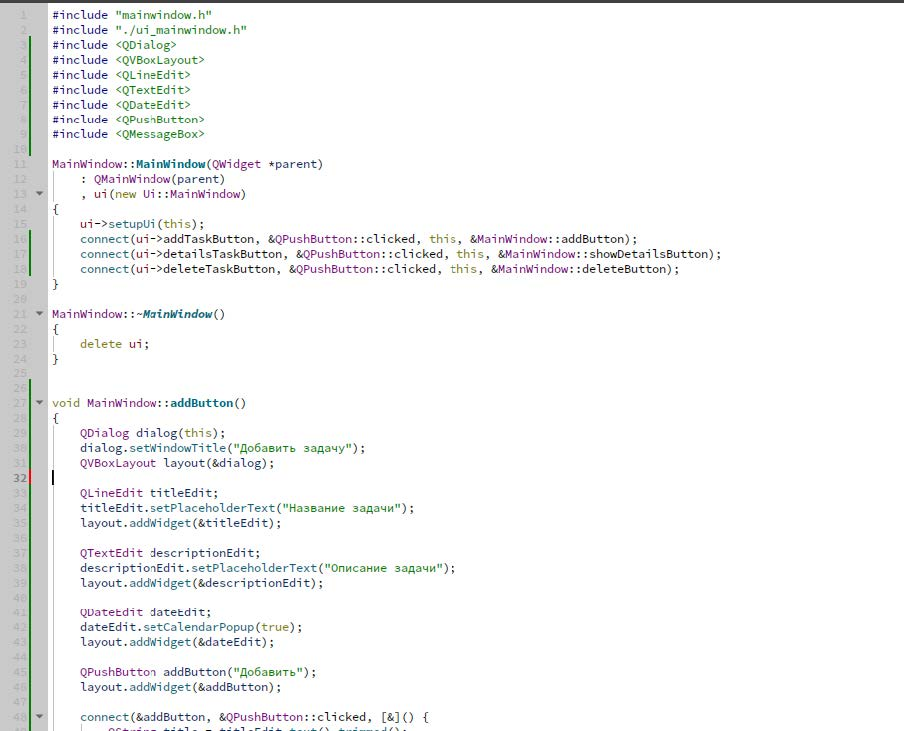
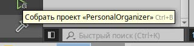

# Лабораторная работа №1  
## Основы работы с виджетами в Qt

---

### Цель работы:
- Изучить основные виджеты, доступные в Qt.
- Научиться разрабатывать графический интерфейс пользователя (GUI) с использованием виджетов.
- Разработать простое приложение с GUI, используя виджеты Qt.

---

### Задание:
Создать приложение **"Персональный органайзер"**, в котором пользователь сможет добавлять, просматривать и удалять записи о своих задачах. Приложение должно содержать следующие элементы управления:
- **Список задач** (`QListWidget` или `QTreeView`).
- **Кнопки** для добавления, удаления и просмотра деталей задач.
- **Форма** для добавления новой задачи с полями:
  - Название задачи (`QLineEdit`)
  - Описание (`QTextEdit`)
  - Дата выполнения (`QDateEdit`)

---

### Формирование отчета
В отчёте по лабораторной работе необходимо:
- Кратко изложить описание выполненных действий с использованием соответствующих команд.
- Приложить скриншоты настроек и результатов тестов для наглядности.
- Указать на возникшие в процессе работы проблемы и описать найденные способы их решения (если таковые имелись).
- Интегрировать ответы на контрольные вопросы (если они есть).

---

## Часть 1 — Разработка интерфейса

### Шаг 1. Создание проекта.
1. Запустите **Qt Creator** и создайте новый проект **"Приложение Qt Widgets"**. 

2. В мастере проектов укажите название проекта **"PersonalOrganizer"** и выберите директорию для проекта. 

3. Выберите систему сборки **CMake**.  

4. Заполните информацию о классах, данные оставьте по умолчанию. 

5. Файл перевода можно оставить по умолчанию пустым. 

6. Выберите комплект для сборки (он должен быть автоматически определён на основе установленной версии Qt). 

7. Завершите создание проекта, нажав кнопку **"Завершить"**. 


### Шаг 2. Дизайн интерфейса.
1. Откройте файл `mainwindow.ui` в редакторе форм **Qt Creator**. 

2. Используя визуальный редактор, разместите на главном окне следующие виджеты:
   - **QListWidget** для отображения списка задач.  
   
    *Так как изначально цвет виджета и окна будет серым (что не очень приятно для просмотра итогового приложения), его следует изменить:*  
    - Нажмите по окну **MainWindow** и перейдите в редактор свойств (расположен в правой части Qt Creator).
    - Найдите свойство `styleSheet`, которое позволяет задавать стили для графических элементов (аналог CSS в веб-разработке). 
    
    - Для установки фона используйте строку:  
        ```css
        background-color: white;
        ```  
        
    - Аналогично измените фон для `ListWidget`. 
    
    
   - **QPushButton** для кнопок:
        - "Добавить задачу"
        - "Удалить задачу"
        - "Подробности задачи"

          
    *Нажмите на каждую кнопку и в редакторе свойств измените значение свойства `text` в разделе `QAbstractButton`.*  
    
    
   - Разместите виджеты так, чтобы интерфейс был удобен для пользователя.  
    *Можно использовать `QVBoxLayout` и `QHBoxLayout` для организации виджетов. Скомпонуйте виджеты по горизонтали и сузьте окно приложения для компактного вида.*  
    
### Шаг 3. Настройка виджетов.
1. Выберите `QListWidget` и в редакторе свойств измените значение `objectName`, например, на `tasksListWidget`. 

2. Аналогично настройте имена для кнопок:
   - `addTaskButton`
   - `deleteTaskButton`
   - `detailsTaskButton`  
   *Проверьте изменения в инспекторе объектов.*  
   
3. Сохраните изменения в дизайнере форм с помощью сочетания клавиш **Ctrl+S**.

---

## Часть 2 — Реализация логики

### Шаг 1. Обработка событий кнопок.
1. Перейдите в режим редактирования кода для `mainwindow.cpp`. 

2. Создайте слоты для обработки нажатий на кнопки. Это можно сделать двумя способами:
   - **С помощью редактора сигналов и слотов в Qt Creator:**
        - Перейдите в `mainwindow.ui` и нажмите правой кнопкой мыши на любую из добавленных кнопок. 
        
        - Выберите опцию **“Перейти к слоту”** и затем обычный сигнал `clicked()`. После этого слот автоматически создастся в `mainwindow.cpp`.  
        *Повторите для остальных кнопок.*  
        
   - **Вручную:**
        - Откройте `mainwindow.h` и добавьте объявление вашего слота в секцию `private slots` или `public slots` (в зависимости от требований к защите).  
        
        - В `mainwindow.cpp` определите поведение слота при нажатии кнопки. 
        
        - Осталось только соединить сигнал и слот в конструкторе вашего класса. Перейдите в mainwindow.cpp и перейдите в конструктор класса.  
        
        - В конструкторе класса соедините сигнал кнопки со слотом с помощью команды:
            ```cpp
            connect(ui->addTaskButton, &QPushButton::clicked, this, &MainWindow::addButton);
            ```
        - Здесь:
            - `connect()` устанавливает связь между сигналом и слотом.
            - `ui->addTaskButton` – указатель на объект кнопки (`QPushButton`).
            - `&QPushButton::clicked` – сигнал, испускаемый при нажатии кнопки.
            - `this` – объект, в котором находится слот.
            - `&MainWindow::onButtonClicked` – слот, который будет вызван при срабатывании сигнала.  
    
              
        *Аналогично соедините другие кнопки со своими слотами.* 
        

3. **Слот добавления задачи:**  
   Реализуйте открытие диалогового окна с формой для ввода данных о новой задаче. При добавлении задачи должно открываться диалоговое окно с полями:
   - Название задачи (`QLineEdit`)
   - Описание (`QTextEdit`)
   - Дата выполнения (`QDateEdit`)
   
   Ниже приведён пример кода:
   
   ```cpp
   #include <QDialog>
   #include <QVBoxLayout>
   #include <QLineEdit>
   #include <QTextEdit>
   #include <QDateEdit>
   #include <QPushButton>
   #include <QMessageBox>
   
   void MainWindow::addButton()
   {
    QDialog dialog(this);
    dialog.setWindowTitle("Добавить задачу");
    QVBoxLayout layout(&dialog);
    
    QLineEdit titleEdit;
    titleEdit.setPlaceholderText("Название задачи");
    layout.addWidget(&titleEdit);
    
    QTextEdit descriptionEdit;
    descriptionEdit.setPlaceholderText("Описание задачи");
    layout.addWidget(&descriptionEdit);
    
    QDateEdit dateEdit;
    dateEdit.setCalendarPopup(true);
    layout.addWidget(&dateEdit);
    
    QPushButton addButton("Добавить");
    layout.addWidget(&addButton);
    
    connect(&addButton, &QPushButton::clicked, [&]() {
       QString title = titleEdit.text().trimmed();
       QString description = descriptionEdit.toPlainText().trimmed();
       QDate date = dateEdit.date();
       QListWidgetItem *newItem = new QListWidgetItem(title);
       newItem->setData(Qt::UserRole, description);
       newItem->setData(Qt::UserRole + 1, date);
       ui->tasksListWidget->addItem(newItem);
       dialog.accept();
    });
    
    dialog.exec();
   }
   ```
    
4. **Слот удаления задачи:**  
   Реализуйте удаление выбранной задачи из списка:
   
   ```cpp
   void MainWindow::deleteButton()
   {
    QListWidgetItem *item = ui->tasksListWidget->currentItem();
    if (item) {
       QMessageBox msgBox(this);
       msgBox.setWindowTitle("Удаление задачи");
       msgBox.setText("Вы уверены, что хотите удалить задачу?");
       QPushButton* yesButton = msgBox.addButton(QMessageBox::Yes);
       QPushButton* noButton = msgBox.addButton(QMessageBox::No);
       yesButton->setText("Да");
       noButton->setText("Нет");
       msgBox.exec();
       if (msgBox.clickedButton() == yesButton) {
        delete item;
       }
    } else {
       QMessageBox::warning(this, "Удаление задачи", "Выберите задачу для удаления.");
    }
   }
   ```
    
5. **Слот просмотра деталей задачи:**  
   Реализуйте отображение информации о выбранной задаче, например, с помощью `QMessageBox`:
   
   ```cpp
   void MainWindow::showDetailsButton()
   {
    QListWidgetItem *item = ui->tasksListWidget->currentItem();
    if (item) {
       QString taskDetails = item->text();
       QString description = item->data(Qt::UserRole).toString();
       QDate taskDate = item->data(Qt::UserRole + 1).toDate();
       QString details = QString("<b>Задача:</b> %1\n<b>Описание:</b> %2\n<b>Дата выполнения:</b> %3")
        .arg(taskDetails)
        .arg(description)
        .arg(taskDate.toString("dd.MM.yyyy"));
       QMessageBox::information(this, "Детали задачи", details);
    } else {
       QMessageBox::warning(this, "Просмотр задачи", "Выберите задачу для просмотра.");
    }
   }
   ```
    
### Шаг 2. Работа со списком задач.
1. Реализуйте добавление введённой задачи в `QListWidget` после закрытия формы добавления задачи.
2. Обеспечьте возможность выбора и удаления задач из списка.  
   *Работа со списком задач была выполнена в шаге 1.*

### Шаг 3. Тестирование приложения.
1. Соберите и запустите приложение.  
   - Для сборки используйте кнопку **молоточек** или сочетание клавиш **Ctrl+B**.  
   
   - Для запуска приложения используйте зелёную кнопку запуска или сочетание клавиш **Ctrl+R**.  
    
2. Проверьте функциональность:
   - **Добавление задачи:**  
    При нажатии кнопки **«Добавить задачу»** появляется диалоговое окно с необходимыми полями.  
    
   - **Заполнение задачи:**  
    Давайте добавим какую-то задачу.  
    
   - **Просмотр деталей задачи:**
    Выберите задачу и нажмите кнопку **«Подробности задачи»** для отображения деталей.  
    
   - **Удаление задачи:**  
    Попробуйте удалить задачу, выбрав её и нажав соответствующую кнопку.  
    

---

## Задание для самостоятельной работы
- **Добавьте валидацию данных** формы добавления задачи (например, проверку на пустое название).
- **Реализуйте сохранение списка задач между сессиями** работы приложения (можно использовать `QSettings` или работу с файлом).

---

## Вопросы для самопроверки
- **Как добавить виджеты на форму в Qt Creator?**
- **Как создать слот для обработки нажатия на кнопку?**
- **Как можно реализовать сохранение данных между сессиями приложения в Qt?**
